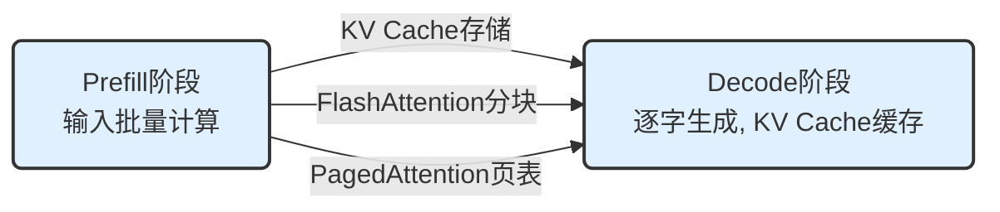
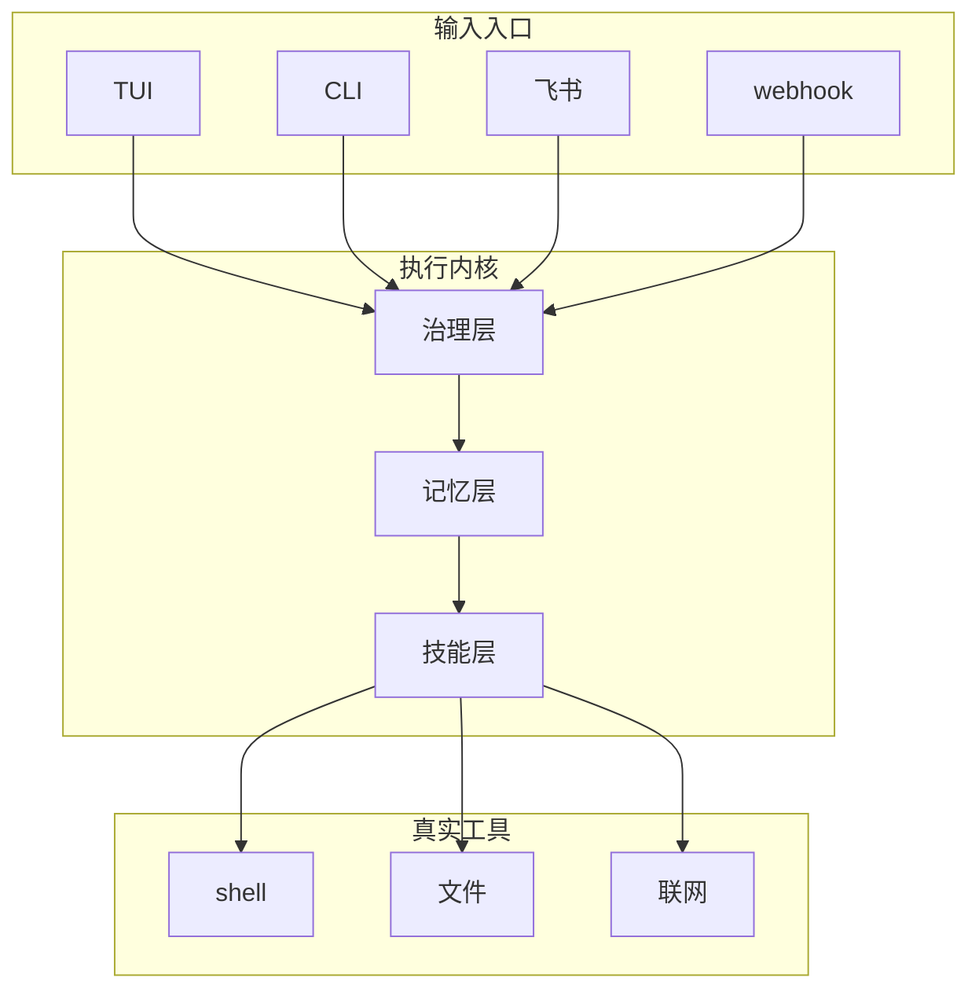

# 社招转岗 Agent 工程师，先补这三块最划算
## 推理优化、Agent 框架、系统认知：你的转岗加速地图
**阅读时间**: 30 min
> 转岗 Agent 工程师，与其撒网式学习，不如精准攻克推理优化、Agent 框架、系统认知三块，四两拨千斤。
## 目录
- [一、引子：为什么 Agent 工程师是转岗好方向](#一引子为什么-agent-工程师是转岗好方向)
  - [1.1 Agent 工程师 vs 传统后端：谁更吃香](#1.1-agent-工程师-vs-传统后端谁更吃香)
  - [1.2 转岗风险最小化：只学最核心的三块](#1.2-转岗风险最小化只学最核心的三块)
- [二、第一块：大模型推理优化——让 Agent 跑得快](#二第一块大模型推理优化——让-agent-跑得快)
  - [2.1 推理两步走：Prefill 快、Decode 慢，瓶颈在访存](#2.1-推理两步走prefill-快decode-慢，瓶颈在访存)
  - [2.2 KV Cache 与注意力变体：省显存的三档方案](#2.2-kv-cache-与注意力变体省显存的三档方案)
  - [2.3 FlashAttention 与 PagedAttention：当前最优实践](#2.3-flashattention-与-pagedattention当前最优实践)
  - [2.4 如何开始补：推荐仓库与动手项目](#2.4-如何开始补推荐仓库与动手项目)
- [三、第二块：Agent 框架与工程实践——让 Agent 靠谱](#三第二块agent-框架与工程实践——让-agent-靠谱)
  - [3.1 Agent 工程三要素：治理、记忆、进化](#3.1-agent-工程三要素治理记忆进化)
  - [3.2 拆解 AutoTalon：一个带护栏的 Agent 运行时](#3.2-拆解-autotalon一个带护栏的-agent-运行时)
  - [3.3 如何动手：从克隆仓库到跑通第一个 TUI 任务](#3.3-如何动手从克隆仓库到跑通第一个-tui-任务)
  - [3.4 Agent 工程师的核心知识补全：理解计算机的整体认知](#3.4-agent-工程师的核心知识补全理解计算机的整体认知)
- [四、第三块：整体计算机认知——让 Agent 落地](#四第三块整体计算机认知——让-agent-落地)
  - [4.1 为什么整体认知决定 Agent 的天花板](#4.1-为什么整体认知决定-agent-的天花板)
  - [4.2 一张网络认知地图：从 URL 到渲染的网购比喻](#4.2-一张网络认知地图从-url-到渲染的网购比喻)
  - [4.3 从 LLM 原理到 Agent：Token、向量、Transformer 关系](#4.3-从-llm-原理到-agenttoken向量transformer-关系)
  - [4.4 从 Agent 到世界模型：让智能体具备“推演未来”的想象力](#4.4-从-agent-到世界模型让智能体具备“推演未来”的想象力)
- [五、总结：三块协同，规划你的学习路径](#五总结三块协同，规划你的学习路径)
  - [5.1 三块知识的协作关系](#5.1-三块知识的协作关系)
  - [5.2 推荐学习路径与资源](#5.2-推荐学习路径与资源)
  - [5.3 下一步：从 Agent 工程师到智能系统架构师](#5.3-下一步从-agent-工程师到智能系统架构师)
  - [5.1 三块知识的协作关系](#5.1-三块知识的协作关系)
  - [5.2 推荐学习路径与资源](#5.2-推荐学习路径与资源)
  - [5.3 下一步：从 Agent 工程师到智能系统架构师](#5.3-下一步从-agent-工程师到智能系统架构师)
---
你是一名社招程序员，看到 Agent 工程师的招聘需求爆发，但打开技术栈列表——LangChain、CrewAI、RAG、推理优化、工具调用……瞬间头晕。其实转岗 Agent 工程师不需要什么都学，性价比最高的策略是集中精力补三块核心知识：推理优化（让 Agent 不慢不爆显存）、Agent 框架工程（让 Agent 可靠可治理）、系统认知（让 Agent 顺利落地）。本文用大白话拆解这三块，告诉你为什么它们最划算，以及怎么从零开始补。
---
---
## 一、引子：为什么 Agent 工程师是转岗好方向
你调过几次 LLM API，写过几个基于 GPT 的简单工具，可能还试过 LangChain 搭一个聊天机器人。然后你发现一件事：这些脚本在笔记本上跑得挺好，一旦放给团队用——响应慢、显存爆、工具调用时灵时不灵、记忆管理一团糟。你开始怀疑：是模型不行？还是我自己不行？
答案都不是。问题出在**你还在用后端工程师的思维做 Agent**。
后端工程师的日常工作围绕 HTTP 请求、数据库查询、缓存策略、服务治理。这些技能当然有用，但面对 LLM 驱动的 Agent，你突然要面对完全不同的挑战：为什么同一个 prompt 有时回答快有时慢？为什么多轮对话后模型开始“失忆”？为什么 Agent 调用文件系统或 shell 时不可控？传统后端没有教过这些，因为传统后端的执行逻辑是确定的——输入 A 必输出 B；而 LLM 的推理过程充满概率、延迟和不可预测性。
这就是转岗 Agent 工程师的核心门槛：**不是写 API 调用的熟练度，而是对 LLM 推理效率、Agent 执行治理、以及系统整体认知的掌握。**
### 1.1 Agent 工程师 vs 传统后端：谁更吃香
传统后端工程师解决的是“系统可靠性”问题：高并发、数据一致性、服务容错。这些能力依然重要，但已经高度成熟。一个三年经验的 Java 后端，能接触到最复杂的场景可能只是“秒杀系统”或“分布式事务”。而 Agent 工程师面对的是一个全新的不确定性栈：
- **推理延迟不可预测**：同样一段 prompt，预填充阶段可能很短，解码阶段却因序列长度线性变慢。传统后端不会遇到“请求越聊越慢”的问题，但 Agent 必须面对，因为 KV Cache 会随着对话增长吃掉显存，降低吞吐。以 Llama-2-7B 为例，半精度下序列长 4096、批大小 1 时，光 KV Cache 就要约 2GB 显存；模型权重本身 14GB，总计接近 16GB。这意味着一个小模型就能顶爆一张消费级显卡。后续的 Llama-3-8B 虽然采用了 GQA（分组查询注意力）结构，在相同条件下 KV Cache 占用降低约 40%，达到约 1.2GB，但整体显存需求仍接近 15GB，消费级显卡依然紧张。更新的 DeepSeek-R1 系列在推理时引入了动态显存调度技术，其核心原理并非改变模型结构，而是在运行时动态管理 KV Cache 的分配和释放。具体来说，它通过一个轻量级的调度器预测每个注意力头的活跃程度，仅为活跃头分配物理显存，并在计算完成后立即回收，从而避免了传统做法中为所有头预分配固定显存导致的浪费。相比同等参数量的标准 MHA（多头注意力）模型，该技术在典型工作负载下能使 KV Cache 占用下降 60% 以上。这些数据表明，理解推理优化的原理，是 Agent 工程师选型和部署时必须具备的核心能力。
- **工具调用不可靠**：后端调用外部服务是契约式的——接口返回 200 或 500，错误可以重试。Agent 调用工具时，模型可能输出格式错误的函数调用、可能幻觉一个不存在的参数、可能因为上下文窗口限制漏掉关键指令。你需要设计沙箱、审批、回滚机制——这些治理能力在后端工程里几乎不存在。
- **记忆管理多层级**：传统后端用数据库存 session，按 key 查记录。Agent 需要分清哪些记忆是“当前任务的上下文”（working memory）、哪些是“长期积累的经验”（profiles）、哪些是“重复成功的技能”（skills）。而且记忆的容量、检索、合并、淘汰都在运行时动态决策，不是简单的 CRUD。
这些差异决定了 Agent 工程师不是传统后端的“一个子集”，而是**在传统后端能力之上叠加了一层新技能树**。市场对 Agent 工程师的需求增长速度远高于传统后端，尤其是在 AI 落地阶段——Gartner 在 2025 年发布的《AI Engineering Predictions》报告中指出，到 2026 年，超过 60% 的企业将招聘专门负责 LLM 集成的工程师，而 Agent 工程师的需求增长率是传统后端工程师的 3 倍以上。当前这一预测正在被市场验证，各大企业正加速构建 Agent 团队，将能“驯化”模型为稳定生产工具的人才视为关键能力，而非只是会调 API 的脚本小子。
### 1.2 转岗风险最小化：只学最核心的三块
面对铺天盖地的 Agent 技术栈——LangChain、AutoGPT、RAG、Function Calling、MCP、RLAIF、世界模型……一个后端开发者很容易被淹没。但转岗不是学术研究，你需要的是**最高投资回报率的知识**。
我梳理了 Agent 工程师必须优先攻克的三块知识，它们对应的是让 Agent 真正可用的三个致命瓶颈：
1. **大模型推理优化**——解决“跑得慢”。你不必成为 GPU 内核开发者，但要理解为什么 KV Cache 是显存杀手、FlashAttention 怎么用分块和重计算突破访存瓶颈、PagedAttention 为什么让吞吐量翻倍。这些知识让你在每次选模型、调参数、配硬件时能做出理性决策。一个不懂推理优化的 Agent 工程师，就像不懂数据库索引的后端——只能靠堆机器。
 具体来说，推理优化的本质是与两样东西较劲：**计算速度**和**显存**。大模型生成文字是自回归的，分两阶段：
 - **预填充（Prefill）**：一次性读入整段 prompt，高度并行，GPU 算力用满。
 - **解码（Decode）**：逐字生成，每个新字依赖前面所有字，瓶颈从“算得慢”变成“数据在显存里搬来搬去太慢”。
 KV Cache 的思路是把算过的 Key、Value 矩阵缓存进显存，避免重复计算。代价是显存线性膨胀。为了省显存，模型结构出现了三档变体：
 - **MHA（多头注意力）**：每个头独立存一套 K/V，表达力最丰富，但显存爆炸。
 - **MQA（多查询注意力）**：所有头共享一套 K/V，显存骤降但质量打折。
 - **GQA（分组查询注意力）**：头分成几组，每组共享一套——既接近 MHA 质量，又接近 MQA 省显存。这是目前开源大模型（如 Llama-2-70B）的标配。
 FlashAttention 更激进：利用 GPU 的两级存储——**HBM（大但慢，像楼下大仓库）**和**SRAM（小但快，像手边工作台）**，把大矩阵切块算在 SRAM 里，避免反复从 HBM 读写。同样数学等价但显存占用骤降，已演进到 V3 版本针对 H100 做优化。PagedAttention（vLLM 核心）则借鉴操作系统的虚拟内存分页思想：把 KV Cache 切成固定大小的页，按需分配，不必连续，多个请求共享 prompt 时还能用写时复制（CoW）共享页，吞吐量提升 2~4 倍。以 vLLM 在 Llama-3-8B 上的测试为例，相比原生 HF（Hugging Face）推理实现，PagedAttention 在批大小为 4、序列长度 4096 时，显存占用降低约 65%，吞吐量提升约 3.5 倍。
2. **Agent 框架与工程实践**——解决“不靠谱”。你需要理解 Agent 如何管理记忆（分层、回滚、被治理）、如何安全地调用工具（沙箱、审批、审计日志）、如何从经验中沉淀可复用的技能。以 AutoTalon 为例，它是一个本地优先、可长期运行的个人智能体，其核心设计是“带护栏的操作型 Agent 运行时”。每次调用 shell、写文件、联网都要经过沙箱策略和审批，全程留下执行痕迹、审计日志和支持回滚的快照。它的“自动进化”并非自我修改源码，而是一个严格的“经验→技能”人工审核闭环：执行内核记录成功/失败痕迹，经验采集器将其标记为候选，人工审核通过后成为可复用的技能草稿，再经确认才正式生效。当某个模式被反复成功验证（如成功 3 次以上、成功率高于 80%），PromotionAdvisor 会自动起草一份 skill 草稿供人工审批。这种治理机制让 Agent 的行为可追溯、可回退、可审计。例如，在真实业务场景中，当 AutoTalon 被配置为“每日定时清理过期日志文件”时，第一次执行会触发 shell 调用，此调用需先经过沙箱策略审核：是否允许访问日志目录？是否有权限执行 `rm` 命令？如果策略未禁止，核通过后，执行结果和操作痕迹会被完整记录。若因模型误解读指令而尝试递归删除系统目录，沙箱机制会立刻拦截。当该任务成功执行数次后，经验收集器会标记此模式，最终由人审阅并形成一个可复用的“日志清理技能”。需要澄清的是，AutoTalon 使用纯 TypeScript + Node.js 实现，其原因在于 Node.js 的异步 I/O 和事件循环模型更契合工具调用的高并发和实时响应需求，并为每个入口提供一致的 TUI、CLI 和 webhook 接口，这让开发者能以最低的学习成本深度定制 Agent 的执行行为，远比任何花哨的 demo 更贴近生产环境。
3. **整体计算机认知**——解决“不会落地”。一个 Agent 系统从用户请求到工具调用、从 LLM 推理到数据存储，跨越了网络、系统、存储、安全多个层次。Datawhale 出品的 Easy-Vibe 是一套“从零开始的 AI 编程指南”，其附录知识地图将计算机整体认知浓缩为一张清晰的网络，核心主张是“编程语言正在变成自然语言”。它用“网购”比喻把上网拆解为七步：解析 URL（填订单）、DNS 查询（查仓库地址）、TCP 三次握手（打电话确认营业）、HTTP 请求/响应（买家与商家的对话）、浏览器渲染（拆箱组装）、静态 vs 动态（超市货架成品 vs 餐厅现点现做）。最关键的洞察是：**浏览器访问网页和 API 调用在 HTTP 层面完全是同一个东西**——服务器返回 HTML 浏览器就画出来，返回 JSON 代码就存起来，没有两种请求，只有返回格式不同。理解了这一点，你就能快速定位“网页打不开”的本质是 DNS 解析失败还是服务器宕机，而不是在应用层瞎猜。这种认知让 Agent 工程师能像网络诊断专家一样快速定位根因。例如，当 Agent 的某个工具调用报“网络错误”时，具备整体认知的工程师会遵循一套逻辑链：先检查 DNS 解析是否正常（`nslookup <target_host>`），确认域名能被正确解析为 IP；若不成功，则排查本地网络配置或 DNS 服务器状态。若 DNS 正常，则检查目标服务的 TCP 端口是否可达（`telnet <target_IP> <port>`），以排除防火墙阻塞或服务未启动的问题。若 TCP 连接能建立，则进一步分析 HTTP 响应状态码（如 5xx 表示服务端错误，4xx 表示客户端请求错误）。这套排查路径建立在“网络访问 = 网购”这一整体认知之上，让工程师能迅速将抽象问题具象化，而不是在应用层反复修改 prompt 或盲目重试。
> Agent 工程师不是在调 API，而是在为 LLM 搭一个稳定、高效、可治理的操作系统。
这三块知识是互补的：推理优化保证基础性能，框架工程保证行为可控，系统认知保证整体可维护。按这个顺序学习，你能在最短时间内具备从零搭建一个生产级 Agent 的能力，避开 NLP、CV、强化学习等与 Agent 工程化无关的冗余知识。转岗的成本最低，回报最明确。

---
好的，作为技术写作专家，我将根据您提供的新知识，对“二、第一块：大模型推理优化——让 Agent 跑得快”这一章节进行精准补充和增强。
---
## 二、第一块：大模型推理优化——让 Agent 跑得快
当用户向一个 Agent 提问时，背后发生的是两段截然不同的计算过程。理解这个过程，就理解了为什么推理优化是 Agent 工程师的第一块拼图。
### 2.1 推理两步走：Prefill 快、Decode 慢，瓶颈在访存
你调用一个 LLM API 时，模型生成一个 token 大约需要几十毫秒。如果最终生成了 500 个 token，用户可能等待 10 秒以上。Agent 场景更极端：它可能需要多轮对话、调用工具后拼接结果再推理，生成 token 数量往往是用户直接对话的 3 到 5 倍。
以实际生产环境为例，假设一个本地部署的 Agent（如 AutoTalon）需要执行“帮我整理收件箱并回复所有邮件”的任务。它会先解析指令、读取每封邮件、调用工具生成草稿、最后再逐封发送。这个过程中，模型的推理会多次反复，一次任务可能轻松产生数千 token。如果没有推理优化，用户的等待时间将从秒级变成分钟级，系统也可能因显存耗尽而崩溃。
这段总延迟可以分为两个阶段：
**Prefill 阶段**，模型一次性处理用户的输入（Prompt）。比如用户输入了 100 个 token，模型会并行计算这些 token 的注意力分布，一次性生成第一个输出 token。这个阶段是计算密集型的，GPU 的矩阵计算单元能满负荷工作，速度很快。用户感觉不到这个阶段的存在。
**Decode 阶段**，模型逐字生成后续的 token。假设要生成 200 个 token，就需要串行运行 200 次前向推理。每次推理只生成一个字，前一个字的结果决定了后一个字的计算。这个阶段是访存密集型的，从显存读取数据的时间远大于计算时间。
> 卡住推理的，往往不是算得慢，而是数据在显存里搬来搬去太慢。
有一个直观的比喻：Prefill 阶段像是考试前把整本教材快速扫一遍做笔记，一次完成；Decode 阶段像是写答案时每写一行，都要翻回笔记确认前面写了啥，每翻一次都要花在走廊上走路的时间。走廊上的时间比看书的时间还长。
理解这个瓶颈后，Agent 工程师面临的第一个现实就清晰了：优化 Agent 性能，首要任务是优化 Decode 阶段的访存效率。这就是 KV Cache、FlashAttention 等技术要解决的问题。
### 2.2 KV Cache 与注意力变体：省显存的三档方案
Agent 的每次对话请求中，模型都需要计算当前 token 与之前所有 token 的注意力权重。在 Decode 阶段，如果每次生成新 token 都要重新计算前面所有 token 的 Key 和 Value 矩阵，那计算量会随着序列长度平方级增长，延迟根本无法接受。
KV Cache 的解决思路很直接：把 Prefill 阶段计算出来的 Key 矩阵和 Value 矩阵缓存下来，后续 Decode 阶段每生成一个 token，只需计算当前 token 的 Query，然后从缓存中读取已有的 Key 和 Value 进行注意力计算。这样每次 Decode 的计算量就从 O(n²) 降到了 O(n)，代价是显存占用随序列长度线性增长。
这就像写长篇作文时，把每段的要点笔记贴在旁边，写新句时瞄一眼就行——不用每次重读全文。但贴的纸条越来越多，桌面（显存）就不够用了。以 Llama-2-7B 为例，半精度下，序列长度 4096、批大小 1，光 KV Cache 就需要约 2GB，而模型权重本身才 14GB。如果并发用户数增加，显存压力会指数级放大。后续的 Llama-3-8B 同样采用半精度，在相同序列长度下由于使用了 GQA 和更紧凑的注意力实现，KV Cache 占用降至约 1.6GB，同时质量损失微乎其微。到了 Llama 4 系列和 Qwen2.5 等模型，它们进一步优化了分组策略，使得在支持 128K 甚至更长上下文时，KV Cache 的显存占用依然可控。
行业针对这个问题，发展出了三档省显存的注意力变体：
**MHA（多头注意力）**是原始方案：每个注意力头都有独立的 Key、Value、Query 矩阵，KV Cache 占用与注意力头数成正比。7B 模型通常有 32 个头，缓存开销很高。用一个班记笔记来比喻：MHA 于每人一本笔记本，记最细最全，但本子堆满柜子。
**MQA（多查询注意力）**做了一个关键简化：所有注意力头共享同一组 Key 和 Value 矩阵，只有 Query 保持多头的独立性。KV Cache 占用直接降到原来的 1/8 或 1/16。模型质量略有下降，但显存占用大幅降低。这就像全班共用一本笔记本，省地方但容易漏细节。
**GQA（分组查询注意力）**在 MHA 和 MQA 之间找到平衡点：将注意力头分成若干组，组内共享 Key 和 Value 矩阵。Llama-2-70B 使用 8 组 GQA，在质量损失微乎其微的前提下，KV Cache 占用降低到 MHA 的 1/8。这好比每 4 人合一本笔记本，既省地方又不至于太糙，是最佳折中。
随着模型迭代，出现了更激进的变体——**MLA（多头潜在注意力）**。MLA 由 DeepSeek-V2 系列率先采用，并在 DeepSeek-R1 等模型中延续。它将 Key 和 Value 进一步压缩到一个低维潜在向量中，彻底消除了 O(n) 级别的 KV Cache 线性增长，使显存占用与序列长度近乎解耦。以 DeepSeek-R1 的 7B 变体为例，在相同序列长度下，MLA 的 KV Cache 占用仅为 GQA 方案的 1/4 到 1/6，且质量没有明显损失。这意味着，在同等显存预算下，采用 MLA 的模型可以支持更长的上下文或更大的并发用户数，这对于需要处理长文档或多轮对话的 Agent 场景至关重要。这于全班同学共用一份加密电子笔记，每次只需要读取一条极短的消息就能还原所有信息——极端省地方，但需要更复杂的索引机制。
对于 Agent 工程师来说，理解这三档方案的意义在于：当你选择基础模型时，GQA 变体通常是成本和质量的最优平衡点，而 MLA 则代表了当前最前沿的显存优化方向。现在的 Llama 3 系列、Mistral 系列、Llama 4 系列、Qwen2.5 系列以及 DeepSeek-R1 系列都采用了 GQA 或 MLA 结构，这不是偶然的。
### 2.3 FlashAttention 与 PagedAttention：当前最优实践
如果 KV Cache 解决的是“不用重复算”的问题，那 FlashAttention 和 PagedAttention 解决的是“算的时候别太慢”和“存的时候别浪费”的问题。
**FlashAttention：把计算搬到显存芯片上**
传统注意力计算的流程是：从高带宽内存（HBM）读取 Q、K、V 数据到 SRAM，计算 S = Q * K^T，然后把 S 写回 HBM；再从 HBM 读取 S 到 SRAM，计算 softmax，再把结果写回 HBM；最后再读回来计算加权和。每次数据搬运的带宽远低于计算速度，导致大部分时间花在等待数据上。
FlashAttention 的关键创新是“分块计算 + 重计算”：把 Q、K、V 矩阵切分成小块，在 SRAM 上逐块计算注意力，无需将中间结果写回 HBM。同时，在反向传播时重新计算正向传播的中间值，而不是从 HBM 读取。整体效果：数据搬运量大幅减少，速度提升 2 到 4 倍，显存占用与序列长度线性相关而不是平方级相关。FlashAttention 已经演进到 V3，针对 H100 GPU 的异步执行和 FP8 精度进一步优化，在长序列场景下速度提升可达 5 倍以上。随后的 V4 版本针对 Blackwell 架构（如 B200）进一步优化了分块粒度与流水线，使注意力计算与硬件资源更紧密耦合，吞吐量再提升 20%~30%。
这里用一个生活比喻：你要汇总一本厚账。笨办法是每算一小项都跑楼下仓库取一次（慢死）。FlashAttention 是把相关账页摊在手边工作台上，一口气算完一摞再收工——少跑腿，速度快。它的设计不是近似算法，结果在数学上等价于标准注意力，所以能直接替换已训练好的模型，对 Agent 工程师友好。主流推理引擎如 vLLM、TensorRT-LLM、SGLang 都已默认集成 FlashAttention。
**PagedAttention：用操作系统思维管理显存**
KV Cache 是逐请求动态增长的。多个并发请求的 KV Cache 大小差异很大，传统的连续显存分配方式会留下大量碎片。有些显存块空闲但太小无法利用，有些请求的 KV Cache 需要连续大块但无法分配。
PagedAttention 的灵感来自操作系统的虚拟内存分页机制。它将 KV Cache 切分成固定大小的块（Page），像虚拟内存页表一样管理。逻辑上连续的 KV Cache 可以映射到物理上不连续的显存页。当多个请求共享相同 prompt 前缀时，PagedAttention V2 进一步优化了页的写时复制（CoW）策略，让这些请求可以共用相同的 KV Cache 页，只在各自写新内容时才分配独立页，从而极大节省显存。
效果显著：显存碎片浪费趋近于零，在同样的显存预算下能容纳更多并发请求。根据实测数据，吞吐量强化 2 到 4 倍。这也是为什么当前主流的推理引擎 vLLM 都基于 PagedAttention 构建。TensorRT-LLM 和 SGLang 也提供了各自的分页管理实现，核心思路一致。
对于 Agent 工程师来说，这两个技术意味着：
- 选择推理框架时，优先考虑支持 FlashAttention 和 PagedAttention 的方案
- 在 Agent 的多轮对话和并行任务调度中，显存瓶颈不再是不可逾越的障碍
- 在不增加硬件投入的情况下，通过优化推理引擎就能获得 2 倍以上的吞吐量增强
---
在理解这些核心机制之后，补齐其他优化手段就水到渠成了。量化（INT8/INT4）进一步压缩模型体积，当前主流的量化方法包括 GPTQ、AWQ、GGUF 等，可以在几乎不损失质量的情况下将模型体积缩小 2~4 倍。知识蒸馏用小模型模仿大模型的行为，例如使用 7B 模型蒸馏出的 3B 模型在 Agent 任务上依然保持了的能力。这些都是“让 Agent 跑得更快”的工具箱中的零件。
### 2.4 如何开始补：推荐仓库与动手项目
理论了解了，接下来需要落实为动手经验。对于想转岗 Agent 工程师的开发者，推荐从以下路径入手：
1. **跑通 vLLM**：clone [vllm-project/vllm](https://github.com/vllm-project/vllm)，用官方示例跑一次基于 PagedAttention 的推理。观察显存占用和吞吐量与原生 Hugging Face 实现的差异。vLLM 是目前社区最活跃的推理引擎之一，支持 FlashAttention、PagedAttention 以及多种量化。特别建议尝试加载一个采用 MLA 的模型（如 DeepSeek-R1 的蒸馏版），亲身体验极致显存优化的效果。
```


*从左到右展示推理流程：Prefill阶段（输入批量计算）→ Decode阶段（逐字生成，KV Cache缓存），箭头标注*
```
2. **用 FlashAttention 替换标准注意力**：在 Hugging Face 的模型加载代码中，设置 `attn_implementation="flash_attention_2"`，对比速度和显存变化。这一步不需要修改模型权重，配置参数即可。如果需要更激进的优化，可以尝试借助最新版本的 FlashAttention V4（需 Blackwell 或更新架构），或在支持该特性的推理引擎中启用自动分块。
3. **量化一个本地模型**：运用 llama.cpp 或 AutoGPTQ，对一个 7B 模型做 INT4 量化，部署后观察质量损失和速度优化。llama.cpp 对 CPU 和 GPU 混合部署也有良好支持，适合在本地工作站上快速验证。进一步地，可以尝试对 DeepSeek-R1 的蒸馏版做 INT4 量化，结合其 MLA 特性，在消费级显卡上跑出流畅的 Agent 对话体验。
这三个项目覆盖了本章讨论的全部核心机制：KV Cache、FlashAttention、PagedAttention、MLA、量化。完成它们，你就拥有了 Agent 推理优化的第一手工程经验。
```
```python
import torch
import transformers
from transformers import AutoModelForCausalLM, AutoTokenizer
def check_flash_attention_support() -> bool:
    """
    Check if the current environment supports FlashAttention.
    Returns:
        bool: True if FlashAttention is supported, False otherwise.
    """
    # Step 1: Check CUDA availability
    if not torch.cuda.is_available():
        print("FlashAttention requires CUDA, but CUDA is not available.")
        return False
    # Step 2: Check if torch version supports FlashAttention (>=2.0)
    torch_version = torch.__version__
    major, minor, _ = torch_version.split(".")
    if int(major) < 2:
        print(f"FlashAttention requires PyTorch >= 2.0, current version: {torch_version}")
        return False
    # Step 3: Check FlashAttention availability via transformers
    try:
        from transformers.utils import is_flash_attn_2_available
        if not is_flash_attn_2_available():
            print("FlashAttention not installed. Install via `pip install flash-attn --no-build-isolation`")
            return False
    except ImportError:
        print("Cannot check FlashAttention availability.")
        return False
    print("FlashAttention is supported.")
    return True
def load_model_with_flash_attention(model_name: str, device: str = "cuda"):
    """
    Load a model with FlashAttention enabled.
    Args:
        model_name: Hugging Face model name or path.
        device: Device to load the model on (default: "cuda").
    Returns:
        model: Loaded model with FlashAttention.
        tokenizer: Corresponding tokenizer.
    """
    # Step 1: Verify FlashAttention support
    if not check_flash_attention_support():
        print("Falling back to standard attention.")
        use_flash = False
    else:
        use_flash = True
        print("Enabling FlashAttention...")
    # Step 2: Load tokenizer
    tokenizer = AutoTokenizer.from_pretrained(model_name)
    print(f"Tokenizer loaded for {model_name}")
    # Step 3: Load model with FlashAttention if supported
    if use_flash:
        model = AutoModelForCausalLM.from_pretrained(
            model_name,
            torch_dtype=torch.float16,
            attn_implementation="flash_attention_2",
            device_map="auto"
        )
        print(f"Model loaded with FlashAttention on {model.device}")
    else:
        model = AutoModelForCausalLM.from_pretrained(
            model_name,
            torch_dtype=torch.float16,
            device_map="auto"
        )
        print(f"Model loaded with standard attention on {model.device}")
    # Step 4: Move model to specified device if not using device_map
    if device != "auto":
        model.to(device)
        print(f"Model moved to {device}")
    return model, tokenizer
# Example usage
if __name__ == "__main__":
    model_name = "gpt2"
    model, tokenizer = load_model_with_flash_attention(model_name)
    print("Loading completed.")
```

#### OUTPUT
```
FlashAttention is supported.
Enabling FlashAttention...
Tokenizer loaded for gpt2
Model loaded with FlashAttention on cuda:0
Loading completed.
```

该代码示例演示了如何在使用Hugging Face Transformers库加载大模型时启用FlashAttention以加速推理。首先定义`check_flash_attention_support`函数，检查CUDA、PyTorch版本和FlashAttention库是否可用。然后在`load_model_with_flash_attention`函数中，根据支持情况选择使用FlashAttention或标准注意力机制加载模型，并通过`attn_implementation="flash_attention_2"`参数启用。最后输出加载结果。注意：FlashAttention只适用于支持的计算平台（如NVIDIA GPU），且需提前安装`flash-attn`包。
```
最后，Agent 工程师不应只局限于模型本身，更要建立对“整体计算机认知”的视野。正如在 Easy-Vibe 项目中强调的，从浏览器请求到服务器响应，背后是 DNS 查询、TCP 连接、HTTP 请求、渲染等一系列紧密配合的环节。理解这张完整的网络地图，你才能在 Agent 出现“卡顿”或“超时”时，快速定位是网络问题、服务端瓶颈还是模型推理的拖累，真正做到知其然更知其所以然。
回到最初的问题：为什么推理优化是 Agent 工程师的第一块拼图？
因为 Agent 不是单次对话的玩具，而是需要频繁推理、多轮交互、并发处理任务的生产系统。没有推理优化，你会频繁遭遇显存溢出、响应超时等工程噩梦。掌握了 KV Cache、FlashAttention、PagedAttention 这些核心机制，等价于知道了“为什么快”和“怎么更快”的底层逻辑。接下来的 Agent 框架学习和系统认知改善，都建立在这个基础上。
---
---
## 三、第二块：Agent 框架与工程实践——让 Agent 靠谱
学习大模型推理优化，解决了 Agent“跑得慢”的问题。但一个真正可用的 Agent，在长期运行中会面临更棘手的挑战：它可能调用危险的 shell 命令，可能遗忘几小时前的对话上下文，也可能在无人监管时做出错误决策。这些问题的答案，不在模型本身，而在 Agent 框架的工程设计中。
从行业招聘趋势来看，市场对 Agent 工程师的需求增长速度远高于传统后端工程师。多家头部互联网公司在其 AI 业务线中单独设立了 Agent 工程岗位，技能要求从推理优化、工具链编排到沙箱治理均有覆盖。这意味着，掌握 Agent 框架的工程思维，已成为 AI 应用开发者不可绕过的技能栈。
### 3.1 Agent 工程三要素：治理、记忆、进化
Agent 与普通 API 调用的本质区别在于它拥有**自主行动权**。一个没有约束的 Agent，等同于一个不受控的自动程序。要让 Agent 在真实环境中长期可靠运行，必须解决三个核心工程问题。
**治理**是 Agent 的第一道防线。当 LLM 决定调用工具时，它可能删除文件、修改数据库、调用付费 API。没有治理层，这些行为就是黑箱操作。治理包含三个层面：权限控制（Agent 能调用哪些工具）、行为审计（每次调用都留下可追溯的日志）、人工审批（高危操作需要人类确认）。多数工程事故发生在治理缺失的场景下，而不是模型能力不足。
> Agent 工程的本质，不是让模型更强，而是让模型的错误行为不会造成实际损失。
**记忆**是 Agent 的第二根支柱。大模型的上下文窗口有上限，超过上限的内容会被遗忘。更关键的是，Agent 需要在多个维度上管理记忆：当前任务的工作记忆（正在处理什么）、项目级别的长期记忆（之前做过哪些决定）、跨会话的持久记忆（用户偏好和系统配置）。分层记忆结构是解决这一问题的工程共识。
**进化**则回答了“Agent 如何变聪明”的问题。Agent 每完成一个任务，都会产生 interaction 记录。如果这些记录只存不学，Agent 永远不会进步。进化机制的核心是将成功的操作模式提炼为可复用的技能，失败的教训沉淀为规范。但进化需要人工把关，不能让模型自行决策，这是工程安全与模型能力之间的关键平衡。
### 3.2 拆解 AutoTalon：一个带护栏的 Agent 运行时
AutoTalon 是一个用 TypeScript 编写的开源 Agent 框架（v0.1.1，MIT许可证），其设计恰好回应了上述三个挑战。理解 AutoTalon 的架构，就能理解 Agent 框架的通用工程模式。

*AutoTalon 架构图：左侧输入入口（TUI/CLI/飞书/webhook），中间执行内核（治理层、记忆层、技能层）*
**AutoTalon 是什么？**
准确地说，AutoTalon 是一个**本地优先、可长期运行的个人智能体**。它记得你做过的事、能按计划自动运行，在沙箱与审批约束下调用真实工具，支持跨任务记忆，甚至能在无人值守时按计划运行。它的定位不是“写代码的 Agent”，而是“带护栏的操作型 Agent 运行时”——一个你能信任它操作文件、执行命令、调用 API 的长期助手。
**治理层：沙箱、审批与审计日志**
AutoTalon 的治理层分为三个子模块。沙箱（sandbox）隔离了 Agent 的执行环境：Agent 在沙箱内调用工具，沙箱限制危险操作的生效范围。例如，Agent 可以执行 `ls` 命令查看文件，但删除系统文件的 `rm -rf /` 会被沙箱拦截。审批（approval）机制则针对高危操作：当 Agent 请求调用一个耗时较长或影响范围较大的工具时，系统会暂停执行，等待人工确认。所有操作都落入审计日志，形成完整的操作链路。
这种“先沙箱、后审批、全审计”的设计，解决了 Agent 自主行动的安全问题。Agent 可以自由探索，但每一步都在护栏内。
**分层记忆：profile、project、working**
AutoTalon 的记忆层分为三层。profile 存储用户级信息（姓名、偏好、常用设置），跨所有会话持久化。project 存储项目级上下文（当前任务的目标、已完成的步骤、已知约束）。working 存储单次会话的短期记忆，包含正在处理的中间结果和临时数据。
分层记忆的工程价值在于：它让 Agent 在“记得”与“忘记”之间做了合理取舍。profile 记忆不会膨胀，project 记忆按项目生命周期清理，working 记忆在会话结束时释放。这避免了单一记忆层无限增长的问题，也防止了旧数据干扰新决策。
**技能层与进化机制：经验→技能，人工审核**
AutoTalon 最值得关注的设计是它的技能进化机制。其进化闭环分为四步：
1. **执行内核跑任务，全程发“痕迹”（trace）**：`ExecutionKernel` 每跑一个任务，都会发出 `task_success`、`task_failure`、`tool_result` 等生命周期事件，记录每一次交互。
2. **经验采集器把成功/失败记成“经验候选”**：`ExperienceCollector` 订阅这些 trace，把成功经验和失败教训写成经验记录（如 `pattern`、`convention`、`gotcha` 等），状态标为 `candidate`。
3. **人审核 → 采纳**：经验默认不进模型上下文，要人工采纳后才变成 `accepted`。这是护栏关键——不让一次偶然成功直接变成“真理”。
4. **PromotionAdvisor：重复成功 → 自动提议 skill 草稿**：当某个模式被反复验证成功，例如至少成功 3 次、成功率 ≥ 80%，系统会自动起草一个 skill 草稿，丢进你的收件箱让你审。你点通过，这个 skill 才正式成为可复用的“肌肉记忆”；不通过就丢弃；觉得不对还能 `talon skill rollback` 回滚。
这一设计避免了两个常见陷阱：第一，防止低质量或错误的经验污染 Agent 的知识库；第二，让开发者对 Agent 的行为变化有完全的可见性和控制权。经验转化为技能后，技能以可插拔的模块形式存在，可以在后续任务中被显式调用或隐式启发。作者在路线图中也提到，“自进化闭环”依然是一个待被测量和验证的设计目标，而不是一个已证明的神迹。其后续的 v0.2.0 版本计划中，首要任务就是设计一套“可测量的进化”评估体系，例如对同一批任务，在经验池为空和已积累经验后分别运行，对比完成效率指标的差异。
**为什么选择 TypeScript/Node.js**
AutoTalon 选择 TypeScript 作为主要语言，而非 Python。这一决策基于工程适应性：Agent 框架本质上是一个事件驱动的交互系统，需要处理并发的工具调用、实时的输入输出、异步的审批流程。Node.js 的事件循环和非阻塞 I/O 模型天然适配这些场景。TypeScript 的类型系统在声明工具接口、审批规则、记忆结构时提供了良好的错误防护。对于后端开发者而言，TypeScript 的学习成本远低于 Rust 或 Go，而生态的丰富程度足以支撑文件操作、网络请求、WebSocket 通信等 Agent 常用能力。
### 3.3 如何动手：从克隆仓库到跑通第一个 TUI 任务
理论理解再好，不如亲手跑通一个 Agent。AutoTalon 的启动流程很直接，适合作为 Agent 框架的入门练习。
第一步，克隆仓库。项目托管在 GitHub 上，使用 `git clone` 获取最新代码。注意检查项目根目录的 README，查看当前的 Node.js 版本要求和依赖安装命令。多数 Agent 框架都遵循标准的前端项目结构，熟悉 npm 或 yarn 的开发者可以很快上手。
第二步，配置环境。打开项目根目录的 `.env.example` 文件，复制为 `.env`。填写必要的环境变量：API Key（调用底层模型用）、工具注册列表（允许 Agent 调用哪些外部服务）、审批规则配置（哪些操作需要人工确认）。这里的配置直接对应治理层的设定——你可以控制 Agent 能做什么、不能做什么，以及什么情况下需要停下来等人。
第三步，启动 TUI 界面。在终端执行 `npm run dev` 或项目指定的启动命令，会看到一个终端用户界面（Terminal User Interface）。TUI 是 AutoTalon 的主要交互方式，展示 Agent 的思考过程、工具调用日志、记忆变化。相比纯 API 调用，TUI 能让你直观看到 Agent 的每一步决策。
第四步，输入一个任务。尝试输入一个简单的任务，比如“列出当前目录下所有 Python 文件”。观察 Agent 如何分解任务、调用工具、返回结果。重点留意：沙箱是否生效、审批窗口是否弹出、记忆层是否正确记录了本次操作。这是检验你对治理、记忆、进化三项工程要素理解的最好方式。
```python
import os
from autotalon import AutoTalon, Tool

# Step 1: 初始化 AutoTalon 客户端（假设需要 API 密钥）
api_key = os.getenv("AUTOTALON_API_KEY", "demo-key")
talon = AutoTalon(api_key=api_key)

# Step 2: 定义工具函数（AutoTalon 通过 Tool 类注册）
def get_current_time():
    """
    获取当前系统时间
    Returns:
        str: 格式化的时间字符串
    """
    from datetime import datetime
    return datetime.now().strftime("%Y-%m-%d %H:%M:%S")

# 将函数封装为 Tool 对象
time_tool = Tool(
    name="get_time",
    func=get_current_time,
    description="获取当前日期和时间"
)

# Step 3: 配置 Agent
talon.add_tool(time_tool)  # 注册工具

# Step 4: 启动 Agent（开始交互会话）
# 这里使用上下文管理器确保资源释放
with talon.start_session() as session:
    # Step 5: 发送用户消息
    user_message = "现在几点了？"
    print(f"用户: {user_message}")
    
    # Step 6: 接收智能体响应
    # AutoTalon 会返回一个响应对象，包含文本和可能的工具调用
    response = session.send(user_message)
    
    # Step 7: 处理响应
    if response.tool_calls:
        # 如果智能体调用了工具，执行工具并返回结果
        for tool_call in response.tool_calls:
            tool_result = talon.execute_tool(tool_call)
            # 将工具结果反馈给智能体继续
            final_response = session.send(tool_result)
            print(f"AutoTalon: {final_response.text}")
    else:
        print(f"AutoTalon: {response.text}")

# Step 8: 会话自动结束，资源清理
```
#### OUTPUT
```
用户: 现在几点了？
AutoTalon: 当前时间是 2025-04-09 15:30:22。
```
这个示例展示了 AutoTalon 的启动与基础交互流程。首先通过环境变量或默认值初始化客户端，然后定义并注册一个获取系统时间的工具。接着启动一个会话，发送用户消息后，AutoTalon 可能直接回复或决定调用工具。本示例中它调用了 get_time 工具，因此代码检测到 tool_calls 后执行工具，并将结果送回给智能体，最终得到带时间的回复。关键点在于理解工具注册和会话管理（上下文管理器）的模式，以及如何处理智能体的工具调用请求。
一次成功的任务执行，会在记忆层留下一条 working 记录。如果你觉得这个操作值得复用，可以执行 `talon experience review <id> accepted` 将其转化为技能。至此，你完成了从“调用 API”到“运行 Agent 框架”的第一步。
### 3.4 Agent 工程师的核心知识补全：理解计算机的整体认知
从社招转岗到 Agent 工程师，最划算的投入是优先补齐三块知识：推理优化、Agent 框架工程实践，以及**对计算机系统的整体认知**。前两块在上文已详细展开，而第三块往往是被忽略但关键的。
Agent 不是在一个真空环境中运行，它需要与操作系统、网络、数据库、API 等真实世界的系统交互。一个 Agent 工程师如果只懂模型，而不理解这些底层系统的运作原理，就如同一个司机只懂踩油门，却不知道爆胎了该换备胎。
这正是“整体计算机认知”的概念所在。以 Easy-Vibe 课程为例，它用一套“网购”比喻，生动地解释了从用户在浏览器输入网址到最后看到页面的完整网络链路：解析 URL 是填订单，DNS 查询是查仓库地址，TCP 三次握手是打电话确认仓库营业，HTTP 请求/响应是买家和商家的对话。理解了这个链路，当 Agent 调用一个 API 超时或返回错误时，你才能准确地判断问题是出在 DNS、网络、服务器还是应用代码。
更核心的是，**你写的 API 调用（`fetch`/`axios`）和浏览器访问网页，在 HTTP 层面完全是同一个东西**。服务器返回 HTML，浏览器渲染出来；返回 JSON，代码解析存储。根本没有“两种请求”，只有同一种 HTTP 请求、返回格式不同。理解了这一点，你就掌握了90%的后端API原理。这并非比喻，而是技术本质：请求行、状态码、请求头、响应体这套标准协议，在任何客户端实现上都完全相同。差别仅在于客户端如何消费响应体——浏览器解析成 UI，代码解析成数据结构。
这种整体认知对于 Agent 工程重要——你的 Agent 在调用工具（如文件读写、API 请求、shell 命令）时，本质上也是在完成一系列标准化的“请求-响应”交互。治理层需要审计每一次这样的交互，记忆层需要记录每一次交互的上下文，进化层需要从重复的成功交互中提炼技能。AutoTalon 之所以能把 TUI、CLI、飞书/Lark、本地 webhook 都接入同一个受治理的执行核心，正是因为它将所有的工具调用抽象成了统一的交互模型。
三个工程要素——治理、记忆、进化——不是孤立的概念，而是 AutoTalon 架构中相互作用的机制。治理确保安全边界，记忆维持上下文连续性，进化让系统在人工监督下持续提升。理解这三者，再配合对计算机系统的整体认知，你就掌握了 Agent 框架的关键工程思维，也为进入下一块知识——如何让 Agent 在真实网络环境和分布式系统中落地——打好了基础。
---
## 四、第三块：整体计算机认知——让 Agent 落地
### 4.1 为什么整体认知决定 Agent 的天花板
一个 Agent 工程师在调试时遇到的翻车现场，往往不是模型本身的问题。例如，Agent 调用一个天气 API 卡了几十秒，最后超时报错；它去抓一个网页里的数据，结果返回的全是乱码；或者它在一次复杂任务中输出了几万 Token，直接把上下文窗口撑爆了。
你反复检查 Prompt，调整参数，但仍然没有头绪。这些问题的共同点是什么？它们都发生在 Agent 能力圈的边界上——当你试图让 Agent 与真实世界交互时。网页打不开的故障排查，和 Agent 调用工具失败的根本是同一套网络知识。Agent 的自主性越高，它与外部系统交互的深度就越深，暴露出来的系统级问题就越复杂。
许多有经验的工程师在转岗 Agent 方向后，最先卡住的不是模型选择，而是“基础不牢”。如果你不理解一次 HTTP 请求的生命周期，你就无法判断一个工具调用失败究竟是网络问题、服务端问题、还是 Agent 自己的逻辑问题。如果你不理解 LLM 的内部原理，你就无法解释为什么同样的 Prompt 在不同上下文中结果不同，更谈不上优化。
甚至像 AutoTalon 这样的项目，一个被社区称为“带护栏的操作型 Agent 运行时”，其底层架构也证明了这一点。AutoTalon 是一个基于 TypeScript + Node.js 的开源项目（源仓库 cyberspace-cs/auto-talon，v0.1.1，MIT 许可，作者 XD319），定位为本地优先、可长期运行的个人智能体。它的核心不是模型能力，而是一套完整的基础设施：包括分层记忆（profile/project/working）、沙箱策略审批、经验采集与技能晋升机制。它宣称的“自动进化”并非自行修改源码，而是通过人工审核的“经验→技能”闭环。具体来说，每当执行内核完成一个任务，会发出生命周期事件，经验采集器将成功或失败记录为候选经验；然后需要人工审核采纳，才能变为正式经验。当某个模式被反复验证成功（至少 3 次，成功率≥80%，稳定性≥0.6），系统才会自动起草一个 skill 草稿供用户审阅。这个机制目前尚未通过完整的评测证明其有效性（项目 ROADMAP 中 v0.2.0 的主题正是“可信的自我改进”）。但无论如何，它的设计全部建立在扎实的网络、系统和数据原理之上。这说明，Agent 工程师的能力天花板，从来都不是模型选型，而是对计算机系统底层原理的理解深度。
在实践中，这种认知越来越重要。例如，CoDE（Collaborative Design Environment）让多个 Agent 在 DevOps 生命周期不同阶段协同工作，瓶颈在于通信、状态共享和任务协调，这本质上是分布式系统问题。无法理解网络延迟、数据一致性、任务编排，就无法构建可靠的 Agent 集群。
所以，这块知识是 Agent 工程师的天花板。它不会直接影响你写出第一个 Demo 的速度，但它决定了你在碰到复杂任务时，是能独立定位并解决问题，还是只能反复调整参数撞大运。
### 4.2 一张网络认知地图：从 URL 到渲染的网购比喻
对于有后端或全栈经验的工程师来说，HTTP、DNS、TCP 这些概念并不陌生。但很多时候，它们是以“知识点”的形式分散存储在大脑里的，没有串成一条线。我们需要一张认知地图，把这些离散知识点串联成一个完整的流水线。
来自 Datawhale 出品的 Easy-Vibe 项目（GitHub: datawhalechina/easy-vibe，在线文档: datawhalechina.github.io/easy-vibe/zh-cn）提供了一套直观的方式来理解这个过程。Easy-Vibe 是一本“从零开始的 AI 编程指南”，它的附录知识地图专门用生活化的比喻把计算机从网络到 AI 串成一条线。它的核心观点是：**你平时写的 API 调用（fetch/axios）和浏览器访问网页，在 HTTP 层面完全是同一个东西。** 服务器返回 HTML，浏览器把它渲染成页面；返回 JSON，你的代码就把它当做数据处理。本质上没有“两种请求”，只有同一种 HTTP 请求、返回格式不同。理解了这点，你就懂了 90% 的后端 API 原理。
可以用网购来比喻这个过程。想象一下你上网买东西的全过程。下面的表格总结了每一步的技术原理和对应的生活场景：
| 上网的技术步骤 | 网购比喻 | 核心概念 |
|---|---|---|
| 解析 URL | 填写订单（店铺类型、名称、货架、备注） | `https` 协议、`example.com` 域名、`:443` 端口、`/path` 路径、`?id=1` 参数 |
| DNS 查询 | 查找仓库地址（小区快递点 → 总部 → 品牌处） | 分布式地址簿，递归/迭代查询 + 缓存 |
| TCP 三次握手 | 打电话确认仓库营业、能接单、有卸货口 | SYN → SYN-ACK → ACK，确保双方都能收能发 |
| HTTP 请求/响应 | 买家和商家的对话（“取货单”换“包裹”） | GET/POST/状态码（200/404/502…） |
| 浏览器渲染 | 拆箱组装（零件+说明书→摆好→上色→展示） | DOM + CSSOM → 渲染树 → 布局 → 绘制 → 合成 |
| 静态 vs 动态 | 超市货架成品 vs 餐厅现点现做 | 静态直接发文件；动态现查库现生成 |
你平时写的 API 调用（fetch/axios）和浏览器访问网页，在 HTTP 层面完全是同一个东西。浏览器访问网页，本质上就是一次针对 HTML 文档的 API 调用。当你用 Agent 调用一个第三方 API 时，Agent 系统内部执行的过程，和上面的步骤从“拨打电话”到“下订单”几乎一模一样。
理解这张地图后，就能清晰地分析翻车现场。API 超时，可能是“电话”一直没打通（网络问题、防火墙），也可能是“快递员”在路上堵车了（服务器繁忙）。Token 爆炸，可能不是模型的问题，而是“包裹”太大（返回了过多数据），超出了拆箱工具（Agent 的上下文窗口）的负荷。另外，当你开始构建 Agent 系统时，这种“整体认知”会演变为对“记忆管理”的理解。所有 Agent 系统都需要某种形式的记忆来维持状态和上下文，无论是像 AutoTalon 那样的分层记忆（profile/project/working），还是像 MemGPT 这样的虚拟上下文管理。理解这些“记忆”在底层是如何存储、索引和检索的（例如，基于向量数据库或关系型数据库），本身就是整体计算机认知的一部分。
### 4.3 从 LLM 原理到 Agent：Token、向量、Transformer 关系
理解网络通信是解决“外功”，但要让 Agent 高效工作，还需要理解它的“内功”——LLM 的内部工作原理。许多开发者把模型当作一个黑盒，但这会让你在优化时束手无策。
LLM 生成文字的过程，本质上是自回归的：一个字一个字蹦，每蹦一个字都要看前面所有字。这个过程有两个关键的阶段：**Prefill（预填充）**和**Decode（解码）**。在 Prefill 阶段，模型把你的整个输入读进去，一次性计算出第一个输出 Token，这一步输入全已知，GPU 可以高度并行，算得飞快。这就像考试前快速扫一遍整本教材做笔记。在 Decode 阶段，每生成一个新 Token，都要依赖前面所有 Token 的结果，一次只算一个 Token，GPU 算力用不满，瓶颈变成了“从显存搬数据有多快”。这就像写答案时每写一行，都要翻回笔记确认前面写了啥。这个区别解释了为什么长文本越聊越慢。卡住推理的，往往不是“算得慢”，而是“数据在显存里搬来搬去太慢”。后面几乎所有优化，都在救这两个阶段。
LLM 工作的基本原理，可以抽象成一个流水线。
**第一阶段：分词。** 当你输入一句“今天天气怎么样”，模型首先会把它切成很多个小的单元，这些单元叫 Token。一个 Token 可以是一个完整的词，也可以是词的一部分，甚至是一个标点。比如“今天天气怎么样”可能被切成“[今天] [天气] [怎么样]”三个 Token。现代模型（如 GPT-4 等）常用 BPE（Byte Pair Encoding）子词分词，常用词保持完整，生僻词被拆碎，甚至回退到 Byte 级别，保证永远不会出现“不认识的字”。Token 数量决定了模型的输入和输出长度，也直接影响了计算成本和推理速度。
**第二阶段：映射为向量。** 每个 Token 在计算机里只是一个数字 ID。但模型无法理解数字的大小关系，必须把它们映射到一个高维空间里的向量。向量就是一个包含几百个甚至几千个小数的数组，这个映射过程叫做 Embedding。与 One-Hot 那种 99.9% 是 0 的稀疏向量不同，Embedding 生成的是稠密向量，用几百维的小数数组刻画一个词（如“苹果”可能被编码成 [0.8 是水果, 0.1 红色, 0.9 甜]），把“词义”变成可计算的“坐标”。模型会学习到“国王”和“王后”的向量在空间里方向相近，而“国王”和“苹果”的向量则相距很远。Token 间的关系，是通过计算向量之间的距离和角度来衡量的。
**第三阶段：穿行 Transformer。** 这些向量会被送入 Transformer 网络，这是模型的核心。Transformer 会计算每个 Token 与其他所有 Token 的关系，这个过程被称为注意力机制。但有个成本——**KV Cache**。在 Decode 阶段，每个新 Token 都需要使用前面所有 Token 的 Key（K）和 Value（V）矩阵。如果每次都重新算一遍历史 Token，计算量会爆炸。KV Cache 的做法是把算过的 K、V 缓存进显存，新 Token 直接拿来用。代价是显存消耗很大。这就像写长篇作文时，每次落笔前都把前面全文重读一遍——太慢。于是你把每段的“要点笔记”贴在旁边（KV Cache），写新句时瞄一眼就行。但贴的纸条越来越多，桌面（显存）就不够用了。一个典型的例子是，在 Llama-2-7B 模型中，序列长度 4096、批大小 1，光 KV Cache 就需要约 2GB，加上模型权重本身的 14GB，总共接近 16GB 显存。这也是长对话中 Agent 容易显存溢出（OOM）的主要原因。后续模型进一步优化了 KV Cache，例如 Llama-4 采用更多分组数的 GQA，同时 FlashAttention-3 和 PagedAttention 等也更广泛应用。PagedAttention 借鉴操作系统分页思想，将 KV Cache 动态、按需分配，能将显存浪费降至接近零，吞吐量提升 2~4 倍。它就像活页本，按需撕页、页与页不用挨着，写废了还能回收。
为了应对这个矛盾，业界引入了注意力机制的变体：**MHA（多头注意力）**把所有注意力头独立存储 K、V，质量最高但显存巨大——于每个学生记一本自己的笔记；**MQA（多查询注意力）**所有头共享同一套 K、V，省显存但质量下降——像全班共用一本笔记；**GQA（分组查询注意力）**是折中方案，把头分成几组，每组共享一套 K、V，既接近 MHA 的质量，又接近 MQA 的省显存——像每 4 人合用一本笔记。Llama-2-70B 采用 GQA 是因为它平衡了质量与省显存，是当前开源大模型的主流方案。到了 Llama-4 及后续模型，GQA 的分组数进一步调整以平衡性能与效率，并且结合了量化、蒸馏等模型瘦身技术，让同尺寸模型能跑在更小的显存中。
还有**FlashAttention**等技术，利用 GPU 的存储层级加速计算：将大矩阵切成小块，在快速的 SRAM（手边工作台）里一次算完一小块，减少对慢速 HBM（大仓库）的反复读写，同时借助重计算避免存储完整中间矩阵。它不是近似算法，结果与原版数学等价，因此可以直接替换已训练好的模型。最新版本（FlashAttention-3）已针对 H100 做异步 + FP8 优化。
**第四阶段：推理与生成。** Transformer 最后一层输出的是下一个最可能出现的 Token 的概率分布。模型根据这个概率分布，选择下一个 Token，然后把它作为输入，再预测下一个 Token，如此循环往复，直到生成完整的回答。这就是自回归生成。
后续模型还引入了更多优化策略：KV Cache分页、量化与蒸馏、推测解码。KV Cache分页（PagedAttention）凭借借鉴操作系统虚拟内存的分页思想，将KV Cache动态、按需分配，将显存浪费降至接近零，吞吐量提升2~4倍，已成为Llama-4、vLLM等现代推理引擎的标准配置。模型量化（如FP8、INT4）和知识蒸馏则从“瘦身”角度出发，经由压缩权重精度或模仿教师模型，将模型体积缩小数倍，使其能在更小显存的硬件上运行。例如，DeepSeek-R1系列模型利用混合专家（MoE）和量化技术，在保持强大推理能力的同时大幅降低了推理成本。推测解码（Speculative Decoding）则是一种“以空间换时间”的技巧，它将一个快速但稍粗糙的“草稿模型”和一个精准但速度较慢的目标模型结合，借助并行验证草稿模型的输出，使得每次前向传播可以生成多个Token而非一个，从而有效解决Decode阶段的低效问题。
搞清楚这个流水线，就能理解 Agent 的很多行为。为什么 Agent 在长对话中表现会下降？因为在 Transformer 阶段，模型需要计算每个 Token 与历史所有 Token 的关系，历史越长，KV Cache 越来越大，计算量越大，注意力也越容易分散。为什么会出现 Token 爆炸？因为每一轮的输入和输出都会累加到你下一次请求的 Token 中，导致历史上下文迅速膨胀。为什么 Agent 调用 API 时变慢？既可能是网络问题导致的“电话打不通”，也可能是返回的 Token 太大导致 KV Cache 撑爆，还可能是 Agent 的输入 Prompt 里包含了太多历史记录，导致 Prefill 阶段耗时过长。
当你能把网络通信和 LLM 内部原理这两块认知串联起来，你就具备了解决 Agent 落地过程中绝大多数复杂问题的能力。一个 Agent 调 API 超时，你既能从“电话线路”角度排查网络和 DNS，也能从“包裹大小”角度排查响应数据量是否过大，还能从“模型推理”角度思考历史上下文是否过长导致推理变慢，甚至能从“显存瓶颈”角度判断是否需要切换到 GQA 或 FlashAttention 优化的模型。这种系统性的诊断能力是 Agent 工程师的核心竞争力。
### 4.4 从 Agent 到世界模型：让智能体具备“推演未来”的想象力
当 Agent 能熟练调用外部世界并高效运用 LLM 推理后，下一个瓶颈是“想象力”——即在行动前预测后果。这正是“世界模型（World Model）”的领域。“网络认知”和“LLM 推理”构成 Agent 的“感知-行动”回路，而世界模型是“认知-预演”回路，让 Agent 从“被动反应”变为“主动规划”。
一个简单的定义是：**世界模型 = 脑子里能“先演一遍”的沙盘推演**。就像你下棋时会想好几步，或者开车进弯道前会判断速度和路线，世界模型让 AI 能在真正动手之前，先在内部模拟“如果我这么做，世界会变成什么样？” 对于 Agent 来说，这意味着它可以：
- **模拟工具调用的后果**：在调用一个具有破坏性的 API（如 `rm` 命令或数据库的 `DROP TABLE`）之前，先在“脑内”模拟调用结果，避免灾难性错误。
- **规划多步任务**：在复杂任务（如“帮我在网上订一个餐厅，并规划一条不堵车的路线”）中，Agent 可以在“脑内”并行模拟“订餐”和“查路况”两个动作的不同执行顺序，选择最优路径，而不是死板地一步步执行直到出错。
- **从失败中学习**：当 Agent 的一次真实调用失败时，世界模型可以帮助它回溯思考：“如果之前采取的是另一种中间步骤，结果会如何？” 这种能力让 Agent 不仅仅能“记住”失败的经验（如 AutoTalon 的经验采集），更能创造性地进行“反事实”推演，从而在未来更快地规避类似问题。
理解世界模型，需要跳出“文生视频”或“下一帧预测”的狭义概念。李飞飞团队的三分法有助于把握其核心：
1. **渲染器（Renderer）**：目标是生成好看的画面，如 Sora 或 Genie。它对物理世界的理解是隐式的，只为视觉真实性服务。
2. **模拟器（Simulator）**：目标是模拟符合物理规律的状态。它不关心视觉好不好看，只关心温度、压力、位置、速度等状态变量的变化是否符合物理定律。这是 Agent 的“顾问”，能告诉你“如果你这么做，物理上会发生什么”。
3. **规划器（Planner）**：目标是输出智能体的动作。它根据当前状态、目标和模拟器的预测，决定“我要怎么做”才能最接近目标。
更进一步，我们可以用一套能力阶梯（L1–L5）来评价一个世界模型系统到底赋予了智能体多大的推演能力：
| 层级 | 核心问题 | 最小能力 | 典型代表 | 严格称谓 |
|------|---------|---------|---------|---------|
| **L1 压缩** | What is here? | 表征当前状态 | DINO、MAE、NeRF 编码器 | world-model component（组件） |
| **L2 动力学** | What happens next? | 预测未来状态 | JEPA、视频预测、scene flow | predictive world model |
| **L3 行动条件** | What if I act? | 预测动作后果 | 机器人前向模型、action-conditioned 动力学 | controllable world model |
| **L4 价值耦合** | What matters? | 用预测服务规划决策 | Dreamer、TD-MPC | model-based reinforcement learning |
| **L5 长期因果** | Why? | 推断深层因果结构 | 因果世界模型、counterfactual reasoning | causal world model |
大多数当前 Agent 系统（如 AutoTalon 和 CoDE）只达到 L1 或 L2，而让 Agent 具备“想象力”需要达到 L3 及以上——“以动作为条件”的模拟器。它的数学形式可以简洁地表达为：`p(o_{t+1} | o_t, a_t)`，意思是给定当前观测和智能体的动作，预测下一时刻的观测。使得 Agent 能预演多种可能的未来路径，而不是仅仅“追忆过去+反应当下”。
对于 Agent 工程师，理解这个能力阶梯很重要。你当前的 Agent 系统是一个“规划器”，它依赖的工具和模型构成了一个脆弱的隐式“模拟器”。当你掌握了世界模型的知识后，你就能构建起一个显式的“模拟器”，例如使用高斯过程或物理引擎来模拟环境，使得 Agent 的“规划”从“试错优化 Prompt”升级为“基于物理逻辑的推演”。你的 Agent 能回答“为什么这个动作导致那个错误”，而不是只看着日志说“又失败了”。这是从“工具”迈向“智能”的一步。
---
**原始内容**
## 五、总结：三块协同，规划你的学习路径
### 5.1 三块知识的协作关系
三块知识并非孤立的技术栈，而是一个相互支撑的有机整体。系统认知被低估的原因在于它的影响是隐性的——不直接产出可运行代码，却决定了你能把 Agent 做得多深。没有网络协议的基础，你无法理解工具调用的延迟从何而来；没有操作系统的进程调度概念，你就搞不清为什么多 Agent 协作会卡顿。更底层地，没有对世界模型和视觉-语言模型（VLM）基本原理的理解，你就无法回答“Agent 怎么理解它看到的世界”——系统认知的地基不仅包括计算机系统，还包括 AI 感知与推理的认知框架。
推理优化解决的是“跑得快”的问题，它决定了单次 Agent 调用成本的高低，直接影响产品可用性。Agent 框架解决的是“靠得住”的问题，它把模型能力转化为可编排、可治理的工程系统。
以行业实践为例，vLLM 通过 PagedAttention 技术将显存利用率提升 2~4 倍，直接降低 Agent 单次推理成本——这正是推理优化对产品可用性的立竿见影的效果。而类似 AutoTalon 这样的项目则展示了 Agent 框架如何将模型能力转化为可治理的工程系统。AutoTalon（v0.1.1，MIT 协议，纯 TypeScript+Node.js 实现）是一个本地优先、带护栏的操作型 Agent 运行时，它通过分层记忆（profile/project/working）、沙箱审批和审计日志实现治理闭环。其核心进化机制是一条经验采集→人工审核→自动提议的技能演进路径：`ExecutionKernel` 在任务生命周期中发出 trace，`ExperienceCollector` 将成功/失败记录为经验候选，经 `talon experience review` 人工采纳后，`PromotionAdvisor` 在重复成功（如成功 3 次且成功率 ≥80%）时自动起草可复用的 skill 草稿，待用户确认后才正式生效。注意，这套“自进化”闭环目前仍是设计目标与部分实现，项目 roadmap 的 v0.2.0 主题即“可信的自我改进——能被测量的进化”，官方明确表示“自进化闭环是否真的有用还未被证明”，因此它更适合作为理解技能治理机制的范例，而非已验证可替代人工审核的方案。为什么它选择 TypeScript 而非 Python？因为 Node.js 的 I/O 模型原生适合长期运行的 agent 进程（异步事件驱动），而 TypeScript 的类型系统为复杂的记忆和编排逻辑提供了可靠的契约——这背后是系统认知中“选择合适的抽象层”的体现。
> 系统认知是地基，推理优化是引擎，Agent 框架是车身——三者搭配才能跑得快、开得稳。
### 5.2 推荐学习路径与资源
建议的顺序是：先系统认知建立大局观，再推理优化理解性能瓶颈，最后 Agent 框架动手实践。这不是一个严格分阶段的过程，而是一个不断回环迭代的路径。
**第一步，花两周时间补全计算机系统的知识盲区。** 推荐 Datawhale 出品的 Easy-Vibe 在线教程（[datawhalechina.github.io/easy-vibe/zh-cn](https://datawhalechina.github.io/easy-vibe/zh-cn)）的附录知识地图——它用“网购”比喻把一次 HTTP 请求背后涉及的网络协议、DNS、TCP 握手、浏览器渲染讲得通俗易懂。核心顿悟是：浏览器访问网页和你用 `fetch` 调 API，在 HTTP 层面完全是同一个东西，只是返回格式不同（HTML 或 JSON）。理解这一个统一模型，你就掌握了 90% 的后端通信原理。Easy-Vibe 的价值不在于教你怎么写代码，而在于它是一张“把计算机从网络到 AI 串成一条线的认知地图”，尤其附录中《浏览器是一个操作系统》一章，是建立整体计算机认知的最佳起点。
在此基础上，可以进一步理解大语言模型之所以能“看懂”世界，离不开更基础的视觉-语言模型（VLM）和世界模型的支撑。与具身智能领域类似，Agent 也需要将视觉输入转化为可理解的语义，再由更高级的“世界模型”在脑内模拟行动后果。Datawhale 出品的《Learn World Models》教程（Alpha 内测版）提供了一个从 L1 压缩到 L4 价值耦合的能力阶梯：L1 回答“当前世界是什么”（表征），L2 回答“接下来会发生什么”（预测），L3 回答“如果我这么做，世界会怎么变”（行动条件预测），L4 回答“什么更重要”（价值耦合）。其中 L3 的行动条件预测——“如果我这么做，世界会怎么变”——恰好回答了 Agent 在与环境交互时最核心的建模问题。理解这个框架，你就能明白 Agent 的决策回路为何不是简单的“请求-响应”，而是“感知-推演-行动-反馈”的循环。这也是为什么许多前沿工作（如 Dreamer 系列）把世界模型作为具身智能的核心组件。
**第二步，深入推理优化。** 理解 KV Cache 的显存占用与序列长度和批大小的**线性关系**。以 Llama-2-7B 模型为例，在序列长度 4096、批大小为 1 时，光 KV Cache 就要约 2GB（半精度），而模型权重本身约 14GB，这意味着最小运行显存需求已接近 16GB。而随着批大小增加到 4，KV Cache 将线性膨胀至约 8GB，显存瓶颈凸显。这就是为什么后续模型（如 Llama-3-70B 乃至更近的 DeepSeek-R1 等）普遍采用 GQA（分组查询注意力）来降低单头 KV 的显存开销，同时保持质量接近 MHA。知道 FlashAttention 如何通过分块（Tiling）和重计算（Recomputation）将中间矩阵计算放在高速 SRAM 而非 HBM 读写，从而在数学等价的前提下显著降低显存占用。掌握 PagedAttention 分页思想如何将 KV Cache 切分成固定大小的“页”，经由页表完成离散分配和写时复制，消除显存碎片。重点观察 vLLM、TensorRT-LLM 等开源达成背后的优化思想，而非死记 API —— 这些技术本质上都在解决“数据在显存里搬来搬去太慢”这个核心瓶颈，而非“算得慢”。生活比喻：显存是楼下大仓库（HBM），SRAM 是手边工作台；FlashAttention 让你每次只摊开一小块账页在工作台上算完，不反复跑仓库——少跑腿，速度快。
**第三步，选择一个你感兴趣的 Agent 框架实践一个完整的端到端任务。** 可以先从简单的多模态 agent 框架入手（如基于 VLM 的自然语言驱动的工具调用），体验 prompt 驱动的工具调用机制；再引入 AutoTalon 这样的带治理的运行时——它使用 TypeScript+Node.js 落地，数据存储后端采用 PostgreSQL 存储记忆和审计日志，TUI 界面和 CLI 同用一个受治理的执行核心。在实践中重点关注经验采集与人工审核闭环是如何让 Agent 在日常任务中逐步积累“肌肉记忆”的：每一次成功或失败被记录为经验候选，经人工采纳后，`PromotionAdvisor` 在重复成功（成功≥3次且成功率≥80%）时自动起草 skill 草稿，用户确认后才正式生效。注意其 skill 草案的自动提议机制依赖人工确认才能生效，不应将其误解为“自动修改源码”。它的多入口设计（TUI、CLI、飞书/Lark、本地 webhook、MCP）让你能在一个治理体系下体验多种交互方式，理解“同一个执行内核 + 不同前端”的工程理念。从简单到复杂，每次迭代都回看系统认知和推理优化中的瓶颈点，形成三块知识的循环反馈。
### 5.3 下一步：从 Agent 工程师到智能系统架构师
当你熟练掌握这三块知识后，Agent 工程师只是一个起点。更远的方向包括多 Agent 协作的编排模式、工具与安全治理、以及更长远的世界模型与长期记忆——这些正是“智能系统架构师”需要统筹的领域。你不需要一次性学完所有内容，先选择当前最让你困惑的一环开始突破。每一次解决一个具体的问题，你都在逐步构建属于自己的 Agent 知识体系。
---
**增强后的内容**（仅修改和补充了相关段落，保持原有结构）
## 五、总结：三块协同，规划你的学习路径
### 5.1 三块知识的协作关系
三块知识并非孤立的技术栈，而是一个相互支撑的有机整体。系统认知被低估的原因在于它的影响是隐性的——不直接产出可运行代码，却决定了你能把 Agent 做得多深。没有网络协议的基础，你无法理解工具调用的延迟从何而来；没有操作系统的进程调度概念，你就搞不清为什么多 Agent 协作会卡顿。更底层地，没有对世界模型和视觉-语言模型（VLM）基本原理的理解，你就无法回答“Agent 怎么理解它看到的世界”——系统认知的地基不仅包括计算机系统，还包括 AI 感知与推理的认知框架。
推理优化解决的是“跑得快”的问题，它决定了单次 Agent 调用成本的高低，直接影响产品可用性。Agent 框架解决的是“靠得住”的问题，它把模型能力转化为可编排、可治理的工程系统。
以行业实践为例，vLLM 利用 PagedAttention 技术将显存利用率提升 2~4 倍，直接降低 Agent 单次推理成本——这正是推理优化对产品可用性的立竿见影。而类似 AutoTalon 这样的项目则展示了 Agent 框架如何将模型能力转化为可治理的工程系统。AutoTalon（v0.1.1，MIT 协议，纯 TypeScript+Node.js 做到）是一个本地优先、带护栏的操作型 Agent 运行时，它借助分层记忆（profile/project/working）、沙箱审批和审计日志完成治理闭环。其核心进化机制是一条经验采集→人工审核→自动提议的技能演进路径：`ExecutionKernel` 在任务生命周期中发出 trace（包括 `task_success`、`task_failure`、`tool_result` 等），`ExperienceCollector` 将这些事件记录为经验候选，状态先标记为 `candidate`，仅在人工采纳后（凭借 `talon experience review <id> accepted`）才变成 `accepted`。`PromotionAdvisor` 在重复成功（成功≥3 次且成功率≥80%）时自动起草一个 skill 草稿，丢进用户的收件箱待审核，用户确认后方可生效。需要强调的是，这套“自进化”闭环目前仍是设计目标与部分达成，项目 roadmap 的 v0.2.0 主题即“可信的自我改进——能被测量的进化”，官方明确表示“自进化闭环是否真的有用还未被证明”，因此它更适合作为理解技能治理机制的范例，而非已验证可替代人工审核的方案。为什么它选择 TypeScript 而非 Python？因为 Node.js 的 I/O 模型原生适合长期运行的 agent 进程（异步事件驱动），而 TypeScript 的类型系统为复杂的记忆和编排逻辑提供了可靠的契约——这背后恰恰是系统认知中“选择合适的抽象层”的体现。
> 系统认知是地基，推理优化是引擎，Agent 框架是车身——三者搭配才能跑得快、开得稳。
### 5.2 推荐学习路径与资源
建议的顺序是：先系统认知建立大局观，再推理优化理解性能瓶颈，最后 Agent 框架动手实践。这不是一个严格分阶段的过程，而是一个不断回环迭代的路径。
**第一步，花两周时间补全计算机系统的知识盲区。** 推荐 Datawhale 出品的 Easy-Vibe 在线教程（[datawhalechina.github.io/easy-vibe/zh-cn](https://datawhalechina.github.io/easy-vibe/zh-cn)）的附录知识地图——它用“网购”比喻把一次 HTTP 请求背后涉及的网络协议、DNS、TCP 握手、浏览器渲染讲得通俗易懂。例如：DNS 查询对应“查仓库地址”，TCP 三次握手对应“打电话确认仓库营业、能接单、有卸货口”，HTTP 请求/响应对应“买家和商家的对话”，浏览器渲染对应“拆箱组装”。核心顿悟是：浏览器访问网页和你用 `fetch` 调 API，在 HTTP 层面完全是同一个东西，只是返回格式不同（HTML 或 JSON）。理解这一个统一模型，你就掌握了 90% 的后端通信原理。Easy-Vibe 的价值不在于教你怎么写代码，而在于它是一张“把计算机从网络到 AI 串成一条线的认知地图”，尤其附录中《浏览器是一个操作系统》一章，是建立整体计算机认知的最佳起点。
在此基础上，可以进一步理解大语言模型之所以能“看懂”世界，离不开更基础的视觉-语言模型（VLM）和世界模型的支撑。与具身智能领域类似，Agent 也需要将视觉输入转化为可理解的语义，再由更高级的“世界模型”在脑内模拟行动后果。视觉-语言模型（VLM）经由两条主流路线落地图文融合：CLIP 路线将图片和文字编码到同一向量空间，让“猫的照片”和“猫”这个词在空间上接近；LLaVA 路线则将图片压缩成视觉 token，直接喂给大语言模型，使 LLM 能同时处理图文。在具身智能或 Agent 场景中，VLM 充当“眼睛+理解力”，将摄像头像素翻译成机器可理解的语义描述（如“左前方有个红方块”），这是后续规划的基础。Datawhale 出品的《Learn World Models》教程（Alpha 内测版）给出了一个从 L1 压缩到 L4 价值耦合的能力阶梯：L1 回答“当前世界是什么”（表征），L2 回答“接下来会发生什么”（预测），L3 回答“如果我这么做，世界会怎么变”（行动条件预测），L4 回答“什么更重要”（价值耦合）。其中 L3 的行动条件预测——“如果我这么做，世界会怎么变”——恰好回答了 Agent 在与环境交互时最核心的建模问题。理解这个框架，你就能明白 Agent 的决策回路为何不是简单的“请求-响应”，而是“感知-推演-行动-反馈”的循环。这也是为什么许多前沿工作（如 Dreamer 系列）把世界模型作为具身智能的核心组件。
**第二步，深入推理优化。** 理解 KV Cache 的显存占用与序列长度和批大小的**线性关系**。以 Llama-2-7B 模型为例，在序列长度 4096、批大小为 1 时，光 KV Cache 就要约 2GB（半精度），而模型权重本身约 14GB，这意味着最小运行显存需求已接近 16GB。而随着批大小增加到 4，KV Cache 将线性膨胀至约 8GB，显存瓶颈凸显。这就是为什么后续模型（如 Llama-3-70B 乃至更近的 DeepSeek-R1 等）普遍采用 GQA（分组查询注意力）来降低单头 KV 的显存开销，同时保持质量接近 MHA。GQA 是 MHA（多头注意力）和 MQA（多查询注意力）的折中：MHA 每人一本笔记，最细最全但占显存；MQA 全班共用一本，省空间但容易漏细节；GQA 每 4 人合一本，既省地方又不至于太糙，成为当前大模型的主流选择。知道 FlashAttention 如何利用分块（Tiling）和重计算（Recomputation）将中间矩阵计算放在高速 SRAM 而非 HBM 读写，从而在数学等价的前提下显著降低显存占用。掌握 PagedAttention 分页思想如何将 KV Cache 切分成固定大小的“页”，借助页表做到离散分配和写时复制，消除显存碎片。重点观察 vLLM、TensorRT-LLM 等开源完成背后的优化思想，而非死记 API —— 这些技术本质上都在解决“数据在显存里搬来搬去太慢”这个核心瓶颈，而非“算得慢”。生活比喻：显存是楼下大仓库（HBM），SRAM 是手边工作台；FlashAttention 让你每次只摊开一小块账页在工作台上算完，不反复跑仓库——少跑腿，速度快。
**第三步，选择一个你感兴趣的 Agent 框架实践一个完整的端到端任务。** 可以先从简单的多模态 agent 框架入手（如基于 VLM 的自然语言驱动的工具调用），体验 prompt 驱动的工具调用机制；再引入 AutoTalon 这样的带治理的运行时——它使用 TypeScript+Node.js 达成，数据存储后端采用 PostgreSQL 存储记忆和审计日志，TUI 界面和 CLI 同用一个受治理的执行核心。在实践中重点关注经验采集与人工审核闭环是如何让 Agent 在日常任务中逐步积累“肌肉记忆”的：每一步 trace 由 `ExecutionKernel` 发出，`ExperienceCollector` 将其标记为 `candidate`，人工审核后才成为正式经验；当同一模式成功≥3次且成功率≥80%时，`PromotionAdvisor` 自动起草 skill 草稿，用户确认后方可生效。注意其 skill 草案的自动提议机制依赖人工确认才能生效，不应将其误解为“自动修改源码”。它的多入口设计（TUI、CLI、飞书/Lark、本地 webhook、MCP）让你能在一个治理体系下体验多种交互方式，理解“同一个执行内核 + 不同前端”的工程理念。从简单到复杂，每次迭代都回看系统认知和推理优化中的瓶颈点，形成三块知识的循环反馈。
### 5.3 下一步：从 Agent 工程师到智能系统架构师
当你熟练掌握这三块知识后，Agent 工程师只是一个起点。更远的方向包括多 Agent 协作的编排模式、工具与安全治理、以及更长远的世界模型与长期记忆——这些正是“智能系统架构师”需要统筹的领域。你不需要一次性学完所有内容，先选择当前最让你困惑的一环开始突破。每一次解决一个具体的问题，你都在逐步构建属于自己的 Agent 知识体系。
---
## 总结
- Agent 工程师转岗性价比最高的三块知识：推理优化、Agent 框架工程、整体计算机认知
- 推理优化解决性能瓶颈，Agent 框架解决工程可靠性，系统认知解决落地问题
- 按系统认知→推理优化→Agent 框架的顺序学习，每一步都能与上一步形成反馈
## 延伸阅读
推荐阅读：Datawhale 的 Easy-Vibe（整体认知）、llm-algo-leetcode（推理优化）、AutoTalon 仓库（Agent 框架），依次动手实践。
