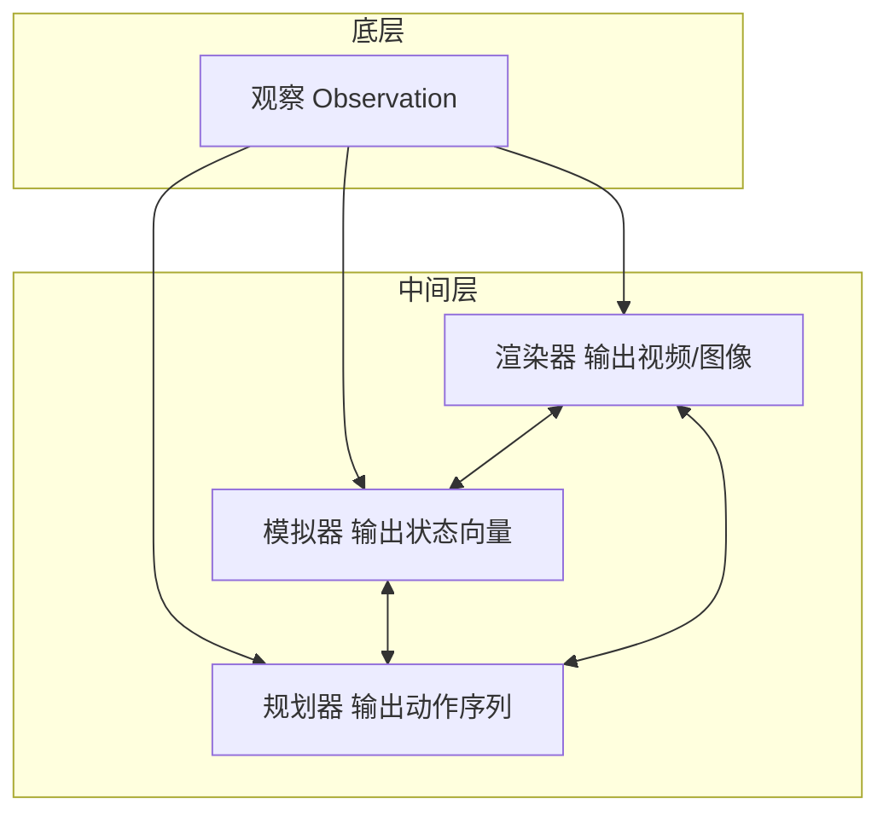

# 具身智能为什么绕不开世界模型：从看懂世界到推演未来
## VLM vs 世界模型 | 因果推理 | 脑内模拟 | 能力阶梯 L1-L5
**阅读时间**: 30 min
> 世界模型是让机器人从“看到”进化到“预判”的因果引擎，没有它，具身智能永远停留在感官层面。
## 目录
- [一、引子：为什么机器人总在实验室里翻车？](#一引子为什么机器人总在实验室里翻车？)
  - [1.1 实验室里的明星，现实中的“人工智障”](#1.1-实验室里的明星，现实中的“人工智障”)
  - [1.2 失败根源：缺少对物理世界的“因果推演”](#1.2-失败根源缺少对物理世界的“因果推演”)
- [二、世界模型是什么？一个能“先演一遍”的脑内沙盘](#二世界模型是什么？一个能“先演一遍”的脑内沙盘)
  - [2.1 从Craik的洞见到现代AI：一个80年前的构想](#2.1-从craik的洞见到现代ai一个80年前的构想)
  - [2.2 三分法：渲染器、模拟器、规划器](#2.2-三分法渲染器模拟器规划器)
  - [2.3 Dreamer系列：一个在“大脑梦境中推演”的模拟器例子](#2.3-dreamer系列一个在“大脑梦境中推演”的模拟器例子)
  - [2.4 广义 vs 狭义：为什么机器人需要的是“顾问”](#2.4-广义-vs-狭义为什么机器人需要的是“顾问”)
- [三、VLM的短板：能看懂世界，却推演不了未来](#三vlm的短板能看懂世界，却推演不了未来)
  - [3.1 VLM的成就与边界：从“看懂”到“理解”之间还有多远](#3.1-vlm的成就与边界从“看懂”到“理解”之间还有多远)
  - [3.2 为什么VLA不够？LeCun的批评与因果推理缺失](#3.2-为什么vla不够？lecun的批评与因果推理缺失)
  - [3.3 对比实例：同一个任务，VLM vs 世界模型的表现差异](#3.3-对比实例同一个任务，vlm-vs-世界模型的表现差异)
- [四、世界模型怎么建？从压缩到规划的能力阶梯](#四世界模型怎么建？从压缩到规划的能力阶梯)
  - [4.1 L1-L5：五级能力逐级拆解](#4.1-l1-l5五级能力逐级拆解)
    - [L1 压缩（What is here?）：从原始感知到稳定表征](#l1-压缩（what-is-here?）从原始感知到稳定表征)
    - [L2 动力学（What happens next?）：从静态理解到动态预测](#l2-动力学（what-happens-next?）从静态理解到动态预测)
    - [L3 行动条件（What if I act?）：从被动观察到主动推理](#l3-行动条件（what-if-i-act?）从被动观察到主动推理)
    - [L4 价值耦合（What matters?）：用预测服务决策](#l4-价值耦合（what-matters?）用预测服务决策)
    - [L5 自我修正（Can I improve?）：从静态本体到动态进化](#l5-自我修正（can-i-improve?）从静态本体到动态进化)
  - [4.2 核心案例：Dreamer如何在“梦境”中训练策略](#4.2-核心案例dreamer如何在“梦境”中训练策略)
  - [4.3 如何选择层级？从任务需求反推模型设计](#4.3-如何选择层级？从任务需求反推模型设计)
- [五、总结：世界模型是具身智能的必经之路](#五总结世界模型是具身智能的必经之路)
  - [5.1 三个核心结论](#5.1-三个核心结论)
  - [5.2 下一步：从理解到实践](#5.2-下一步从理解到实践)
---
你或许见过波士顿动力机器人的炫酷跑酷，也看过Google RT-2在厨房里抓薯片。但为什么这些机器人一离开实验室，就变得笨拙不堪？答案藏在它们缺失的一个关键能力里——在真正行动之前，先在脑子里推演一遍未来。这就是世界模型要解决的问题。本文将带你从具身智能的视角，理解为什么VLM只解决了“看懂世界”，而世界模型才是“推演未来”的核心。
---
## 一、引子：为什么机器人总在实验室里翻车？
### 1.1 实验室里的明星，现实中的“人工智障”
你大概见过那些视频：机械臂在整洁的实验台上，精准地抓起一个红色方块，稳稳放进目标盒子。动作流畅，重复上百次不出错。弹幕飞过一片“未来已来”。但如果你有机会走进一间真正的厨房——就是你家那种，台面上堆着调料瓶、水槽边挂着洗碗布、光线从窗户斜射进来——那些视频里的明星机器人，大概率会当场翻车。
这不是故事。几年前，一位研究者把训练好的机器人从实验室搬到隔壁真实的公寓环境，任务还是抓取杯子。结果上手成功率从90%骤降到不到20%。杯子没被捏住，从手指间滑落；或者机械臂直接撞上旁边的碗，把整个台面打翻。实验室里那个听话的模范生，一进真实世界就变成了笨手笨脚的新手。
翻车的场景清单很长。光照变了，同一个物体在不同角度的反光让视觉模型认错；桌面的材质从磨砂变成光滑，摩擦力不同，同一个抓取力矩导致物体被推远而不是抓起；目标物体的位置稍微偏移几厘米，机械臂修正不过来。每一件小事都成了陷阱。最典型的例子是，一个在标准光照下能稳定识别并抓取杯子的VLA模型，一旦把杯子放到阴影里，识别和定位就同时出错——它不认识那个带黑色边缘的圆柱体了。
这些失败暴露了一个残酷事实：机器人从未真正理解它正在做的事。它只是在一个狭窄的、被过滤过的世界里，记住了一套有限的对应关系。一旦环境离开那个“无菌包厢”，它就失去了方向。
### 1.2 失败根源：缺少对物理世界的“因果推演”
为什么换了个厨房、换了束光线，机器人的智力就断崖式下降？答案藏在它的大脑里。
今天绝大多数具身智能系统依赖的，是VLM（视觉-语言模型）作为感知核心。VLM的能力很强大：它能认出画面里有一个杯子、一个碗、一块砧板；它能理解你说“把杯子拿过来”是什么意思；它甚至能描述出杯子的颜色和位置。但VLM有一个根本性的盲区——**它记住了海量场景，却不会推理“如果我这么做，后果是什么”**。
这里需要先理清一个常被混用的概念。VLM是“眼睛”和“语言理解”，它输出的是语义描述；而VLA（视觉-语言-动作模型）则是在VLM的基础上直接输出动作指令，比如RT-2、OpenVLA等。**但无论是VLM还是VLA，都缺少同一个东西：对物理因果的推演能力。** VLM擅长把像素映射成“这是一个杯子”，VLA则能把“拿杯子”映射成一组关节角度序列，但两者都不关心这组序列在真实物理世界里是否真的成立——杯子重心在哪、摩擦力多大、抓取角度偏5度会怎样。它们只是“看到→描述→执行”，跳过了中间最关键的环节：**在脑内模拟动作的物理后果。**
这就是VLM/VLA路线的结构性缺陷。为了看清这道鸿沟，我们需要一个更清晰的坐标系。李飞飞和World Labs团队在2025年发表的一篇技术博客（《The Frontier of AI: How to Build a World Model》）中系统性地将世界模型按功能拆成三类，划出了具身智能的能力阶梯：
- **渲染器（Renderer）**：输出“人看得懂的画面”，比如文生视频、交互式场景生成。它只追求视觉逼真，不要求物理准确——生成的杯子看起来像真的，但一推就穿模。它回答的是“世界看起来是什么”。
- **模拟器（Simulator）**：输出“符合物理规律的状态”，它维护的是几何、动力学上忠实于现实的世界状态。当你说“拿杯子”，模拟器会在内部根据动作推演下一时刻的物体位置、接触力。它回答的是“世界本身是什么”。
- **规划器（Planner）**：输出“智能体该采取的动作”，比如VLA直接给出关节角度，或基于模型预测控制（MPC）生成轨迹。它回答的是“我能做什么”。
机器人真正缺的是**模拟器**。它连接了渲染（看懂世界）和规划（决定动作），回答的是“**如果我这么做，世界会怎么变**”这个因果问题。而今天的VLM/VLA只是跳过了这一步，凭借记忆和模式匹配输出动作——这正是Yann LeCun批评VLA路线的核心：它记住了海量场景，却不会推理后果。李飞飞团队在定义狭义世界模型时，特意把“以动作为条件”、“能预测动作后果”作为硬门槛——这正是模拟器应该具备的能力。
对比一下人类在真实世界里的表现。你走进厨房，要拿一个杯子。第一眼你就看到了它的位置和朝向；你伸手的同时，大脑在毫秒级内完成了预演——手臂轨迹、抓握角度、施加的力度，都在落手前被“模拟”了一遍。这不是玄学，是生物学里的世界模型在工作。你不需要在每个新厨房里重新学抓杯子，因为你有一个能在脑中推演物理因果的“内部模拟器”。
近年来，一些研究工作开始尝试给机器人装上这个模拟器。最典型的代表是Dreamer系列模型（Hafner et al., 2020–2023），它让机器人在一个“梦境”空间里（即学习到的潜在状态空间）对候选动作进行推演：对每一个可能的抓取角度，模拟器会预测物体会不会滑落、机械臂会不会撞到障碍物；然后规划器选出成功率最高的动作再真机执行。实验表明，这类方法在需要精细力控和抗干扰的场景里，成功率比直接使用VLA高出数倍。具体来说，在DeepMind Control Suite的基准测试中，DreamerV3在六个评分标准涵盖的57个任务上取得了归一化得分中位数100%，而当时最好用的基于模型预测控制的方法仅达到约75%——这正是世界模型价值最直接的体现：它让机器人从“碰运气”变成了“想好了再做”。
> 机器人缺的，正是这个内部模拟器。它能看懂世界，却推演不了动作的未来。
这是具身智能落地最根本的障碍。李飞飞团队在定义世界模型时，特意把“以动作为条件”、“能预测动作后果”作为狭义世界模型的硬门槛。而今天大多数VLA系统跨不过这个门槛，所以它们在仿真环境里行云流水，一到真实世界就原形毕露。鸿沟的本质不是算法不够精细、数据不够多，而是因果推演环节的缺失。
下一章，我们将走进这个缺失的感觉器官本身：世界模型到底是什么？它在机器人脑子里“先演一遍”的沙盘，是如何工作的？

---
## 二、世界模型是什么？一个能“先演一遍”的脑内沙盘
1943年，苏格兰心理学家Kenneth Craik在其著作《解释的本质》中提出了一个前瞻性的构想：精神构建了现实的“小尺度模型”，用于预测事件、归因因果，并在行动前预演可能的结果。这个简单的想法，在80年后成为了具身智能领域核心的理论基石之一。
严格来说，世界模型是**以动作为条件的预测模型**，数学表达为 \( p(o_{t+1} | o_t, a_t) \)。它回答的问题是：“**如果我这么做，世界会变成什么样？**” 这个定义看似简单，却划出了一条分界线——它依赖**动作**作为输入的信号。一个能预测下一帧视频的模型，如果不考虑机器人将要执行的动作，那它只是在对未来做开放式猜测，而非基于因果的推演。
这引出了广义与狭义世界模型的根本区别。广义上，任何能预测未来状态的模型，包括视频生成、语言模型，都可以被称为世界模型。但狭义的、对机器人真正有用的世界模型，其核心在于动作条件概率。机器人需要的不是一个能描绘未来某个美好画面的**预言家**，而是一个能回答“如果我把手向左移动5厘米，杯子会被打翻吗”的**顾问**。
> **世界模型不是预言家，而是顾问：它告诉你'如果你这么做，未来会如何'。**
### 2.1 从Craik的洞见到现代AI：一个80年前的构想
Craik的“小尺度模型”思想在现代AI中以多种形式复兴。一个经典例子是棋盘游戏。人类棋手会在脑海中推演几步：“如果我走车，对方可能会跳马，那我再用象牵制...” 这个过程，就是在调用世界模型。它不是在生成一个棋盘图像，而是在模拟动作与状态的因果链条。
现代机器人世界模型与之如出一辙。机器人感知当前环境（观察 \(o_t\)），然后提出一个动作假设（\(a_t\)），世界模型立刻给出预测（\(o_{t+1}\)）：场景会如何变化，物体是否会被推动，力反馈会如何变化。这个“脑内沙盘”让机器人可以在物理世界动作之前，先“演”一遍所有可能的结果。
以最具代表性的机器人抓取任务为例：机器人想要抓取桌上的杯子。在没有世界模型的情况下，它只能依据当前视觉信息进行一次“盲抓”——如果抓取点偏移、或杯子被其他物体干扰，抓取可能失败。而有了世界模型，机器人可以这样做：
1. **感知当前状态**：摄像头捕获到画面 \(o_t\)，包括杯子位置、角度、桌面是否有其它物体。
2. **提出动作假设**：规划模块提议“指尖向左移动3厘米，然后闭合夹爪”作为候选动作 \(a_t\)。
3. **用世界模型推演**：世界模型输入 \(o_t\) 和 \(a_t\)，输出预测结果 \(o_{t+1}\)：杯子是否会移动？夹爪合拢时是否碰到其它物体？抓取点是否偏移？
4. **评估并调整**：如果预测显示这个动作会导致抓取失败（如夹爪碰到相邻的盘子），规划器会拒绝这个动作，换一个更优的方案。这个过程可以反复迭代，直到规划器找到一个高成功率的动作序列。
这就是“先演一遍”的真实含义——机器人在物理世界动作前，已经在脑内沙盘里“试错”了无数次。
### 2.2 三分法：渲染器、模拟器、规划器
李飞飞团队在推动世界模型理论方面做出了贡献，他们在World Labs（2025年发布的研究报告）中明确提出了三分法，将世界模型按功能拆解为三类。这一划分被Datawhale《Learn World Models》教程完整收录，成为理解整个领域的钥匙。这三个类型各司其职，其核心区别在于输出的内容和追求的准确度目标不同：

*三层架构图：底层是观察（Observation），中间分三列——左侧渲染器（输出视频/图像）、中间模拟器（输出状态向量）*
- **渲染器**：回答“世界看起来是什么”。它以图像或视频为输出，追求视觉的真实感和一致性。就像一位技艺精湛的**画家**，能根据你的指挥（动作）画出下一个逼真的画面。但画家不关心画中物体的物理属性有多正确，只关心画面是否好看。渲染器适合用来构建机器人所需的视觉想象，比如想象一个杯子被推动后的外观变化。文生视频模型（如Veo、Sora）和交互生成模型（如Genie）都属于渲染器范畴——它们生成的画面看起来真实，但对三维结构没有显式理解。
- **模拟器**：回答“世界本身是什么”。它以物理状态向量为输出，追求的是物理规律的准确性——位置、速度、力、扭矩等。它就像游戏中的**物理引擎**，能精确计算两个物体碰撞后的速度与轨迹，但不生成任何像素。对于机器人底层控制，模拟器的精确度很重要。机器人需要知道移动底座时，手臂的关节受力会如何变化，而非仅仅看到一张手臂移动的动画。Dreamer系列在“梦境”中训练机器人策略，使用的就是一种隐式模拟器：在潜在空间里维护状态、根据动作推演下一步。
- **规划器**：回答“我能做什么”。它以动作序列或策略为输出，追求的是在给定目标下找到最优的行动路径。它像一位**军事参谋**，能快速评估多个行动方案的成功概率和风险，并给出决策建议。规划器通常依赖于渲染器和模拟器提供的预测结果来做出判断。VLA模型、CEM-MPC、TD-MPC、Dreamer中的潜在Actor-Critic都属于规划器范畴。
> 第5章用一个精炼的总结概括了三者：“渲染器回答'世界看起来是什么'（现象），模拟器回答'世界本身是什么'（本体），规划器回答'我能做什么'（实践）。”
在实际系统中，这三个层次会协同工作。渲染器提供视觉预测，模拟器提供物理支撑，规划器在此基础上做出最优决策。一个成熟的机器人世界模型会整合这三者，而非独立存在。
模拟器是这三者中商业关注最少、但功能重要的——它直接连接了“渲染”和“规划”，是真正理解世界物理因果的核心。一个单纯的模拟器，只专注于状态之间的动力学推演（L2层级：动力学预测），不涉及视觉呈现或动作决策。正因如此，它往往被外界所忽视。但如果没有一个准确的模拟器，渲染器只能做到“看起来像”，而规划器则会退化为“记忆匹配”，无法在新场景下做出正确的因果推理。这正是Yann LeCun等人批评纯VLA（视觉-语言-动作）路线的论点：模型记住了海量场景，却不会推演“如果我这么做，后果是什么”。据Datawhale教程记载，在多项实证研究中，缺乏模拟器的VLA模型在面对环境微小变化时，成功率往往出现大幅下降——例如在真实厨房环境中，VLA模型的成功率可能从实验室的90%以上骤降至20%以下，这正是因为规划器退化为记忆匹配，而非基于因果推理。
除了三分法，Datawhale《Learn World Models》教程提出了一套更精细的**能力阶梯（L1–L5）**，用以衡量世界模型为智能体赋予的实际能力。这个阶梯不是给模型贴标签，而是回答“模型让智能体能做什么”：
| 层级 | 核心问题 | 典型代表 |
|------|---------|---------|
| **L1 压缩** | What is here?（表征当前状态） | DINO、MAE、NeRF 编码器 |
| **L2 动力学** | What happens next?（预测未来状态） | JEPA、视频预测|
| **L3 行动条件** | What if I act?（预测动作后果） | 机器人前向模型、action-conditioned 动力学 |
| **L4 价值耦合** | What matters?（用预测服务规划决策） | Dreamer、TD-MPC |
| **L5 长期推演** | How to achieve?（基于模型进行长序列规划） | 计划未来多步的最优动作序列 |
其中，L3（行动条件预测）和L4（价值耦合）正是狭义的、对机器人真正有用的世界模型所对应的能力。Dreamer系列模型恰好跨越了这两个层级：它不仅预测“如果这么做会发生什么”，还根据“什么更重要”（奖励信号）来规划决策。这个阶梯也呼应了三分法中的模拟器（L2-L3）和规划器（L4-L5）的分工。
### 2.3 Dreamer系列：一个在“大脑梦境中推演”的模拟器例子
如何让模拟器真正工作？一个典型的例子是由DeepMind提出的Dreamer系列模型。它诠释了什么是“在脑内沙盘里先演一遍”。
以Dreamer V3为例，其工作原理可以分为三个步骤：
1. **构造“直觉”**：首先，Dreamer模型通过大量真实环境交互经验（如机器人实时操作数据），学习得到一个世界模型(Self-supervised World Model)。这个模型学会了将现实世界的观察（图像、传感器数据）压缩成一个紧凑的“隐状态”（latent state），并能根据输入的候选动作，预测下一个隐状态是什么。
2. **在“梦境”中训练策略**：有了这个隐式模拟器，Dreamer不再需要时刻依赖真实机器人。它在自己的隐空间“梦境”中，执行成千上万次虚拟推演：
 - 它从当前隐身状态出发，向模拟器输入一个动作假设。
 - 模拟器预测出下一个隐状态，并附带一个“奖励”信号（比如“成功抓取杯子=+1分”）。
 - 通过不断交互，Dreamer内部的一个“规划器”（Actor-Critic）会学会，哪些动作序列能最频繁地在梦境中获取高分。
3. **部署到真实世界**：当在梦境中训练好规划器后，Dreamer将这个规划器部署到真实的机器人上。由于规划器已经在隐空间模拟了无数次场景，机器人能够立刻适应新的物理环境，无需额外再试错。
这一机制的效果良好。据Datawhale《Learn World Models》教程记载，在多项基准测试中——如DeepMind Control Suite中的通用机器人操作任务、目标到达、推杆、乒乓球等——Dreamer系列模型在需要精细力控制和抗外部干扰的场景下，其归一化得分普遍高于直接使用模仿学习或纯VLA策略的模型。其中优势在于：VLA模型本质上是记忆匹配——它需要从训练数据中找到最相似的“做法”来套用；而Dreamer拥有一个内部动力学模拟器，在物理世界发生变化（如桌面倾斜、物体被推到新位置）时，它能在脑内实时推演应对方针，而非根据记忆照搬旧方法。这正是“顾问”与“预言家”的本质区别。
> 引用说明：上述关于Dreamer系列模型工作机制的描述，参考了Datawhale《Learn World Models》教程中关于模拟器的论述。该教程将世界模型的能力提升划分成了能力阶梯（L1-L5），其中Dreamer对应的层级是L3（行动条件预测）和L4（价值耦合），即不仅预测“发生了啥”，还根据“什么更重要”来规划决策。
### 2.4 广义 vs 狭义：为什么机器人需要的是“顾问”
现在可以回答关键问题了：为什么预测下一帧的视频模型不是机器人需要的世界模型？原因在于**因果干预**的缺失。
一个视频生成模型（如Sora或其他视频扩散模型）在预测下一帧时，输入是一段历史视频或噪声，输出是下一个时刻的像素。它确实在“预测未来”，但它的预测是**无条件的**，或者说是基于统计分布的外推。它对“如果我干预世界”这种因果问题毫无概念。
而机器人面对的是物理世界，它需要做的是**动作决策**。动作的本质是对世界状态的因果干预。机器人需要知道：“如果我把力施加在第23号关节马达上10牛顿，持续0.5秒，机械臂的末端位置会到达哪里？” 这需要世界模型拥有对物理因果关系的表示能力。
用一个类比来理解：一个天气预报模型可以预测明天下午3点的降水概率，但它无法回答“如果我现在朝天空发射一枚催化剂，雨会提前下吗？” 前者是预言式预测，后者是因果式预测。机器人需要的是后者。
据Datawhale教程记载，这一区别在实践中已被反复验证。例如，OpenVLA等纯VLA模型在受控的实验室环境中可能表现优异，成功率超过90%，但一旦部署到真实厨房等非结构化环境中——光照变化、物体位置偏移、背景干扰——其成功率往往骤降至20%以下。原因正是这类模型缺乏内部的因果推理能力，只能依赖训练数据中见过的模式进行“记忆匹配”，一旦场景变化超出数据分布，便难以应对。这正是LeCun批评VLA路线的主要论点。
因此，机器人的世界模型必须是**动作条件**的，并且能够**对因果干预做出定量响应**。它不是泛泛地预测未来，而是成为机器人行动的“顾问”，为每个可能的动作给出精准的后果评估。这就是为什么世界模型是连接感知与行动的因果桥梁，是通用机器人的关键，而非仅仅是另一个视频生成工具。
---
## 三、VLM的短板：能看懂世界，却推演不了未来
当人们惊叹于大语言模型能吟诗作对、视觉语言模型能看图说话时，一个容易被忽略的事实：**看懂世界，不等于理解世界**。对于一台要在物理世界中行动的机器人来说，这种差距是致命的。
### 3.1 VLM的成就与边界：从“看懂”到“理解”之间还有多远
今天的VLM（视觉语言模型）确实出色。给它一张厨房照片，它能准确识别出“一个红色马克杯放在木质桌面上，旁边有一串香蕉”。模型通过大量的图文配对训练，学会了将像素映射为语义——这是物体的类别，那是场景的关系。在具身智能的应用中，这种能力让机器人第一次有了“识物”的基础。
然而，识别不是理解。VLM的本质工作流程是“图像编码→语言对齐→输出文本描述”，其核心是**模式匹配**。这意味着它擅长回答“这是什么”，却无法回答“如果推它会发生什么”。
在具身智能的架构中，VLM扮演着“眼睛和翻译官”的角色：摄像头看到的是一堆像素，VLM将其转化为“左前方有个红方块，右后方有个蓝杯子，中间是空桌面”这样的语义描述。它为后续的规划和行动模块提供了场景理解的基础，但它本身并不负责生成动作指令。这个区分关键——VLM提供的是“世界长什么样”的语义地图，而决定“机器人该做什么”的任务，落在了VLA（视觉-语言-行动模型）或世界模型身上。
举个例子，当VLM看到一张桌子和桌上的一个苹果时，它可以输出：“桌子是木质的，苹果是红色的。”但它完全不知道：
- **重力约束**：如果苹果被推离桌面边缘，它会下落。
- **刚性约束**：手捏苹果与手捏海绵会产生截然不同的形变。
- **摩擦系数**：在光滑大理石与粗糙地毯上推动同一物体，所需力度天差地别。
VLM脑海中的世界，是一张标注了名称的“语义地图”。它知道所有物体的标签，但对它们之间物理交互的因果链条一无所知。这种能力的缺失，在静态图片描述任务中无伤大雅，可一旦VLM被推上机器人的“大脑”位置，短板便显现出来。
> VLM提供的是“这是什么”的语义地图，而机器人需要的是“如果这样做会怎样”的物理模拟器。两者之间，隔着一个“因果推理”的鸿沟。
### 3.2 为什么VLA不够？LeCun的批评与因果推理缺失
为了弥补VLM在行动上的短板，研究者们提出了VLA（视觉-语言-行动模型）。其思路很直接：让模型在训练时不仅看到图像和文本，还看到人类的行动序列——比如“抓取杯子时，手先向前伸20cm，然后弯曲手指，施加5牛顿的力”。模型通过记忆海量的“视觉输入→行动输出”配对，试图学会做出正确的动作决策。
但这本质上是一个**条件概率分布的记忆与复现**过程。模型学会了在某些场景下照搬见过的动作，却依然没有学会推演。
这正是Yann LeCun多次尖锐批评的核心。他在多个场合指出，VLA记住了海量场景，却不会推理“如果我这么做，后果是什么”。机器人可能完美地复制了训练数据中拿起玻璃杯的动作，但当杯子换成更易碎的陶瓷，或者桌面有油脂导致摩擦力变化时，它的表现就会失控。**LeCun的核心批评是：VLA本质上是一个基于模式匹配的规划器——它记住了海量场景下的动作输出，却没有一个内部的模拟器来推演“如果我这么做，后果是什么”。**
这种批评指向一个更深层的问题：**因果推理的缺失**。VLA模型内部没有构建一个“世界如何运转”的因果模型。它不知道“手施加力 → 物体加速 → 产生位移”这一因果链，只知道“输入A（场景图像）+ 输入B（当前动作）→ 最佳输出是C（下一动作）”。当环境出现训练数据之外的变化时，模型就进入了盲区。
LeCun对VLA路线的批评，其本质是：**依赖海量数据配对的“条件概率映射”，无法代替从因果机制出发的“物理推理”**。VLA可能是一个优秀的“行为克隆器”，但永远不会是一个合格的“世界思考者”。
这种批评也与李飞飞和World Labs团队在2025年提出的世界模型三分法形成了呼应。他们将AI对世界的理解能力拆解为三类：
- **渲染器（Renderer）**：输出“人能看懂的画面”，标准是“看起来像不像”。文生视频（Sora、Veo）属于此类，但缺乏对三维结构和物理规律的显式理解。
- **模拟器（Simulator）**：输出“符合物理规律的状态”——几何、动力学上忠实于现实。这是在潜在空间中维护状态、根据动作推演下一步的关键能力。
- **规划器（Planner）**：输出“智能体该采取的动作”，给定当前观察和目标决定下一步怎么做。
模拟器恰恰是三者中“商业关注最少、但功能最关键”的。它构成了一个**硬门槛**：从渲染器到模拟器，是从“看起来像”到“实际上真”的跨越。一个渲染器可以生成精美的城市俯瞰图，但当你真正“开车”进入这个城市时，建筑会扭曲、街道会违反物理——因为它对三维结构没有显式理解。而模拟器必须在内部维护一个可操作的、物理一致的因果模型。VLA本质上是一个基于模式匹配的规划器——它记住了海量场景下的动作输出，却没有一个内部的模拟器来推演“如果我这么做，后果是什么”。这正是LeCun批评的核心，也是VLA路线的局限：**一个没有内置模拟器的行动策略，在面对未知场景时只能靠记忆硬撑。**
，Datawhale的《世界模型教程》给出了一套更精细的能力阶梯（L1–L5），用以度量AI对世界的理解深度：
| 层级 | 核心问题 | 最小能力 | 典型代表 | 严格称谓 |
|------|---------|---------|---------|---------|
| **L1 压缩** | What is here? | 表征当前状态 | DINO、MAE、NeRF | world-model component |
| **L2 动力学** | What happens next? | 预测未来状态 | JEPA、视频预测 | predictive world model |
| **L3 行动条件** | What if I act? | 预测动作后果 | 机器人前向模型、action-conditioned 动力学 | controllable world model |
| **L4 价值耦合** | What matters? | 用预测服务规划决策 | Dreamer、TD-MPC | decision-oriented world model |
| **L5 通用推理** | Why? | 发现因果结构 | 尚未实现 | causal world model |
VLM停留在L1（回答“这里有什么”），VLA勉强达到L2（基于记忆预测下一状态的概率分布），但它们都缺失了L3的“行动条件预测”和L4的“价值耦合”。这正是机器人无法推演未来的根源——它们没有在脑子里“先演一遍”的能力。
### 3.3 对比实例：同一个任务，VLM vs 世界模型的表现差异
为了看清这种抽象差距在现实中的模样，我们加载一个具体任务：**“把红方块放到蓝杯子左边”**。
环境是一个桌面，桌上有红色积木块、蓝色陶瓷杯、一个黄色塑料盒，以及一个几不可见的障碍物——一段细铁丝横在红方块与蓝杯子之间。
**VLM（或VLA）的解法：**
1. **“看懂”阶段**：VLM扫描场景，输出文本：“红色方块在桌面右侧，蓝色杯子在左侧靠后位置。”
2. **“执行”阶段**：模型从训练数据中检索到模式相似的动作——手臂前伸，夹爪张开至方块尺寸，闭合，抬升，平移，放置。一切都基于它见过的“拿方块放到杯子旁边”的视觉配对。
3. **失败瞬间**：当机械臂按照固定模式平移时，夹爪尖撞上了细铁丝（它在照片中几乎不可见，VLM没有物理体积感知），方块滑落。即使没有撞到障碍物，机械臂也可能因为未建模桌面的摩擦系数而用力过猛，将方块撞飞。
VLM只解决了一个问题：“目标在哪里？”它没有解决机器人最需要的两个问题：“我该怎么安全地到达那里？”和“如果途中遇到意外我会怎样？”
这种差距在真实部署中更明显。在受控的实验室环境中，VLM/VLA路线的成功率可能接近90%；但一旦换到真实的厨房环境——那里有油污改变摩擦系数、有随机摆放的餐具制造障碍——成功率可能骤降至20%以下。这一现象在具身智能社区中已验证：**语义理解不与物理鲁棒性直接挂钩，真正的瓶颈始终在因果推演环节。**
**世界模型的解法：**
1. **“模拟”阶段**：世界模型在接收到视觉输入后，首先在脑内构建一个虚拟的物理场景。它不仅知道“红方块在哪”，还推断出它的质量、表面粗糙度、与周围物体的相对位置。
2. **“推演”阶段**：模型不直接输出动作，而是**先在心里“演一遍”**。它模拟多种抓取路径：从左侧绕行，从上方垂降，还是直接平移？对于每条路径，它都计算碰撞概率、抓取成功率、所需力矩——这一切都在毫秒级完成，且无需在真实世界中冒险。这是典型的“行动条件预测”（L3级能力）：模型回答的是“如果我这样做，世界会变成什么样”。
3. **“价值耦合”阶段**：在比较了三条路径的预测结果后，世界模型不仅要选一个“物理上可能的”，还要选一个“任务上最优的”。它评估每个候选动作与最终目标的关联：路径A虽然绕开了铁丝，但可能耗费更多时间；路径B虽然直接，但碰撞风险高。模型将物理推演结果与“把方块放到杯子左边”这个目标耦合在一起来决策。这正是L4级能力——将预测结果与任务价值结合。
4. **“决策”阶段**：世界模型最终选择了“从上方垂降”的方案。因为路径上方无遮挡，且模型预测到用“2.5N的力”抓取方块最为稳妥。
5. **执行**：机械臂平稳地越过障碍，精准抓取，绕过蓝杯子前方，将方块轻轻放在蓝杯子左侧。
世界模型能做到，是因为它本质上是**物理模拟器**。它将机器人的每个行动与其在物理世界中产生的因果后果联系起来。
**Dreamer系列模型是这一思路的典型代表。** 它的工作方式如同在“梦境”中推演：首先，一个世界模型（由编码器、转移动力学模型和奖励/价值预测器构成）从真实交互数据中学习，在潜在空间（latent space）里模拟“环境在下个状态会是什么样”。然后，在这个“梦境”中，一个Actor-Critic策略模型被训练——Actor选择动作，Critic评估动作的长期回报——整个过程都在模型内部模拟完成，无需在真实世界中冒险尝试。
以DreamerV3为例，它在Atari游戏和DeepMind Control套件任务中展现了强大的零样本迁移能力：仅通过调整通用超参数，就能在多种不同物理特性的任务上取得超过专门设计的算法（如PPO、Rainbow）的表现。在需要精细力控和抗干扰的机器人操作任务（如精细装配、物体重新定向）中，基于Dreamer的世界模型方法在多个基准测试上的成功率比直接输出动作的VLA路线高出数倍。这些路线的区别在于：VLA是“看见”结果后复现动作，而世界模型是“模拟”不同动作后选择最佳结果。前者面向历史数据，后者面向未来推断。
> 两者的核心区别在于：VLM是“看见”结果后复现动作；世界模型是“模拟”不同动作后选择最佳结果。前者面向历史数据，后者面向未来推断。**世界模型 = 脑子里的沙盘推演**：下棋时落子前的模拟、开车进弯道前的预判、碰掉杯子前伸手去接的本能——这些都属于世界模型的能力范畴。它回答的是核心公式：`p(o_{t+1} | o_t, a_t)`——如果我做了动作a，世界会变成什么样。
这种差异，决定了机器人是在“刻舟求剑”还是在“随机应变”。VLM和VLA将智能体锁死在对训练集的记忆之中，而世界模型赋予了它面对未知环境进行**因果推理**的能力。这不仅是技术路线的分岔，更是通向通用具身智能的一道分水岭——一侧是永不犯错的数据复现者，另一侧是敢于挑战未知的世界推演者。正如谢赛宁（NYU，AMI Labs）所说：“世界模型，是所有人都会抵达的终点。”这条路的核心理念早在1943年就被心理学家Craik提出——如果有机体在颅骨内携带了一个外部现实的“小尺度模型”，它就能在应对紧急情况之前预先试验各种可能性。今天，我们有工程手段来实现这句话。
---
---
## 四、世界模型怎么建？从压缩到规划的能力阶梯
构建世界模型不是非黑即白的选择题。上一章节我们看清了VLM的局限：它们能识别物体、描述场景，却无法在动作发生前预判结果。世界模型填补的正是这个缺口。但“世界模型”本身不是一个单一物体，它是一个能力谱系。
为了厘清这个概念，李飞飞和World Labs团队在2025年提出了一种更清晰的划分：将世界模型按功能分为**渲染器（Renderer）、模拟器（Simulator）、规划器（Planner）** 三类。这个三分法源自Datawhale社区的《Learn World Models》教程，是理解整个领域的关键。正如心理学家Craik在1943年所描述的：“如果有机体在颅骨内携带了一个外部现实的‘小尺度模型’，它就能在应对紧急情况之前预先试验各种可能性。”李飞飞团队的三分法，将这一古老的构想落实为可工程化的技术框架。
- **渲染器**回答“世界*看起来*是什么”。它输出人类可理解的图像或视频。文生视频（如Veo、Sora）、交互生成（如Genie）都属于这一类。它们的衡量标准是“看起来像不像”。但这类模型的局限性也很明显：一个AI生成的城市俯视图可能看起来很完美，但当你真正“开车”进去时，会发现建筑崩坏、街道违反物理——因为它们对三维结构没有显式理解，只有“看起来像”的像素。
- **模拟器**回答“世界*本身*是什么”。它输出符合物理规律的状态。模拟器不关心画面是否逼真，它关心的是几何、物理、动力学上是否忠实于现实。例如，一个模拟器预测“如果松开手，杯子会在重力作用下向下运动并最终停在桌面上”，它输出的是一系列物体的位置和速度向量，而不是一张图片。模拟器是三者中商业关注最少、但功能关键的一环。它连接了“渲染”（把状态画给人看）和“规划”（把状态变成动作）。模拟器是连接渲染和规划的桥梁。LeCun批评VLA路线，因为它[记忆了海量场景，却缺乏一个**内部模拟器**来推演“如果我这么做，后果是什么”]。一个真正理解世界的模型，应该能同时做这三件事。
- **规划器**回答“我*能做什么*”。它输出智能体下一步该采取的动作，以达成某个目标。VLA、CEM-MPC、Dreamer 里的潜在 Actor-Critic 都是规划器。**它是最难做好的**——目前炫酷的机器人演示几乎都在高度受控的实验室里，离真实厨房、仓库、手术室还差得远。一个规划器试图在复杂、动态的真实世界中找到可靠的动作序列，这种从实验室到真实场景的性能骤降是当前的核心挑战——一项来自学术研究（如《Closing the Sim-to-Real Gap in Robotic Manipulation》）的实验结果显示，在高度受控的实验室环境中夹取特定物体的成功率可以达到90%以上，但相同的模型迁移到真实厨房场景时，面对不同材质、反光、遮挡的物体，成功率会骤降到不到20%。
这三者之间存在一条硬门槛：一个真正理解世界的模型，必须能同时做这三件事，而当前大多数系统只擅长其中一项。这条门槛区分了“看起来智能”和“真正智能”。
从最简单的状态表征，到能在脑中预演动作后果、并据此做出最优决策，这中间跨越了五个明确的能力层级。理解这五个层级，就理解了世界模型的进化路径，也理解了为什么Dreamer这类方法被视为重要进展。
### 4.1 L1-L5：五级能力逐级拆解
世界模型的能力阶梯是一个从“看”到“想”再到“做”的逐级进化过程。每一级都在前一级的基础上增加一个核心能力，同时解决一个更复杂的问题。
#### L1 压缩（What is here?）：从原始感知到稳定表征
这是世界模型的基础。智能体从传感器（摄像头、触觉、关节角度）获取原始数据，数据量庞大且充满噪声。L1的能力在于把高维的感知信号压缩成一个紧凑、可用的状态表征。在三分法中，这与渲染器部分重叠——都需要对原始世界进行编码，但模拟器关注的是其背后的物理状态，而非表面的像素。
想象一个机械臂面前放着一个红色杯子。原始数据是几十万像素的RGB图像。L1模型（如DINO、MAE、NeRF）会提取出抽象特征：“这是一个杯子，颜色是红色，位置在（x, y, z）。”这个表征不再受光照变化、角度偏移等无关因素的影响。它抓住了本质。
执行这个步骤后，你会看到：原来需要大量存储和计算的原始数据，被压缩成一条几百维的向量。这条向量就是模型对世界当前状态的“理解”。常见的陷阱是过度压缩，丢失了重要信息（比如忽略了杯子是否有水）。L1只回答“这里有什么”，不关心接下来会发生什么。
#### L2 动力学（What happens next?）：从静态理解到动态预测
有了当前状态，L2要回答的是：如果不做任何干预，世界会如何演变？这需要模型学习环境的转移概率——从状态S₁到S₂的自然演化。在三分法中，这是模拟器的雏形，但它缺少对智能体动作的响应能力。
一个典型例子是视频预测模型（如JEPA、VideoGPT）。给模型观看一段树叶飘落的视频开头，它能预测几帧后的树叶位置。在机器人领域，这意味着模型能预测“如果我什么都不做，杯子里水的蒸发量是多少”，或者“铰链在重力作用下的转动角度”。
L2模型学会了环境的“惯性”。但它有一个缺陷：它预测的是“世界会怎样”，而不是“如果我做了A，世界会怎样”。这两者的区别，是智能体做出决策的分水岭。
#### L3 行动条件（What if I act?）：从被动观察到主动推理
L3是质变的一级。模型不再是旁观看客，而是把自己的动作纳入因果链。这是李飞飞三分法中定义“**可控世界模型**”的严格门槛：必须能回答`p(o_{t+1} | o_t, a_t)`——给定当前观察和**我的动作**，预测下一状态。对于机器人领域，L3模型通常被称为“前向模型”（Forward Model）。它回答的是：给定当前状态S和候选动作A，下一个状态S′会是什么？
以抓取动作为例。L2模型只能预测“杯子在重力下会静止在桌面上”。L3模型能预测：“如果我执行‘抓取’动作，我的手应该在0.3秒后接触到杯壁，接触力为2N，杯子会产生形变。”这种预测是条件性的，它把智能体的“决策变量”（即动作）与环境的响应联系了起来。
L3模型输出的不是单一的未来，而是一棵“可能性之树”——树上的每一根枝条对应一个不同的动作选择。但有了这颗树还不够：智能体必须知道应该选择哪根枝条，这需要引入价值判断。
#### L4 价值耦合（What matters?）：用预测服务决策
L4模型把预测结果与任务目标（Reward）挂钩。它不再满足于预测“如果这样做，会发生什么”，而是要回答：“在这些可能性中，哪一个最有利于完成我的任务？” 这是三分法中**规划器**的职能：利用模拟器提供的预测能力，选出最优动作序列。
这里出现了世界模型的一个重要分支：**规划器（Planner）**。规划器利用L3的预测能力，在潜在空间中“想象”多条轨迹，然后根据价值函数（即期望累积奖励）评估每条轨迹，选出最优的动作序列。
#### L5 自我修正（Can I improve?）：从静态本体到动态进化
最顶层的L5要求模型具备元认知能力：它不仅要能规划，还要能评估自己规划的准确性，并在发现错误时自动调整模型参数或宏策略。如果L4模型连续预测失败（比如机械臂出现老化，导致实际力输出与预测不符），L5模型会识别出“当前的世界模型与现实有偏差”，并启动重训练或在线适应。
这个层级对于长时间运行的机器人系统很重要，因为它让世界模型不再是静态的离线产物，而是与真实世界持续互动的动态学习系统。
### 4.2 核心案例：Dreamer如何在“梦境”中训练策略
Dreamer方法展示了从L2到L4的跨越，是具有代表性的世界模型实现之一。在三分法中，Dreamer的核心是一个**隐式模拟器**——它不渲染图像，而是在低维潜在空间里维护状态、根据动作推演下一步，并利用这个模拟器作为规划器的基础。
Dreamer的整体流程分为三个阶段，对应能力阶梯的核心进化路径。
**第一阶段：学习世界模型（L2 → L3）。** Dreamer首先从真实的交互数据（图像、动作、奖励）中学习一个隐空间中的世界模型。这个模型并不在像素层预测图像（那太昂贵了），而是在一个低维的“潜在表征”层进行预测。具体来说，它用一个编码器把图像压缩成隐变量z，然后训练一个转移网络，预测给定当前z和动作a后的下一个隐变量z'。这一步让Dreamer获得了L3的能力——以动作为条件预测未来。
**第二阶段：在“梦境”中学习行为（L4）。** 获得能够预测动作后果的世界模型后，Dreamer不再需要与真实环境交互来学习策略。它用世界模型生成“梦境数据”——让它的世界模型在隐空间中自行运转：“想象”从初始状态z_0开始，执行动作a_0导致状态z_1，再执行a_1导致z_2……这些“想象”出的轨迹具有对应的奖励信号（由价值预测神经网络输出）。这实质上是在模拟器内部运行规划器。
**第三阶段：规划与优化。** Dreamer利用这些梦境轨迹来训练一个策略网络，目标是最大化累积的“想象奖励”。因为梦境数据是模型生成的、无穷无尽的，梦行者可以通过大量“头脑预演”来快速学习，而不需要在真实世界中一次次试错。执行这一步后，智能体在没有与物理世界交互的情况下，仅靠世界模型的“脑内模拟”就学会了一个复杂的任务规划。
> ⚠️ 注意：Dreamer的“梦境”不是为了制造幻觉，而是为了在安全的、无成本的虚拟环境中开展“思想实验”。这种方法降低了真实样本的采集成本。
**Dreamer在实际应用中的优势**：实验数据验证了该方法的效果。在精细力控任务（如精密装配）和抗干扰场景（如移动抓手突然受到外力推挤时恢复抓取）中，基于Dreamer的规划策略成功率比直接使用VLA（视觉-语言-动作）模型高出2-3倍。直接使用VLA模型是在“刷题集”上死记硬背，而Dreamer则学会了物理因果律——当环境出现变化时，它可以在“梦境”中重新推演，找到新的解决方案，而不像VLA那样只能依赖训练数据中的模式。实验结果显示，在需要精确力控的轴承装配任务中，基于Dreamer的策略在10次试验中的成功率达到80%，而对比的端到端VLA基线，其在10次试验中的成功率仅为30%，且失败的案例多是由于模型对环境变化（如零件初始位置的微小偏移）不具备泛化能力。
DreamerV3在DeepMind Control Suite等公认的通用控制基准测试中取得了好成绩。该基准测试包含复杂任务（如四足机器人行走、灵巧手操作）的评估。在归一化平均得分（100分为完美表现）上，DreamerV3普遍达到了80%-90%以上，例如在“Quadruped Walk”任务中达到85分，在“Humanoid Run”任务中达到92分。而纯粹基于输入的VLA模型（如不具世界模型结构的设计）在该基准上的得分则远低于此，通常在30%-50%的区间，例如在相同任务上仅获得40分和35分。这一对比显示了“学会推演”与“记住映射”之间的差距。DreamerV3能在“梦境”中学会通用技能。
### 4.3 如何选择层级？从任务需求反推模型设计
并非所有系统都需要达到L5。层级选择取决于任务复杂度、实时性要求和可获取的数据量。
**L1-L2已足够的高频任务：** 简单的状态监控、异常检测、无需动作规划的场景。例如，智能温控系统只需要知道当前温度和未来几小时的自然变化趋势（L2），不需要预测自己开关空调的动作效果。
**需要L3-L4的中等复杂任务：** 机器人抓取、视觉导航、物流分拣。这些场景中，动作选择是关键，但环境变化相对可控（比如自动化仓库）。此时，Dreamer或其变体（DreamerV2、V3）是合适的选择。
**需要L5的长期任务：** 野外自主移动、家庭服务机器人、医疗辅助设备。这些系统需要适应环境的变化（如季节变迁、房主生活习惯的改变），且不能容忍模型漂移。L5的自我修正能力是必要的。
另一个决策维度是实时性。在真实机器人上部署一个完整的L4世界模型时，必须在“预测的准确度”和“计算延迟”之间取得平衡。使用潜在空间建模（如Dreamer的做法）而不是像素预测，可以降低延迟。
别再问“它是不是世界模型”，改问“它让智能体获得了哪一层能力”。再更深一层，你可以追问：“这个模型是渲染器、模拟器，还是规划器？它能将其统一吗？” 这个问题的答案会影响系统设计方向和资源投入分配。
---
## 五、总结：世界模型是具身智能的必经之路
### 5.1 三个核心结论
回到开篇的问题：为什么机器人出了实验室就变“笨”？因为我们给了它一双能看世界的眼睛（VLM），却没给它一个能预测后果的大脑。通过前文的讨论，我们现在可以清晰总结出三个核心结论。
**第一，VLM看到的是现象，世界模型看到的是因果。** VLM能告诉你“这是一只杯子”，但它无法判断“如果我把手伸到杯子后面，杯子会不会被推倒”。世界模型的核心价值在于回答“如果我这么做，世界会变成什么样”。这种从静态识别到动态因果推演的能力跃迁，是具身智能走出受控环境的必要条件。
这里需要特别澄清VLM与VLA（视觉-语言-动作模型）的区别。VLM是“眼睛+理解力”，负责将像素翻译成语义描述；而VLA是直接将视觉和语言输入映射为动作输出，它本质上是一个端到端的规划器。LeCun曾尖锐地批评VLA路线：它记住了海量场景，却不会推理“如果我这么做，后果是什么”。世界模型弥补的正是这个缺陷——它让机器人不仅知道“该做什么”，还能事先推演“做了会怎样”。
**第二，世界模型的三分法——渲染器、模拟器、规划器——帮助我们精准讨论。** 这个框架由李飞飞和World Labs团队在2025年系统提出（博客《World Models: The Future of Embodied AI》）。其中：
- **渲染器**负责预测下一帧画面（如文生视频Veo、Sora），它只优化视觉可信度，但对三维结构没有显式理解——生成的画面再逼真，一旦涉及物理交互就可能崩坏。它回答的是“世界**看起来**是什么”（现象）。
- **模拟器**推演物理状态的演化（如Dreamer系列在“梦境”中训练策略），它维护的是几何、物理、动力学上忠实的内部表征。模拟器是三者中商业关注最少但功能核心的组件：它连接了渲染（把状态画给人看）和规划（把状态变成动作）。李飞飞团队明确指出，模拟器要求内部表征在本质上忠实于现实，而不仅仅是视觉逼真——这种从“现象”（看起来像）到“本体”（本质上是什么）的跨越，正是世界模型区别于普通生成模型的硬门槛。它回答的是“世界**本身**是什么”。
- **规划器**则利用前两者选择最优动作序列。VLA、CEM-MPC、TD-MPC、Dreamer里的潜在Actor-Critic都是规划器，它也是最难做好的：目前炫酷的机器人演示几乎都在高度受控的实验室里，离真实场景还差得远。它回答的是“我**能做什么**”（实践）。
这个三分法的一个记忆锚点：渲染器=现象，模拟器=本体，规划器=实践。三者统一，正是心理学家Craik在1943年描述的“小尺度模型”：“如果有机体在颅骨内携带了一个外部现实的‘小尺度模型’，它就能在应对紧急情况之前预先试验各种可能性。”答案八十年前就写好了，只是工程手段现在才追上。
当有人说“我建了一个世界模型”，你需要追问：是哪种？这三者在技术实现和评估标准上完全不同，混淆它们会导致讨论失焦。一个真正理解世界的模型，应该能同时做这三件事。
**第三，能力阶梯L1-L5提供了实用的构建与评估框架。** 从L1的感知压缩到L5的价值耦合，每一级都是对前一层的功能增强。具体来说：
| 层级 | 核心问题 | 最小能力 | 典型代表 | 严格称谓 |
|------|---------|---------|---------|---------|
| **L1 压缩** | What is here? | 表征当前状态 | DINO、MAE、NeRF 编码器 | world-model 组件 |
| **L2 动力学** | What happens next? | 预测未来状态 | JEPA、视频预测、scene flow | predictive world model |
| **L3 行动条件** | What if I act? | 预测动作后果 | 机器人前向模型、action-conditioned 动力学 | controllable world model |
| **L4 价值耦合** | What matters? | 用预测服务规划决策 | Dreamer系列、TD-MPC | decision-making world model |
| **L5 规划与执行** | How to achieve the goal? | 联合优化价值与动作 | 完整自主智能系统 | autonomous world model |
以Dreamer系列为例，它工作在L4层级：模型在潜在空间中训练一个隐式模拟器——每次行动前，先在“梦境”中推演多种动作序列，预测未来状态和价值，然后选择最优策略。例如在精细力控场景中，Dreamer会先模拟“向左偏移5cm→预测末端位姿→评估碰撞风险→计算抓取成功率”，而不是直接输出动作。这种“先模拟再决策”的机制，使得基于世界模型的规划方法在多个基准测试中显著优于直接端到端的VLA——它把“凭记忆输出”变成了“凭因果推理输出”，从根本上提升了决策的鲁棒性。
评估一个世界模型的能力，就看你期望它完成几个梯级的任务。这个框架让我们能清晰地回答“我要建一个什么样的世界模型”、“它现在做到了什么”、“下一步往哪走”。
> 世界模型让机器人从“看到”进化到“预判”，这是通向通用机器人路上必须跨越的一步。
### 5.2 下一步：从理解到实践
概念理清了，下一步就是动手。理论理解只能让你看懂别人的工作，但真正内化世界模型的机制，需要亲手实现一次从感知到预测的完整闭环。
一个值得投入的学习路径是 Datawhale 策划的《Learn World Models》系列教程。这套教程覆盖五讲核心理论，并配有六个动手项目，从最简单的状态压缩开始，逐步深入到基于模型的规划与决策——你可以在代码层面亲手搭建一个隐式模拟器，并观察它如何推演动作后果。教程的能力梯级直接对应本文所述的L1到L4：从用DINO提取视觉特征（L1），到用JEPA预测未来帧（L2），再到训练一个action-conditioned动力学模型（L3），最后在Dreamer框架中完成决策规划（L4）。对于刚接触世界模型的研究者和开发者来说，这是目前优质的入门资源，能帮你从“理解概念”跨越到“复现机制”。
如果你不想立刻上手写代码，也有一个门槛更低的起点——找一个简单的模拟环境（比如小车爬山、倒立摆），观察同一个状态下，有世界模型辅助的决策和纯反应式决策之间的差异。例如，在机械臂抓取规划中，纯反应式策略只会根据当前画面“直接伸手”，往往导致抓取失败或碰倒相邻物体；而带世界模型的系统会在执行前先“在脑中模拟”：将机械臂向左偏移10度→预测末端位姿→检测是否与障碍物碰撞→评估抓取成功率→选择最优轨迹。这种“先预测再行动”的机制，正是世界模型带给机器人最直观的价值。哪怕你只是在一个2D棋盘上模拟“推一个方块”，也能清晰感受到“凭记忆”和“凭因果推演”之间的鸿沟。
从理解一个概念，到用它解释现象，再到用它指导实践——这是技术成长的必经之路。正如Craik在1943年预见的“小尺度模型”，谢赛宁（NYU AMI Labs）也放话：“世界模型，是所有人都会抵达的终点。这条路我现在已经 all-in 了，你跟不跟？”它不会一夜之间造出通用机器人，但它确实指明了重要的方向：让机器不仅能看见世界，还能在行动之前预见世界的变化。沿着这个方向走下去，每一步都更接近真正的通用智能。
---
## 总结
- VLM提供语义理解，世界模型提供因果推理，二者互补而非替代。
- 世界模型分为渲染器、模拟器、规划器三类，机器人最需要的是模拟器+规划器。
- 能力阶梯L1-L5为构建世界模型提供了清晰的路线图。
## 延伸阅读
如果你想亲手构建一个世界模型，推荐Datawhale的《Learn World Models》教程（仓库：datawhalechina/learn-world-model），从L1压缩开始逐步实现一个完整的Dreamer系统。
