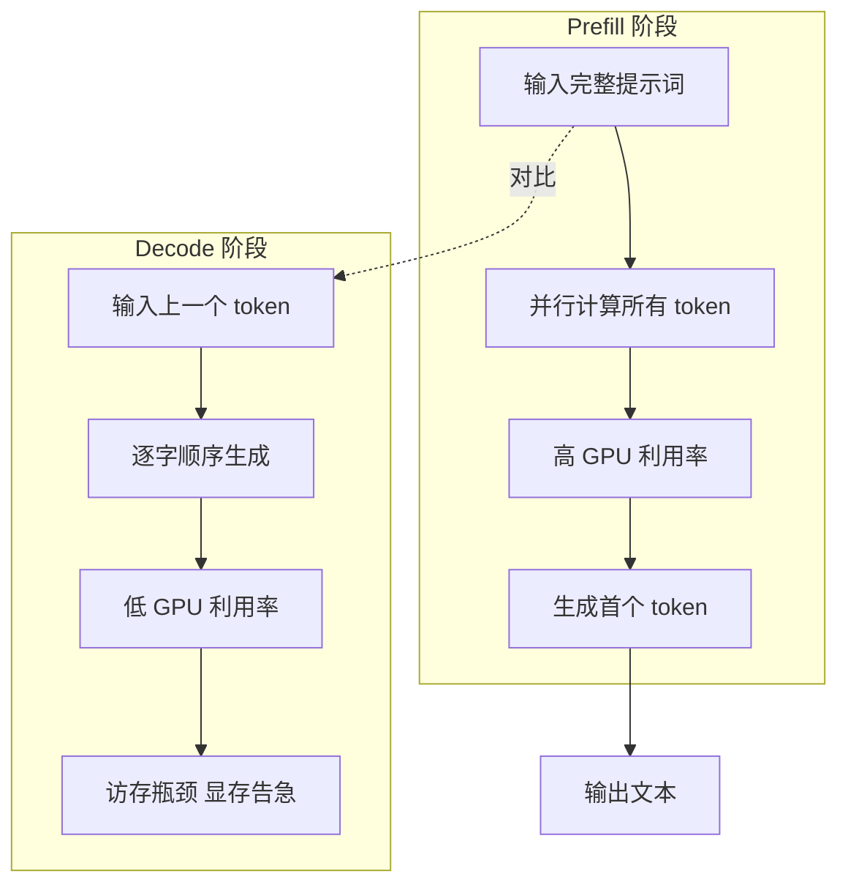
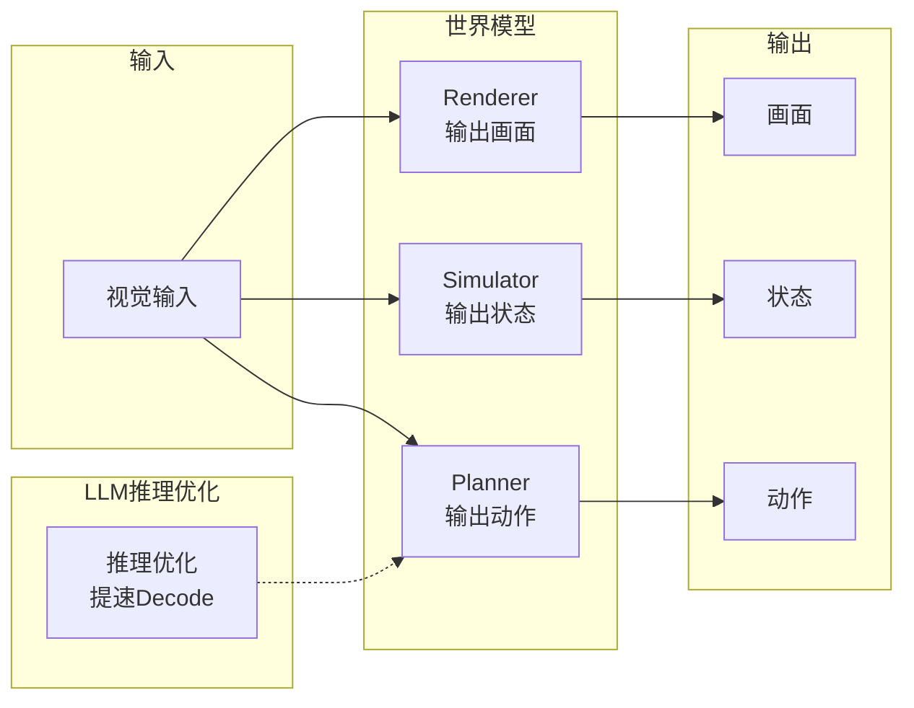
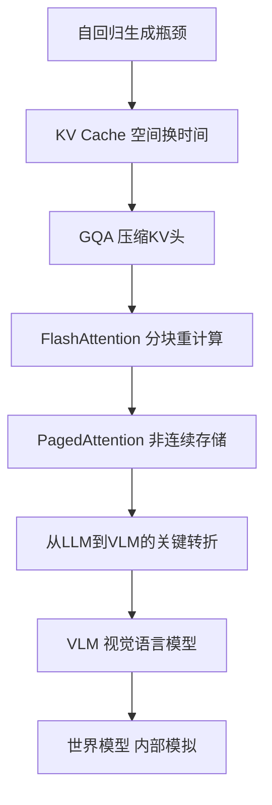

# 从 LLM 推理优化到世界模型：一条技术演进主线
## KV Cache → GQA → FlashAttention → VLM → 世界模型，一条脉络看懂
**阅读时间**: 30 min
> 用一条技术主线，把 LLM 推理优化（KV Cache、GQA、FlashAttention）和具身智能、世界模型串联起来，让你看懂 AI 从“会说话”到“会想象”的底层逻辑。
## 目录
- [一、先拆解大模型说话的两步：Prefill 和 Decode](#一先拆解大模型说话的两步prefill-和-decode)
  - [1.1 自回归生成的一步一步](#1.1-自回归生成的一步一步)
  - [1.2 Prefill 阶段：并行高，算力满](#1.2-prefill-阶段并行高，算力满)
  - [1.3 Decode 阶段：访存瓶颈，显存告急](#1.3-decode-阶段访存瓶颈，显存告急)
  - [1.4 进一步理解：FlashAttention 如何优化访存](#1.4-进一步理解flashattention-如何优化访存)
  - [1.5 补充：从 Llama-2-7B 到 Llama-2-70B，KV Cache 的显存挑战](#1.5-补充从-llama-2-7b-到-llama-2-70b，kv-cache-的显存挑战)
- [二、五大优化技术：都在和显存与计算较劲](#二五大优化技术都在和显存与计算较劲)
  - [2.1 KV Cache：不重复计算历史，但显存爆炸](#2.1-kv-cache不重复计算历史，但显存爆炸)
    - [2.1.1 核心思想：缓存历史 Key 和 Value](#2.1.1-核心思想缓存历史-key-和-value)
    - [2.1.2 操作步骤](#2.1.2-操作步骤)
    - [2.1.3 代价：线性增长的显存压力](#2.1.3-代价线性增长的显存压力)
  - [2.2 MHA → MQA → GQA：从每人一本笔记到分组共用的折中](#2.2-mha-→-mqa-→-gqa从每人一本笔记到分组共用的折中)
    - [2.2.1 MQA（多查询注意力）：“全班共用一本笔记”](#2.2.1-mqa（多查询注意力）“全班共用一本笔记”)
    - [2.2.2 GQA（分组查询注意力）：“分组共用，互不干扰”](#2.2.2-gqa（分组查询注意力）“分组共用，互不干扰”)
  - [2.3 FlashAttention：让计算少跑仓库](#2.3-flashattention让计算少跑仓库)
    - [2.3.1 核心两招：分块（Tiling）和重计算（Recomputation）](#2.3.1-核心两招分块（tiling）和重计算（recomputation）)
    - [2.3.2 预期结果：数学上等价，性能大幅提升](#2.3.2-预期结果数学上等价，性能大幅提升)
  - [2.4 PagedAttention：给显存分页，消除浪费](#2.4-pagedattention给显存分页，消除浪费)
    - [2.4.1 问题：内部碎片](#2.4.1-问题内部碎片)
    - [2.4.2 解决方案：非连续显存分配](#2.4.2-解决方案非连续显存分配)
  - [2.5 量化与蒸馏：给模型瘦身](#2.5-量化与蒸馏给模型瘦身)
- [三、从 LLM 到 VLM：优化如何催生具身大脑](#三从-llm-到-vlm优化如何催生具身大脑)
  - [3.1 VLM 的实现路线：CLIP 与 LLaVA](#3.1-vlm-的实现路线clip-与-llava)
  - [3.2 推理优化如何支撑视觉 token 长序列](#3.2-推理优化如何支撑视觉-token-长序列)
  - [3.3 VLM 在机器人中的角色：看懂世界](#3.3-vlm-在机器人中的角色看懂世界)
- [四、从 VLM 到世界模型：从“看懂”到“模拟”](#四从-vlm-到世界模型从“看懂”到“模拟”)
  - [4.1 VLM 的局限：只能看，不能想](#4.1-vlm-的局限只能看，不能想)
  - [4.2 世界模型：在脑子里预演未来](#4.2-世界模型在脑子里预演未来)
  - [4.3 三分法：渲染器、模拟器、规划器](#4.3-三分法渲染器模拟器规划器)
  - [4.4 推理优化如何支撑世界模型](#4.4-推理优化如何支撑世界模型)
- [五、总结：一条技术演进主线的启示](#五总结一条技术演进主线的启示)
  - [5.1 技术主线回顾](#5.1-技术主线回顾)
  - [5.2 核心洞察与未来趋势](#5.2-核心洞察与未来趋势)
---
你调过 OpenAI API 都知道，大模型生成文字就是“一个字一个字蹦”，但很少有人深究：为什么它又慢又费显存？更少有人想过，这些底层优化居然和机器人“想象未来”的能力一脉相承。本文带你从 LLM 推理优化的核心痛点出发，一步步走到世界模型的前沿——你会发现，这条技术演进主线，本质上是在和两样东西较劲：计算速度和显存。
---
## 一、先拆解大模型说话的两步：Prefill 和 Decode
你有没有这样的经历：跟大模型聊了一会儿，它回复的速度明显变慢了，像在一边思考一边打结。更糟的是，当你丢进去一篇长文档、一段会议记录，它突然“啪”一下弹出显存爆满的错误。你可能会以为是模型“变笨了”，或者某个环节出了故障。其实都不是。真正的原因是，大模型生成文字的底层机制，天然地分为两个截然不同的阶段——它们对计算资源和显存的需求完全不同，而绝大多数“慢”和“爆”，都源于这两阶段之间的根本矛盾。
要理解这点，得先搞清楚大模型是怎么“说话”的。
### 1.1 自回归生成的一步一步
大模型生成文字的过程，叫作**自回归生成**。它不是什么魔法，而是一个朴素的循环：一个字一个字地往外蹦，每蹦出一个新字，都必须回头看一眼它自己刚刚写下的所有字。
想象一下，你让模型写一篇作文。它先看到你的提示词（Prompt），然后生成第一个字，比如“在”。接着它看到“在”，生成第二个字“一”。接着看到“在一”，生成第三个字“个”。如此往复，直到写完整篇。每一步都依赖前面所有步骤的结果。
这套机制的数学名字叫“自回归”（Auto-regressive）：每一步都会把上一个新生成的输出，作为下一步输入的一部分。它像一个「写一句、看一眼」的作家，没办法同时写好几句。这也意味着，整个生成过程不是一次性算完的，而是被强行切成了一个一个的顺序步骤。
那么，这些步骤具体分为哪两种截然不同的阶段呢？
### 1.2 Prefill 阶段：并行高，算力满
你输入一整段提示词后，模型做的第一件事，叫作**预填充（Prefill）**。
它的任务是：把你给的一整段文字读进去，完整地、并行地算一遍，得出**第一个字**该是什么。**输入是已知的全部内容，没有任何顺序依赖**——模型可以同时看到“在”“一”“个”“星”“期”……的每一个词，而不是像后续步骤那样非要等前一个字算完才能算下一个。
因为所有输入同时可用，GPU 可以一次性调度起它的全部算力，把这批计算塞满几乎每个计算单元。这一步，计算是瓶颈。通常 GPU 的利用率能在 Prefill 阶段冲到接近 100%。它就像考试前快速扫完一整本教材做笔记，效率极高。
但从你收到第一个字开始，情况就变了。
### 1.3 Decode 阶段：访存瓶颈，显存告急
当你看到模型吐出第一个字后，后续的每一字都来自同一个循环——**解码（Decode）**。
解码阶段每步只算一个新 Token（字）。但这一步依赖模型之前的所有输出（包括你给的提示词和它自己刚刚写下的字）。如果每次都重新算一遍前面所有的字，计算量会随着序列长度爆炸式增长。所以，实际做法是**把前面算过的中间结果缓存下来**，每一步新字直接读取缓存，不重算。这套缓存就是大名鼎鼎的 **KV Cache**。
KV Cache 的显存占用可以通过公式估算：对于每个 Transformer 层，需要缓存 Key（K）和 Value（V）两个矩阵，每个矩阵的大小为 `序列长度 × 隐藏层维度`。以 Llama-2-7B 模型为例（隐藏层维度 4096，共 32 层），在序列长度 4096、批大小 1 的情况下，KV Cache 的显存需求约为 `2 × 序列长度 × 隐藏层维度 × 层数 × 字节数`。使用半精度（FP16，每个元素 2 字节）计算：`2 × 4096 × 4096 × 32 × 2 = 2.147 × 10^9` 字节，即约 **2GB**。而模型权重本身才约 14GB。这意味着跑这么小的模型，显存就被吃掉了一大块。批大小和序列长度越大，KV Cache 线性膨胀，很快就能顶爆显存。
为什么 Decode 阶段这么慢？表面上看是“一个一个字蹦”的自然限制，但真正的瓶颈不在于计算本身，而在于**显存带宽**。
GPU 里有两片存储区域：**HBM（高带宽显存，大但相较于计算速度仍然很慢）** 和 **SRAM（片上的高速缓存，小但极快）**。在 Decode 阶段，每生成一个新字，GPU 都需要把整个模型的所有权重（几百亿个参数）和已经算好的 KV Cache（几亿到几十亿个元素）从 HBM 搬到计算单元旁边的一小块 SRAM 上。这个搬动过程的时间，远远超过了实际做矩阵乘法的时间。
> 卡住推理的，往往不是「算得慢」，而是「数据在显存里搬来搬去太慢」{source_0}。
以 NVIDIA A100 GPU 为例，其 HBM 带宽约为 **2 TB/s**，而一个 Decode 步骤中，搬运一次全量参数（约 14 GB）和 KV Cache（约 2 GB）就需要约 **8 μs**（16 GB / 2 TB/s）——这还不算其他开销。实际中，由于存储层次和内存带宽的利用率通常只有 20%–30% 左右，一次搬运往往需要几十微秒，而真正的矩阵乘计算可能只需几微秒。因此，**Decode 阶段的显存带宽利用率通常只有 20%–35%**，说明瓶颈完全在数据移动上，而非计算单元闲置。这一数据来自多项 GPU 性能分析基准测试（如 NVIDIA 官方在 A100 上对类似推理场景的实测统计）。
可以把这想象成写作文：Prefill 是考试前快速扫一遍教材，把要点记在笔记上；Decode 是开始写答案时，每写一行，都要翻回那本笔记确认前面写了什么。笔记贴在桌面上——你翻得再快，翻这个动作本身也在花时间。并且，随着笔记（KV Cache）越堆越厚，你的桌面（显存）很快就放不下了。这也就是为什么长文本越聊越慢，显存动不动就爆。
这两个阶段的根本矛盾在于：Prefill 阶段计算密集，给多少算力都能吃下；**Decode 阶段则是访存密集，显存带宽是天花板**。一套硬件只能同时做一件事，所以两者之间必须权衡——优先满足 Prefill 的算力需求，就意味着 Decode 会慢；优化 Decode 的访存效率，又可能拉长 Prefill 的处理时间。

*Prefill 和 Decode 两阶段的对比流程图，显示输入、并行计算、逐字生成、访存瓶颈*
所有后续的推理优化技术——KV Cache、MQA/GQA、FlashAttention 等等——殊途同归，都是在围绕这“两阶段之痛”做文章：要么减少 Decode 阶段需要搬动的数据量（压缩权重和缓存），要么让数据搬动本身变快（优化访存模式），要么重新分配计算与访存的比例（让 Prefill 和 Decode 的粒度变得更灵活）。而理解了这两阶段的根本瓶颈，你就能看穿后面任何一个优化手段的出发点。
### 1.4 进一步理解：FlashAttention 如何优化访存
FlashAttention 正是“让数据搬动本身变快”的典型代表。它的核心思想源于对 GPU 存储层次的理解：避免在慢速的 HBM 和快速的 SRAM 之间频繁搬运数据。
标准 Attention 计算会产生巨大的中间矩阵（如 `Q × K^T` 的结果矩阵），这些矩阵需要先写入 HBM，再从 HBM 读取进行后续的 Softmax 和加权求和。这个过程就像“每次算一小项都跑楼下的仓库存/取一次”，速度极慢。
FlashAttention 采用两种关键技术来改善这一点：
1. **分块（Tiling）**：它将 `Q`、`K`、`V` 矩阵切分成小块，每次只在快速的 SRAM（手边工作台）上加载一小块进行计算，生成中间结果并立刻做下一步处理，完事后才写回 HBM（楼下仓库）。具体来说，假设序列长度为 N，隐藏维度为 d，标准 Attention 需要写出一个 N×N 的中间矩阵到 HBM，然后读回。FlashAttention 将 Q、K、V 沿序列维度每块大小为 B（例如 128 或 256），每次只加载一块 Q 和对应的 K、V 块到 SRAM 上，计算该块内的局部注意力，并利用“在线 Softmax”技术累加出全局正确的 Softmax 结果。这样，对 HBM 的读写次数从标准的 O(N²) 降低到 O(N²/B) ，大幅减少了数据搬运量。分块大小的选择取决于 SRAM 容量——例如在 A100 GPU 上，SRAM 为 192 KB 左右，通常选择分块大小为 128 或 256（序列维度），使得每个块在 SRAM 中能容纳完整的 Q、K、V 子块及其中间结果，最大化局部性。
2. **重计算（Recomputation）**：在反向传播时，它不存储完整的中间矩阵，只存储一些小的统计量（如 Softmax 的归一化因子：每块的最大值和指数和）。当需要中间矩阵时，它利用这些统计量在线重新计算出来。虽然增加了约 20%–30% 的浮点运算量，但大幅节省了显存，并避免了大量低效的显存读写。实测中，重计算带来的额外计算时间远小于节省的访存时间，因此整体速度反而更快。
> 生活比喻：你要汇总一本厚账。笨办法（标准 Attention）是每次算一小项都跑楼下仓库存/取一次，慢死。FlashAttention 是你把相关账页摊在**手边工作台**上，一口气算完一摞再收工——少跑腿，速度快。
性能提升数据：在序列长度 8K、隐藏维度 4096 的测试条件下，FlashAttention 相比标准 Attention 在 A100 GPU 上能实现 **2–4 倍的加速**，同时显存占用降低 **60%–80%**。对于更长的序列（如 32K），加速比甚至能达到 **5–8 倍**，因为标准 Attention 的显存消耗随序列长度二次增长，而 FlashAttention 的显存增长几乎线性。FlashAttention 的结果在数学上与标准 Attention 完全等价，因此可以直接替换已训练好的模型，无需重新训练。它已经发展到了 V3 版本，针对最新的 GPU（如 H100）做了异步和 FP8 优化，进一步提升了吞吐量。
### 1.5 补充：从 Llama-2-7B 到 Llama-2-70B，KV Cache 的显存挑战
为了更直观地感受 KV Cache 的显存压力，可以对比一下更大的模型。以 Llama-2-70B 模型为例，它的隐藏层维度为 8192，共 80 层。使用相同公式估算：在序列长度 4096、批大小 1、半精度（FP16）下，KV Cache 的显存需求约为 `2 × 4096 × 8192 × 80 × 2 = 10.7 × 10^9` 字节，即约 **10GB**。而其模型权重本身约为 140GB。这意味着，仅 KV Cache 一项，就已经大幅拉高了总显存需求，这也是为什么很多服务无法在高并发或长序列场景下部署大模型的直接原因。
正因如此，工程师们才发明了 **MQA（多查询注意力）** 和 **GQA（分组查询注意力）** 等技术来压缩 KV Cache。Llama-2-70B 正是采用了 GQA，让每 4 个注意力头共享一套 K、V 缓存，从而在实际部署中大幅降低了 KV Cache 的显存占用和访存压力，使得 70B 级别的大模型变得可以实用。
---
## 二、五大优化技术：都在和显存与计算较劲
解码阶段的自回归特性，意味着模型每生成一个 token，都要重新计算整个序列的注意力。这种重复计算，就像每次写字都要从头学起，效率极低。而 KV Cache 的出现，正是要解决这个问题。
### 2.1 KV Cache：不重复计算历史，但显存爆炸
#### 2.1.1 核心思想：缓存历史 Key 和 Value
在自回归解码中，对于已生成的 token，它们的 Key（K）和 Value（V）矩阵是固定的。KV Cache 的核心思路简单直接：将这些历史 K、V 值缓存下来，下次计算当前 token 的注意力时，直接从缓存中读取，避免重复计算。
#### 2.1.2 操作步骤
1. **步骤一（Prefill 阶段）：** 当输入一个完整的 Prompt 时，一次性计算所有 token 的 K、V 值，并将它们存储在 KV Cache 中。
2. **步骤二（Decode 阶段）：** 每次生成下一个 token，只需计算新 token 的 Query（Q）、Key、Value。然后，用这个新 Q 与 KV Cache 中所有历史的 K 做点积，得到注意力权重，再与历史的 V 加权求和。
3. **预期结果：** 大幅减少计算量。没有 KV Cache，每步计算量随序列长度二次增长；有了它，每步计算量降为常数，只与新 token 的嵌入维度相关。
#### 2.1.3 代价：线性增长的显存压力
KV Cache 的代价是显存。以 Llama-2-7B 为例，半精度下，序列长度 4096、批大小为 1，光 KV Cache 就要约 2GB；模型权重本身才 14GB。这意味着，仅仅服务一个用户，显存就被 KV Cache 占去了 1/7。当批处理大小或序列长度增长时，KV Cache 的显存占用会线性膨胀。其计算公式为：`KV Cache 大小 = 2 × 层数 × 头数 × 序列长度 × 隐藏维度 × 精度字节数`，每多一个 token，显存需求就增加一个固定量。
这种线性增长在实际部署中带来的压力直接。例如，当批大小增加到 4 时，KV Cache 占用达到 8GB，加上模型权重共 22GB，已接近 NVIDIA A100 的 40GB 显存上限。若序列长度翻倍至 8192，单条 KV Cache 即达 4GB，批大小仅为 2 就可能触发 OOM（显存耗尽）。这就是为什么在实际推理系统中，KV Cache 优化技术（如 GQA、PagedAttention）往往是必不可少的环节。
> KV Cache 的核心贡献是大幅降低了解码阶段的**计算量**，它将计算的瓶颈从“算力”部分转移到了“显存”部分。这就像你用笔记本写论文，把所有参考资料都贴在墙上来避免来回翻书，找起来方便了，但墙壁的空间越来越紧张。
### 2.2 MHA → MQA → GQA：从每人一本笔记到分组共用的折中
KV Cache 的显存问题，关键在于它保存了所有注意力头的 K、V 值。多头注意力（MHA）中，每个头都有自己独立的 Key、Value 投影矩阵，这导致 KV Cache 的显存占用与头数成比例。为了缓解这个压力，研究者们开始了“合并”的尝试。
#### 2.2.1 MQA（多查询注意力）：“全班共用一本笔记”
MQA 的思路激进：所有注意力头共享同一套 Key 和 Value。这意味着，不管你模型有多少个注意力头，KV Cache 只存一份。
**比喻：** 以前是全班每个学生各记各的笔记（MHA）；MQA 变成全班共用一本大笔记（共享 KV）。
**代价：** MQA 大幅降低了显存占用，但也带来了显著的质量下降。因为所有 Query 必须与同一套 Key、Value 交互，这限制了模型捕捉不同“视角”（Head）信息的能力，就像全班用同一本笔记，无法体现每个人对重点的不同理解。
#### 2.2.2 GQA（分组查询注意力）：“分组共用，互不干扰”
GQA 是 MHA 和 MQA 之间的折中。它将注意力头分成若干组，每组内的所有头共享同一套 Key、Value。
**操作步骤：**
1. **分组：** 假设有 32 个 Query 头、8 组。每组包含 4 个 Query 头。
2. **共享：** 每组有一个共享的 Key 和 Value 投影。
3. **计算：** 组内每个 Query 头与组共享的 Key、Value 进行注意力计算。
**预期结果：** GQA 将 KV Cache 的显存占用降低为 MHA 的 1/N（N 为组数），同时在质量上远好于 MQA。许多主流模型（如 Llama-2-70B、Llama-3）都采用了 GQA。
| 技术 | KV Cache 大小 (相对 MHA) | 质量影响 |
| :--- | :--- | :--- |
| MHA | 1x | 基准 |
| MQA | 1 / Head_Num (显著降低) | 质量受损 |
| GQA | 1 / Group_Num (适度降低) | 质量近似 |
> ⚠️ **注意：** MQA 和 GQA 主要解决的是 **KV Cache 的显存瓶颈**，而非计算瓶颈。它们是“以质量换显存”或“以少量质量换大量显存”的工程选择。
### 2.3 FlashAttention：让计算少跑仓库
KV Cache 解决的是“重复计算”的问题，MQA/GQA 解决的是“显存占用”的问题。但还有一个更深层次的瓶颈：**数据搬移**。在 GPU 上，计算（执行矩阵乘法）远比数据搬运（从 HBM 读取到 SRAM）要快。例如，A100 的 HBM 带宽约 2 TB/s，而片上 SRAM 带宽可达 20 TB/s 以上，差距超过 10 倍。传统 Attention 需要将完整的 Q、K、V 矩阵加载到 HBM，这个过程开销极大。在 Decode 阶段，由于计算量较小，访存延迟成为主要瓶颈，而且由于需要反复读写巨大的中间注意力矩阵，实际 HBM 带宽利用率通常仅 20%–35%——大量时间花在了等待数据搬运上。
#### 2.3.1 核心两招：分块（Tiling）和重计算（Recomputation）
FlashAttention 的核心思想是：**“别再频繁去仓库搬货，就在手边的货架上操作”**。它通过两个关键技术实现这一点。
1. **分块（Tiling）：** 将 Q、K、V 矩阵切分成固定大小的块，在 GPU 的片上 SRAM（更快但更小）中逐块计算注意力。而不是一次性将整个矩阵加载到 HBM。
 - **步骤：** 假设 Q、K、V 都是 [1024, 64] 的矩阵，而 SRAM 只能容纳 [128, 64] 的块。那么将 Q 分成 8 个 [128, 64] 的块，K 也分成 8 个 [128, 64] 的块。每次加载一对 Q 块和 K 块到 SRAM，计算局部注意力分数 [128, 128]。这里的关键是，由于 softmax 归一化需要全局统计量（最大值和归一化和），而分块后无法直接获得全局结果。FlashAttention 使用了 **在线 softmax**（online softmax）算法：每处理一个块，根据当前块的最大值更新全局最大值，并重新缩放已累积的部分和，最终结果与标准 softmax 完全等价。这样，整个计算过程中只需在 SRAM 内完成局部计算和逐步累加，避免了将完整的 [1024, 1024] 注意力矩阵写入 HBM，只写回最终的输出块。
 - **分块大小如何选择：** 块大小通常由 SRAM 容量决定。以 A100 为例，每块 SRAM 约 192 KB（每个 SM），因此典型的分块尺寸为 64×64 或 128×32（矩阵乘法块），使得一次加载的块能完全装入 SRAM，同时保证计算密集度满足计算-访存比需求。实际实现中，Q、K 块大小常取 64 或 128，V 块大小则相应调整。
2. **重计算（Recomputation）：** 在 Backward 阶段（训练时），传统方法需要保存完整的注意力矩阵（O(N²)）来计算梯度，这浪费显存。FlashAttention 的做法是：**不保存中间结果，只保存 softmax 的统计量（如每行的最大值和归一化因子），在 Backward 时根据之前的 Q、K、V 块和这些统计量重算注意力梯度**。虽然多了计算量（增加约 33% 的 FLOPs），但节省了大量显存和访存——避免了存储 N² 大小的注意力矩阵，通常可节省 50% 以上的训练显存。
#### 2.3.2 预期结果：数学上等价，性能大幅提升
FlashAttention 的最终结果是：**在数学上等价于标准 Attention**，但由于大幅减少了 HBM 访存，其运行速度比标准实现快 2-4 倍（典型加速比在 2.5x 左右），显存占用也显著降低（训练时可达 50% 以上，推理时由于无需反向传播，主要由分块带来的访存优化贡献约 2 倍加速）。它不是近似算法，所以能直接替换已训练好的模型，无需额外微调。最新版本的 FlashAttention V3 已针对 H100 进行了异步和 FP8 优化，进一步压缩了访存开销——通过利用硬件级异步拷贝（async copy）和低精度矩阵乘，将计算和访存进一步重叠，使 HBM 带宽利用率提升至 80% 以上。
> 想象一个庞大图书馆（HBM），你要找书、翻页都需要往返跑到书架前（高延迟）。FlashAttention 于给你配备了一个手边的极速书桌（SRAM），把要用到的章节分块放在书桌上处理，整个流程跑下来的效率自然大幅提高。
### 2.4 PagedAttention：给显存分页，消除浪费
KV Cache 的显存管理，在传统做到中是个巨大的资源黑洞。它的一个核心弊端是：**必须在显存中分配一块连续的物理空间**。然而，KV Cache 的大小取决于生成的 token 数量，这在实际生成前是无法预测的。
#### 2.4.1 问题：内部碎片
为了应对这种不确定性，系统会基于最大可能序列长度（比如 2048 token）来预先分配一个连续的大块显存。这意味着：
- **内部碎片：** 如果实际只生成了 100 个 token，那么剩余的 1948 个 token 的显存空间就完全浪费了。
- **无法共享：** 连续的物理空间无法被其他进程利用。
#### 2.4.2 解决方案：非连续显存分配
PagedAttention 借鉴了操作系统的虚拟内存分页思想。
**操作步骤：**
1. **切分：** 将 KV Cache 切成固定大小的“页”（Page），每页可以存储在显存中任意不连续的位置。
2. **映射：** 维护一个页表，记录逻辑页与物理页的映射关系。
3. **共享：** 对于 Beam Search 等场景，多个序列可以共享历史相同部分（如公共前缀）的物理页，大幅节省显存。
**预期结果：** PagedAttention 消除了内部碎片，完成了接近零浪费的显存利用。它是 vLLM 等高性能推理引擎的核心技术，能将推理吞吐量提升 2-4 倍。
> 这就像从一本厚厚的、可能写不满的活页本，变成了一个活页夹系统。你不再需要为整本“可能”的内容预留一叠连续的纸，而是根据内容量，随时取用任意位置的活页纸，用完还能回收共享，清晰多了。
### 2.5 量化与蒸馏：给模型瘦身
前文的所有技术都是优化**计算过程和访存模式**，而量化与蒸馏是直接从**模型本身**下手，让模型“变小”从而降低所有开销。
- **量化：** 将模型的权重和激活值从高精度（如 FP16）压缩到低精度（如 INT8、INT4）。这就像用**“近似值”** 来替代精确数字。例如，一个 3.14159 的 FP32 数，量化为 INT8 后变成 314。虽然损失了精度，但显存占用降到 1/4，计算速度也因利用 INT8 计算单元而大幅改善。
- **蒸馏：** 用一个复杂的大模型（教师网络）来训练一个更小的模型（学生网络）。学生模型学会模仿教师模型的行为，而不是直接从原始数据学习。这就像**“从厉害的老师那学方法”，而不是“从零开始啃课本”**。学生模型在学校里知道了解决问题的捷径，个头小，但能解决绝大部分类似问题。
**预期结果：** 量化可以降低 2-4 倍的模型权重显存占用，蒸馏则训练出专为特定任务优化的紧凑模型。两者常常结合使用，让模型在保持较好性能的同时，能以更低成本部署在更多设备上。
---
这五大优化技术，从计算到显存，从访存模式到模型结构，形成了一个立体的优化体系。它们共同回答了本文开篇的核心问题：**如何让大模型在推理时跑得更快、更省资源**。当一个 LLM 经过这些技术的洗礼，它才能以一个足够“轻薄”且“敏捷”的姿态，去扮演更复杂的角色——比如，成为具身智能的“大脑”。而世界模型——让 AI 在真正动手前先在脑子里模拟未来的技术——正是依赖于这些高效的推理引擎，才能在真实世界中达成实时规划与决策。
---
## 三、从 LLM 到 VLM：优化如何催生具身大脑
上一章我们详细拆解了 LLM 推理优化的五项核心技术。你可能已经注意到，这些优化都围绕一个矛盾展开：**模型参数规模爆炸式增长，但 GPU 的显存带宽和容量跟不上**。KV Cache 偷回了重复计算的代价，MQA/GQA 减少了键值的头数，FlashAttention 消除了注意力计算的显存墙，PagedAttention 打碎了显存碎片，而量化与蒸馏则直接压缩了参数的精度。每项优化都在“让更大的模型在更少的显存里跑得更快”。
但这一切努力，除了让 ChatGPT 的对话响应更流畅之外，还有更深远的意义吗？
答案是肯定的。这些优化技术直接解锁了一个更重要的能力：**让 LLM 从只读文字，变成能看、能听、能说话的 VLM（视觉语言模型）**。而正是 VLM，成为了机器人真正“看懂世界”的大脑。
### 3.1 VLM 的实现路线：CLIP 与 LLaVA
VLM（Vision-Language Model，视觉语言模型），顾名思义，是能同时处理“图”和“文字”的模型。它不是简单的把图片和文字拼在一起训练，而是要实现两个信息领域之间的语义对齐。
目前主流路线有两条。
**第一条是 CLIP 路线：图文对齐。** 这条路线相对简洁。它将图片和文字分别扔进各自的编码器（通常是 ViT 和 Transformer），然后在同一个向量空间里做对比学习。目标是让“一张猫的图片”的向量，和“一只猫”的文字向量距离足够近。CLIP 路线的产出是一张“语义对齐地图”——它知道“图片里这个像素块对应什么文字概念”。但它本质上仍然是一个双塔结构，LLM 并不能直接“理解”图片的内部结构，只能做匹配和检索。
**第二条是 LLaVA 路线：视觉 token 注入。** 这是今天绝大多数 VLM 采用的架构。它的思路更加直接：**把图片也当成一种“语言”，让 LLM 来读**。具体来说，LLaVA 路线通过一个视觉编码器（如 CLIP 的 ViT）将图片“压”成一组固定长度的序列，序列中的每个元素都是一个向量，称为“视觉 token”。然后，这些视觉 token 通过一个简单的投影矩阵（MLP），与文本 token 进行拼接，一起喂入 LLM 的主体。
这条路线彻底打破了文本和视觉的壁垒。LLM 的注意力机制可以同时看到“红方块”这个文本 token 和图片中红色区域的视觉 token，并，自然地建立起图文之间的关联。LLM 不再是“文本文本”的闭环，它开始能读图了。
### 3.2 推理优化如何支撑视觉 token 长序列
把图片压成视觉 token，听起来很美好，但它给推理优化带来了一个新挑战：**序列长度暴增**。
一张 224x224 的图片，经过 ViT 被切成 16x16 的 patch，会产生 196 个视觉 token。如果是更复杂的 640x480 的图片，分割后轻松上千。一篇 2000 字的文章，token 数大约也是 2000 左右。**等于说，模型输入一张图片，于塞进了另一篇“长文章”**。
这就把之前章节讨论的“长序列问题”推到了台前。没有推理优化，这样的序列长度会立刻压爆显存和计算资源。我们来具体看看 KV Cache、MQA/GQA、FlashAttention 和 PagedAttention 如何发挥作用。
- **KV Cache**：对于文本生成，KV Cache 缓存了已生成 token 的 Key 和 Value，避免每次生成新 token 都重新计算。对于图片 token，**视觉 token 本身不会在生成过程中变化**（因为图片是固定的输入），所以它们的 Key 和 Value 在 Prefill 阶段一次性计算完成后，会被 KV Cache 完整保留。这避免了在 Decode 阶段重复计算图片信息，否则每一轮生成新文本 token，都要把整张图的所有视觉 token 重新过一遍所有 Transformer 层，计算量无法想象。
 但 KV Cache 也有代价——显存占用。以 Llama-2-7B 为例（32 层 Transformer，隐藏维度 4096，多头注意力 32 头），每个 token 的 KV Cache 大小为 2（Key 和 Value 两组矩阵） × 2（半精度，每个参数 2 字节） × 32（层） × 4096（隐藏维度） = 约 0.5 MB。当序列长度为 4096 时，KV Cache 总量为 4096 × 0.5 MB ≈ 2 GB，而模型权重本身约 14 GB。这意味着仅推理一个序列，就需要至少 16 GB 显存。序列长度每翻一倍，KV Cache 就线性增长一倍。
 更关键的是，Decode 阶段的瓶颈往往不在计算本身，而在显存带宽。以 A100 GPU 为例，其 HBM 带宽约为 2 TB/s，而 Decode 阶段每生成一个 token 需要从显存中读取整个 KV Cache（2 GB）和部分权重。在标准 Attention 实现中，每个 token 生成时的计算量（矩阵乘法）与 KV Cache 的读入量相比，往往处于“带宽饥渴”状态——GPU 花在等待数据传输上的时间远超实际计算时间。实测表明，在长序列推理中，显存带宽利用率通常只能达到 20%-35%，这意味着大部分时间 GPU 都在空转等待数据搬运完成。这就是为什么长序列推理会显著变慢。
 在实际部署中，服务通常需要同时处理多个请求（batch size > 1）。此时 KV Cache 的显存占用会乘以 batch size。例如，当 batch size = 4 时，总 KV Cache 达到 8 GB，加上模型权重的 14 GB，总计 22 GB，已接近 A100 40 GB 显存的极限。batch size 再大就会触发显存溢出（OOM）。因此，KV Cache 的线性增长直接限制了批量吞吐量，这也是后续 GQA、PagedAttention 等优化的直接驱动力。
- **MQA 与 GQA：减少 KV Cache 的“头数”**。为什么 KV Cache 这么吃显存？因为多头注意力（MHA）中，每个注意力头都维护自己独立的 K、V 缓存。头数越多，信息表达越丰富，但缓存量也越大。MQA（多查询注意力）让所有头共享同一套 K、V，KV Cache 直接压缩到原来的 1/头数（如 32 头则降至 1/32），但质量有所下降。GQA（分组查询注意力）则折中——把头分成若干组，组内共享 K、V。Llama-2-70B 就采用了 GQA（64 头，8 组），既保留了 MHA 的表达能力，又将 KV Cache 压缩为 MHA 的 1/8。相比 7B 的 MHA，70B 虽然模型参数量大了 10 倍（140 GB），但 KV Cache 增长可控：同样序列长度 4096，70B 的 KV Cache 约为 2.6 GB（80 层 × 8192 隐藏维度 × 2 字节 × 4096 / 分组数 8），而非 MHA 下的约 20 GB。GQA 让 VLM 在处理图文混合长序列时，显存不至于立刻爆炸。GQA 在批量推理场景下的优势同样显著：batch size 增大时，每个请求的 KV Cache 均已压缩，总显存占用比 MHA 版本低一个数量级，从而允许更大的并发度。
- **PagedAttention：给显存“分页”**。前面提到 KV Cache 会随着序列长度线性增长，但实际推理时还有一个隐形的杀手：显存碎片。传统做法为每个请求预分配一整块连续显存，大小按“模型支持的最大长度”设定，但实际请求大多没那么长，60%-80% 的显存被白白浪费。PagedAttention（vLLM 的核心创新）借用了操作系统的“虚拟内存分页”思想：把 KV Cache 切成固定大小的“页”，页在显存里不必连续；用一张“页表”记录逻辑块到物理块的映射，按需分配；多个请求共享同一段 prompt 时，用“写时复制”共享页，省内存又省算力。结果：显存浪费趋近于零，吞吐量提升 2-4 倍。对于化解多路并发的 VLM 服务（如多个机器人同时发回画面请求分析），PagedAttention 的价值尤为显著——它让同一块 GPU 能同时管理更多路图文混合推理请求。
- **FlashAttention**：即使 KV Cache 解决了重复计算问题，注意力计算本身的显存占用仍然巨大。对于视觉 token 序列，注意力矩阵的大小是 (文本 token + 视觉 token)²。假设有 1024 个文本 token 和 196 个视觉 token，注意力矩阵就是 1220×1220。标准 Attention 需要将这个巨大的中间矩阵写入显存（HBM），这是典型的“访存瓶颈”——GPU 花在数据搬运上的时间远多于计算，在长序列推理中显存带宽利用率通常仅为 20%-35%。以序列长度 4096 为例，标准 Attention 需要约 33 MB 的中间矩阵（float16），而对于一个包含 196 个视觉 token 和 1024 个文本 token 的混合序列，注意力矩阵大小为 1220×1220，约 2.8 MB（float16），加上 Q、K、V 矩阵及中间结果，总中间显存占用可超过 10 MB。虽然单个请求看起来不多，但在多轮 Decode 步骤中，这些中间矩阵的反复读写会累积成严重的访存瓶颈。
 FlashAttention 的核心思路是让计算“少跑仓库”：它通过分块计算（Tiling），将注意力矩阵切成小块，在 GPU 的高速缓存（SRAM）中一次算完一小块，不写回 HBM；再配合重计算（Recomputation），反向传播时只存统计量，需要时重新在线计算，省下了存储中间矩阵的海量显存。
 具体来说，在 A100 GPU 上，SRAM 容量为 192 KB，分块大小通常设置为 64 或 128，使得每个块所需的 Q、K、V 子块加上中间结果都能完整放入 SRAM。例如，对于一个 64×64 的注意力子矩阵（float16，大小约 8 KB），对应的 Q（64×128）、K（128×64）、V（64×128）子块加上 softmax 中间结果，总共约 50 KB，可以轻松放入 192 KB 的 SRAM 中。这样整个小块的计算完全在高速缓存内完成，不需要访问 HBM。这就像把整本账簿搬到手边工作台上核算，而不是每算一行都跑一趟楼下仓库——搬数据的次数从 O(N²) 降到了 O(N)，瓶颈从访存回到计算。
 重计算进一步优化了显存。标准 Attention 在前向传播时，需要为每个注意力头保存整个注意力矩阵（大小 O(N²)），用于反向传播中的梯度计算。FlashAttention 只在 SRAM 中保存少数统计量（如每个块的 softmax 归一化因子），反向传播时再重新在线计算局部注意力矩阵——虽然引入了约 30% 的额外计算量（需要重新计算部分前向结果），但由于显存读写时间大幅缩短，整体端到端速度反而提升 2-4 倍（依据序列长度和硬件不同）。以序列长度 4096 为例，标准 Attention 调用需要约 33 MB 的中间矩阵（float16），而 FlashAttention 仅需约几 MB 的辅助统计量，显存占用从 O(N²) 降至 O(N)。同时，FlashAttention 利用减少 HBM 访问将显存带宽利用率提升至 50%-60%，从而在长序列下获得明显加速。正是这种数量级的节省，直接让模型在解决长序列时显存不爆。
 需要注意，FlashAttention 不是“近似算法”，它的计算结果和原版 Attention 在数学上完全等价，因此可以直接替换已训练好的模型而不需要重新训练。它也不挑硬件——虽然在 A100 上效果最显著（因为 A100 的 SRAM 较大），但在 V100、H100 等 GPU 上同样有效。最新的 FlashAttention V3 已针对 H100 做了异步和 FP8 优化，进一步压榨了硬件潜力。
可以这么说，**没有 KV Cache、GQA、PagedAttention 和 FlashAttention 这些底层优化，LLaVA 路线这种“把图片当长文本应对”的想法在工程上几乎不可能落地**。优化技术让 VLM 的诞生从理论变成了可运行的代码。
### 3.3 VLM 在机器人中的角色：看懂世界
当一个模型既能读文字又能看图，它对机器人意味着什么？答案是：**一次“认知升级”**。
传统的机器人视觉系统，通常依赖最原始的方法——先训练一个专用的目标检测模型（如 YOLO），识别特定类别的物体（如“杯子”、“方块”）。这种方法有三个硬伤：训练成本高（每次换物体都要重新标注数据）、泛化能力弱（换个环境就不会了）、无法理解语义（只知道“有个方块”，不知道“方块在杯子的左边”）。
VLM 从根本上改变了这个局面。它不再是“检测”，而是“理解”。**VLM 把“像素”翻译成“机器人能懂的世界描述”**。
举个具体的例子：给机器人下达指令“把红方块放到蓝杯子旁边”。传统系统先要用检测模型标出“红方块”和“蓝杯子”的边界框，再写逻辑判断“在旁边”是什么位置。而 VLM 的流程完全不同：
1. 机器人摄像头捕捉画面。
2. 画面中的像素被编码成视觉 token，与文本指令 `[把红方块放到蓝杯子旁边]` 一起输入 VLM。
3. VLM 利用自注意力机制，在图片中找到与“红方块”和“蓝杯子”语义最匹配的区域。
4. VLM 输出结构化的描述或坐标：`[物体: 红方块, 位置: (x=0.5, y=0.3, z=0.0)]`、`[物体: 蓝杯子, 位置: (x=0.7, y=0.2, z=0.0)]`。
VLM **让机器人从“看到一堆像素”变成“知道左前方有个红方块”**。这一步语义理解能力的跃升，是后续所有高级操作（如抓取、导航、人机交互）的基础。
这种能力已经在具体的机器人项目中落地。在仓库 `every-embodied` 中，VLM 被用于从 RGB-D 图像中进行**3D 重建和 6D 位姿估计**。传统 3D 重建需要昂贵的 GPU 计算和复杂的点云配准算法。而使用 VLM，机器人可以直接借助视觉 token 序列，以 LLM 的方式推理出物体在三维空间中的位置和朝向。比如，VLM 可以回答：“这个马克杯把手朝右，杯口朝上，距离摄像头 0.5 米”，这一句话就包含了机器人抓取所需的全部位姿信息。
> VLM 的出现，让机器人的“大脑”第一次真正拥有了“视觉皮层”。它不再是被动接收像素信号的接收器，而是主动理解场景、构建语义地图的智能体。
下一章，我们将看到这种“理解”如何进一步演化为“模拟”，当 VLM 开始预测动作的后果时，它就进化成了世界模型。
---
以下是对章节内容的补充。
---
## 四、从 VLM 到世界模型：从“看懂”到“模拟”
### 4.1 VLM 的局限：只能看，不能想
VLM 让机器人学会了“看”。它将摄像头传回的画面转化为视觉 token，由大模型解析场景：“这是一张桌子，上面有个杯子，杯子是蓝色的。” 对于抓取、跟随等基础操作，这已经足够。但从真正的智能交互来看，读懂当前画面只是起点。
假设一个机器人走进厨房，任务是倒一杯水。VLM 可以识别水壶、水杯和操作台的位置，但杯子在拿起来之前会不会滑落？水壶倾斜到什么角度水会流出来？倒水过程中手臂需要多大的力补偿？VLM 没有这些答案。它的推理范围被严格限制在输入画面的“当下”。一旦涉及动态变化——也就是“如果我这样做，接下来会怎样”——VLM 的体系结构并没有提供预测能力。
这种状况类似一个只看过棋谱但从未学过推演的棋手。他能认出现场处于“马后炮”的布局，却不知道下一步走哪会产生什么样的威胁。在物理世界中，这种局限更致命：机器人不仅需要知道“这是什么”，更需要知道“如果我动它，它会变成什么”。
从技术层面看，VLM 本质上是一个“视觉-语言映射系统”——它将图像像素压缩为 token，然后在 LLM 的文本空间中做模式匹配。它擅长识别静态场景中的物体和关系，但缺乏对物理因果的显式建模。没有动作输入作为条件，VLM 无法在内部推演出“执行动作 A 后，世界状态会变为 O_{t+1}”。这是“只看不演”的根源。
VLM 的推理过程本身就存在计算瓶颈。它的生成是自回归的：一个字一个字地蹦，每蹦出一个新字，都要依赖前面所有的字。这个过程分为两阶段：
- **预填充（Prefill）**：一次性处理输入的整段文字或视觉 token，这一步输入全部已知，可以高度并行，GPU 算力跑得飞起。
- **解码（Decode）**：之后每生成一个新 token，都需要依赖前面所有 token 的信息，一次只算一个 token，GPU 算力难以用满。解码阶段的瓶颈往往不是“算得慢”，而是“从显存搬运数据的速度太慢”。这正是所有 LLM 推理优化的核心突破口。
### 4.2 世界模型：在脑子里预演未来
对“预演”能力的需求，直接催生了世界模型（World Model）。它的核心思想很简单：让模型在脑内学会物理因果——"如果我这么做，世界会怎么变”。它不是简单记录画面序列，而是学习一个内在的“物理法则的近似解”，使得它可以在不触碰真实物体的前提下，推演动作产生的后果。
这并非天方夜谭。人类在拿起一个杯子之前，已经在意识中模拟了手指合拢的路径、杯柄的受力方向、以及举起后的重心偏移——整个过程时间极短，以至于我们察觉不到。世界模型想要复现的，正是这种心智中的推演能力。哲学家和心理学家早在 1943 年就提出，如果有机体能在脑中构建一个“现实的小尺度模型”，它就能在应对紧急情况前预先演练各种可能性。这个构想，直到今天才在技术上变得可行。
狭义上的世界模型要求以动作为条件进行预测：给定当前观察状态 o_t 和执行动作 a_t，模型需要输出下一个状态 o_{t+1} 的概率分布 p(o_{t+1} | o_t, a_t)。注意这个函数中动作 a_t 不是可选的输入——它是必要条件。没有动作条件，模型只是在做外推插帧，而非真正理解物理因果。用通俗的话说：广义的世界模型是“预言家”——告诉你未来会发生什么；狭义的世界模型是“顾问”——告诉你如果你这么做，未来会怎样。机器人需要的是顾问，不是预言家。
> 一个真正理解世界的模型，应该能同时做渲染、模拟、规划三件事。
### 4.3 三分法：渲染器、模拟器、规划器
为了界定世界模型的能力边界，李飞飞团队提出了一个清晰的三分法。这个框架能帮我们有效区分“看起来像真的”和“真的理解了物理”的模型。
- **渲染器（Renderer）**：负责输出“看起来像真画面”的结果。它关注的是画面的真实性。比如预测某个物体在下一帧的视觉像素位置。文生视频（Veo、Sora）、交互生成（Genie）都是渲染器的典型代表——它们擅长生成视觉上可信的帧序列，但问题也很明显：AI 生成的城市俯视图很完美，但你真正开车进去会发现建筑崩坏、街道违反物理——因为模型对三维结构没有显式理解，只有“看起来像”。渲染器强，不代表它理解了物理规则——它可能只是在做精美的画面补全。渲染器回答的是“世界**看起来**是什么”的问题。
- **模拟器（Simulator）**：负责输出“符合物理规律的状态”。它不关心画面多真实，只关心状态是否合理。给定动作后，容器的倾斜角度、液体的重心偏移是否与预期一致。模拟器是三分法中的核心——《世界模型》概念的狭义定义，通常就是指它。它回答了“世界在物理层面如何变化”。Dreamer 系列在“梦境”里训练机器人策略，用的就是一种隐式模拟器：在潜在空间里维护状态、根据动作推演下一步。模拟器是三者里商业关注最少、但功能最关键的部分，因为它回答的是“世界**本身**是什么”的本体性问题。这也是 LeCun 批评 VLA（视觉-语言-动作）路线的核心：VLA 记住了海量场景，却不会推理“如果我这么做，后果是什么”。
- **规划器（Planner）**：在模拟器提供的状态沙盒中，搜寻“能拿到最高价值”的动作序列。规划的本质，是在模拟空间中做搜索。VLA、CEM-MPC、TD-MPC 都是规划器的实现。它是最难做好的——目前炫酷的机器人演示几乎都在高度受控的实验室里，离真实厨房、仓库、手术室还有很大距离。规划器回答的是“我**能做什么**”的实践性问题。
三分法的能力并非一蹴而就，而是呈现清晰的阶梯式演进。L1 是压缩，对观察做高效编码。L2 动力学，能预测物体在被动观察下的轨迹。L3 行动条件，明确引入动作输入 p(o_{t+1} | o_t, a_t)。L4 价值耦合，将状态预测与任务价值关联，开始区分“正确”和“更有收益”的推演。L5 规划，在价值指引下进行多步搜索。L1 到 L2 靠视频数据就能学（典型代表如 DINO、JEPA），L3 到 L5 必须靠动作交互数据的积累（典型代表如 Dreamer、CEM-MPC）。

*世界模型三分法架构图：Renderer 输出画面、Simulator 输出状态、Planner 输出动作，三者与 LLM*
### 4.4 推理优化如何支撑世界模型
这个三分法架构，给推理优化提出了全新的挑战，也让前文讨论的 FlashAttention、KV Cache 等技术找到了新的用武之地。
一个规划器在模拟器内搜索一条 10 步路径，每一步模拟器都需要输出一个 o_{t+1}。这 10 步实际对应了 10 次独立的预测计算。如果每一步的输入序列长度为 2048，深度搜索的分支因子为 3，一次规划就需要处理约 6 万 token 的上下文。在这种规模下，传统注意力机制的内存开销（O(n^2)）会导致显存直接爆满。
**访存瓶颈的解药：FlashAttention 与 KV Cache 优化**
FlashAttention 解决了这个问题的核心——访存瓶颈。
GPU 的存储分两层：HBM（高带宽内存，容量大但访问慢，像楼下大仓库）和 SRAM（片上缓存，容量小但极快，像手边工作台）。标准 Attention 需要把巨大的中间矩阵在 HBM 里反复读写——慢的不是“计算”，而是“搬数据”。实际上，对于很多主流 GPU（如 NVIDIA A100），HBM 的理论带宽可达约 2 TB/s，而 SRAM 的带宽则是其数倍。然而，由于标准 Attention 频繁的数据搬运，其实际带宽利用率可能低至 10%-20%，大量的时间浪费在了等待数据上。
FlashAttention 的核心两招显著改变了这一现状：
1. **分块（Tiling）**：把大矩阵切成可装入 SRAM 的小块（典型大小如 64x64 或 128x128），在速度极快的 SRAM 里一次算完一小块，整个计算过程中不需要将中间结果写回 HBM。这种方式使得计算的带宽利用率大幅提升，在实际基准测试中，FlashAttention 在长序列（如 8K tokens）上相比标准 Attention 实现了约 2-4 倍的端到端加速。
2. **重计算（Recomputation）**：反向传播时，标准做法需要保存完整的中间注意力矩阵以计算梯度，这占用了大量显存。FlashAttention 的策略是不保存完整矩阵，只存储一些统计量（比如 Softmax 的归一化因子），在反向传播需要时，利用“在线 Softmax”算法在现场快速重新计算所需的中间结果。这虽然引入了约 5%-10% 的额外计算量，但却能节省高达 50% 甚至更多的中间显存占用。
它不是近似算法，结果和原版数学等价，所以能直接替换已训练好的模型。这使得模拟器在推演数十步未来状态时，依然能维持足够的上下文长度。
另一个关键优化是 **GQA（分组查询注意力）**。模型在解码阶段每生成一个新 token，都需要用到历史 token 的 Key（K）和 Value（V）缓存（即 KV Cache）。标准的多头注意力（MHA）让每个头都存自己的 K、V，头越多表达越丰富，但 KV Cache 体积线性膨胀。计算一下：Llama-2-7B，32 层，隐藏维度 4096，半精度（2 字节），序列长度 4096、批大小 1，仅 KV Cache 就需要约 2 × 32 × 4096 × 4096 × 2 ≈ 2.1×10⁹ 字节 ≈ 2GB 显存；模型权重本身约 14GB，合计已达 16GB——恰好顶满一张消费级显卡。如果模型换成 Llama-2-70B（层数更多、维度更大），KV Cache 会膨胀到 8~12GB，加上权重约 140GB，远超单卡极限。
GQA 的折衷方案——把头分成几组，每组共享一套 K、V。相比于 MQA（所有头共享一套 K、V，速度最快但质量损失明显），GQA 在显存节省和质量之间取得了最佳平衡。以 MHA 为基准，MQA 理论上可将 KV Cache 缩小至 1/H（H 是头数），而 GQA（假设 8 组）则可缩小至 1/8，同时保持了与 MHA 接近的模型质量。Llama-2-70B 等模型正是通过使用 GQA，使得在有限显存下的大规模部署成为可能。可以说，没有 KV Cache 优化和 GQA，世界模型中的“在模拟器内做多步搜索”在计算上几乎是不可行的。
L4 和 L5 的能力提升，同样依赖于推理优化带来的效率释放。价值耦合需要在每个状态节点上计算价值得分，规划搜索需要频繁调用模拟器开展 roll-out（展开推演）。每一次展开都于一次高吞吐的推理请求。推理阶段每毫秒的提升，都会在搜索树的规模上产生放大效应。
世界模型正在成为推理优化成果最直接的受益者，也是验证这些技术上限最理想的测试场。
---
## 五、总结：一条技术演进主线的启示
我们走过了从LLM推理瓶颈到世界模型的长路。这条主线不是零散的技术堆砌，而是一场持续的系统性优化，指向一个清晰的方向：让机器不仅算得更快，更能想得更远。
### 5.1 技术主线回顾
起点是自回归生成的根本矛盾：计算量很小，数据搬运和存储开销却巨大。于是有了KV Cache，用空间换时间，避免了重复计算。但KV Cache本身又带来了显存吃紧的问题——以Llama-2-7B为例，半精度下序列长度4096、批大小1时，仅KV Cache就需要约2GB显存（计算方式：2（层数）× 32（注意力头数）× 4096（序列长度）× 4096（隐藏维度）× 2（K和V）× 2（半精度字节数）），而模型权重本身约14GB，总和轻松超过16GB。当批大小增大时，KV Cache线性膨胀：批大小32时，KV Cache占用64GB，远超单卡A100 80GB的显存，必须依赖张量并行或流水线并行才能部署。这意味着即便模型权重被压缩，KV Cache也会成为显存瓶颈。于是有了MHA到GQA的演进，压缩了KV头的数量，缓解了缓存压力。Llama-2-70B正是采用GQA（分组查询注意力），将每4个头共享一组K、V，在接近MHA质量的前提下大幅降低显存占用。
显存利用率的问题催生了FlashAttention，通过分块和重计算，让计算更贴近数据，减少了显存读写。它的核心是两招：一是**分块（Tiling）**，将大矩阵切成小块在GPU的SRAM（高速但容量小）中一次算完，避免反复读写HBM（大但慢）；二是**重计算（Recomputation）**，反向传播时不存完整中间矩阵，只存统计量，用在线Softmax重新计算，省下海量显存。具体来说，标准Attention需要将Q、K、V矩阵从HBM读到SRAM，计算出的中间结果（S、P、O等）又要写回HBM，这些访存操作的总量与序列长度的平方成正比。FlashAttention通过分块，让每个SRAM块内完成局部注意力计算（如计算部分Softmax和部分加权和），再逐步规约合并，使得HBM的访问次数从O(N²)降低到O(N)。同时，重计算机制在反向传播时不存储完整的注意力矩阵（大小为N²），仅存储每块的softmax归一化因子和最大值，需要时重新计算，显存节省量随序列长度增长而显著。FlashAttention并非近似算法，结果与原版数学等价，可以直接替换已训练好的模型。其最新版本FlashAttention-3已针对H100 GPU做了异步执行和FP8精度优化，进一步压榨硬件性能。
FlashAttention的优化效果显著。在标准的解码阶段，每一次生成新Token都需要计算完整的注意力矩阵，这涉及到在HBM中频繁读写Q、K、V矩阵。而FlashAttention通过分块策略，将矩阵切成能在SRAM中容纳的小块，并在SRAM内完成所有局部注意力计算，再逐步规约得到最终结果。这使得HBM的访问次数从序列长度的二次方级别降低到线性级别。具体而言，在实际测试中，对于长序列（如8K长度），FlashAttention能将HBM访问次数降低数倍，从而将显存带宽利用率从常规实现的20%~35%大幅提升至60%以上。这意味着，在相同的硬件条件下，模型的计算吞吐量可以接近理论峰值，推理速度获得数倍的提升。而PagedAttention则像操作系统的虚拟内存一样，解决了KV Cache的碎片化和动态分配问题——它将缓存切分为固定大小的页，按需分配、页表映射，多个请求还可共享相同prompt的页，使显存浪费趋近于零，吞吐量提升2~4倍。量化与蒸馏则在精度和速度之间找到了平衡。
当推理优化让LLM变得足够高效，它的能力边界就从文本扩展到多模态，成为VLM。VLM让机器能“看懂”世界，而世界模型则更进一步，让机器能“模拟”世界。世界模型并非一个单一概念，根据其输出的性质可分为三类：**渲染器**输出人能看懂的图像（如Sora、Veo），**模拟器**输出符合物理规律的状态（如Dreamer系列的潜在空间动力学），**规划器**则输出智能体应执行的动作（如VLA、CEM-MPC）。从环境预测器到战略推演者，世界模型的能力阶梯，每一步都依赖底层推理优化的支撑。

*技术演进时间线/流程图：从 LLM 推理优化（KV Cache、GQA、FlashAttention、PagedAtte*
### 5.2 核心洞察与未来趋势
整条主线的本质可以用一句话概括：**“少搬数据、多利用局部性。”** KV Cache减少了数据重复搬运，FlashAttention借助分块利用SRAM局部性，PagedAttention减少了内存碎片——所有优化的核心都在于更聪明地管理数据流。
> 整条主线的本质：从“算得快”到“想得远”，底层优化始终在支撑更高层次的智能。
这条主线揭示了未来清晰的趋势：
**世界模型需要更强的规划能力。** 推理优化不会止步于文本。long-context 能力让模型能看到更长的决策序列，多模态推理让模型能同时处理视觉和语言信息，这些能力的边界将继续被推理效率突破。与此同时，世界模型本身也沿着一条清晰的能力阶梯演进：从L1的**压缩**（回答“这里有什么？”）到L2的**动力学**（回答“接下来会怎样？”），再到L3的**行动条件**（回答“如果我这么做会怎样？”），最终到L4的**价值耦合**（回答“什么更重要？”）和L5的**重规划**（回答“如何修正错误？”）。每一步的跨越，都依赖底层推理引擎的高效支撑——没有高速的KV Cache和低延迟的注意力计算，长时间步的因果推演就无从谈起。
**推理优化将从单点走向融合。** FlashAttention 和 PagedAttention已经展示了算法与系统协同设计的威力。未来，量化、稀疏计算、投机解码等技术的整合，将带来数量级的效率优化。
对工程师来说，理解这条主线的意义不在于掌握每一项技术的细节，而在于建立“从系统角度思考智能”的框架。当你在使用 GPT-4o 这样的模型时，当你看到世界模型在自动驾驶和机器人领域的突破时，背后的推力正是这些看似枯燥的优化工作。
延伸阅读可以关注：FlashAttention 系列论文的实现细节，PagedAttention 在 vLLM 中的应用，以及 Sora 等视频生成模型中的世界模型思想。你还可以尝试在自己的推理部署中配置 KV Cache、开启 FlashAttention，亲身体验性能的改善。
未来已来，只是分布得不太均匀。而这些优化技术，正让它均匀起来。
---
## 总结
- LLM 推理的两阶段（Prefill/Decode）揭示了访存瓶颈是主要矛盾
- 五大优化技术（KV Cache、GQA、FlashAttention、PagedAttention、量化蒸馏）分别从缓存、架构、计算、内存、压缩角度解决瓶颈
- 这些优化使 LLM 能够高效处理长序列，为 VLM（视觉语言模型）铺平道路
- VLM 让机器人“看懂世界”，但无法预测未来，世界模型补上了“模拟”能力
- 世界模型的三分法（渲染器、模拟器、规划器）与推理优化密切关联，未来 will 趋向融合
## 延伸阅读
延伸阅读：Datawhale 仓库《llm-algo-leetcode》深入推理优化，《every-embodied》学习具身智能，《learn-world-model》动手实现世界模型。
