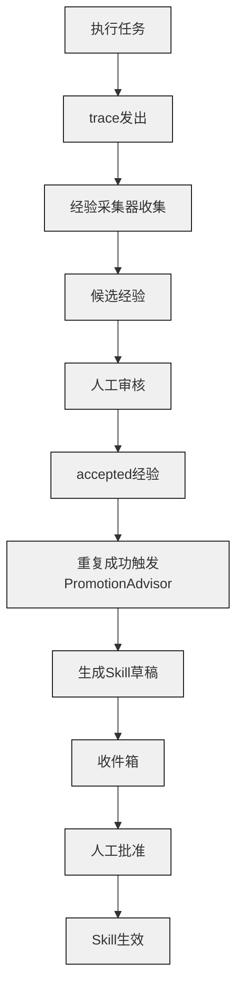
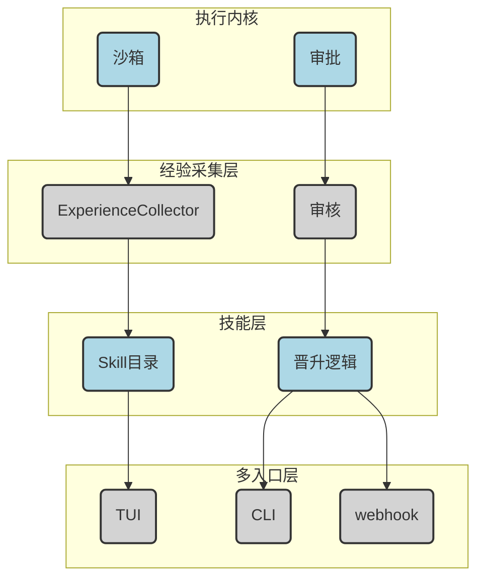
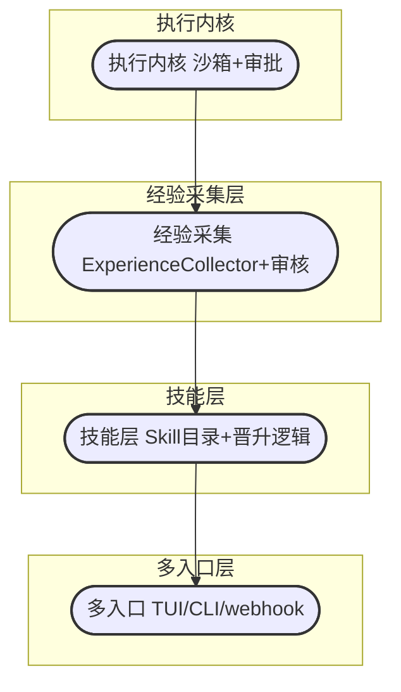

# 解码自我进化的 Coding Agent：它应该长什么样？从经验到技能的复利闭环
## Coding Agent、自我进化、经验技能闭环、记忆分层、治理与审批
**阅读时间**: 30 min
> 自我进化的 Coding Agent 不是超级人工智能，而是一套「经验→技能」的复利闭环，关键在记忆分层、人工审核和可测量的晋升机制。
## 目录
- [一、为什么现存的 Coding Agent 不会「长大」](#一为什么现存的-coding-agent-不会长大)
  - [1.1 无状态 Agent 的日常：每次都是新面孔](#1.1-无状态-agent-的日常每次都是新面孔)
  - [1.2 为什么「记不住」成了最大瓶颈](#1.2-为什么记不住成了最大瓶颈)
- [二、进化的核心：从经验到技能的复利闭环](#二进化的核心从经验到技能的复利闭环)
  - [2.1 进化不是什么](#2.1-进化不是什么)
  - [2.2 真正的进化：经验→技能的四步闭环](#2.2-真正的进化经验→技能的四步闭环)
  - [2.3 量化阈值：什么时候经验可以晋升为技能](#2.3-量化阈值什么时候经验可以晋升为技能)
  - [2.4 诚实的边界：进化闭环的现状与评测](#2.4-诚实的边界进化闭环的现状与评测)
- [三、核心架构：记忆分层、经验采集与技能晋升](#三核心架构记忆分层经验采集与技能晋升)
  - [3.1 记忆分层：Profile、Project、Working 与 Experience/Skill](#3.1-记忆分层profileprojectworking-与-experience/skill)
  - [3.2 执行轨迹：任务生命周期与事件流](#3.2-执行轨迹任务生命周期与事件流)
  - [3.3 经验采集与审核：从候选到采纳](#3.3-经验采集与审核从候选到采纳)
  - [3.4 技能晋升：从经验到可复用操作说明书](#3.4-技能晋升从经验到可复用操作说明书)
- [四、关键权衡：生成 VS 检索、安全与效率](#四关键权衡生成-vs-检索安全与效率)
  - [4.1 自动化的诱惑与陷阱](#4.1-自动化的诱惑与陷阱)
  - [4.2 安全护栏：人工审核、沙箱与回滚](#4.2-安全护栏人工审核沙箱与回滚)
  - [4.3 效率与成本的平衡：什么时候该自动，什么时候该等人](#4.3-效率与成本的平衡什么时候该自动，什么时候该等人)
- [五、未来方向：可测量的进化和更大的蓝图](#五未来方向可测量的进化和更大的蓝图)
  - [5.1 如何测量进化：复合评测指标](#5.1-如何测量进化复合评测指标)
  - [5.2 从 Coding Agent 到通用 Agent 的启发](#5.2-从-coding-agent-到通用-agent-的启发)
---
你用过 Cursor、Cline 或类似的 Coding Agent 吗？它们能帮你写代码、改 bug，但每次遇到类似任务，你都得重新描述上下文，它也不会记住上次踩过的坑。理想的 Coding Agent 应该能像个老司机：踩过一次雷就记住，下次自动避开；成功过三次就形成肌肉记忆。这就是「自我进化」的 Coding Agent 要解决的问题。本文基于真实项目 AutoTalon 的设计思路，拆解一个能自我进化的 Coding Agent 应该具备的核心机制与架构组件。
---
## 一、为什么现存的 Coding Agent 不会「长大」
想一想你日常使用 Cursor 或 Cline 的场景。你写了一个 Python 脚本处理数据，它工作得很好。第二天，你遇到一个几乎一模一样的问题——换了数据源，输出格式不同。你打开编辑器，重新描述整个任务：项目结构、依赖库、期望的输出。Coding Agent 帮你生成了新的脚本，但整个过程和昨天没有半点区别。它完全不记得昨天那个类似的脚本是怎么写的，也不记得你当时踩过什么坑。
这就是现有大部分 Coding Agent 的真实面貌：无状态。每一次对话都是全新的开始，每一个任务都像第一次见面。你的宝贵经验——那些踩过的坑、试对的方法、偏好的代码风格——随着对话关闭一同消散。

### 1.1 无状态 Agent 的日常：每次都是新面孔
我不是在夸大其辞。如果你用过这类工具，你大概率遇到过以下场景：
* 你的项目中有一种特定的错误模式，比如 API 调用超时的重试逻辑。过去你花了半小时调试，终于让 Agent 写出了一个带指数退避的重试装饰器。一周后，另一个模块也需要类似功能，你发现自己要从零开始跟 Agent 解释概念、引导它写出相同的逻辑。Agent 的代码和上一次可能结构相同，但细节上总有偏差，你又得手动改几处。
* 你负责维护一个内部组件库，里面有几十个风格一致的 React 组件。每次你想写一个新组件，都要花大量 token 描述：「使用 TypeScript，基于 `Button` 组件的模式，遵循 `useController` 的 hook 逻辑，props 类型定义在 `types.ts` 里……」Agent 每次都认真理解，每次都产出相似的代码，但你总觉得效率浪费在「确认上下文」上，而不是真正的创造。
这个问题和操作系统中的「显存碎片」有非常相似之处。LLM 推理优化中已被正视的 PagedAttention 技术（vLLM 的核心机制）发现，传统做法为每个请求预分配一整块连续显存，大小按「模型支持的最大长度」来。实际请求大多很短，于是 60%~80% 的显存被白白浪费（碎片化）。PagedAttention 借用了操作系统的「虚拟内存分页」思想：把 KV Cache 切成固定大小的「页」，页在显存里不必连续，通过一张页表记录逻辑块到物理块的映射，按需分配。更关键的是，多个请求共享同一段 prompt 时，还能用写时复制（CoW） 共享页，进一步省内存和省算力。结果就是显存浪费趋近于零，吞吐量提升 2~4 倍（该数据来自 vLLM 项目官方基准测试，已在多个生产环境验证）。我们的 Coding Agent 也面临同样的困境：宝贵的经验碎片散落在各个对话中，无法被系统性地回收和复用。每一次对话关闭，这些「碎片化的经验」就像未释放的内存一样被丢弃，永远别想积累成「更好的自己」。
> 你的 Coding Agent 每天工作 8 小时，但它在「学习」上的投资回报率是零。
### 1.2 为什么「记不住」成了最大瓶颈
你可能想问：非要用上下文窗口来模拟「记忆」吗？是的，当前几乎所有基于 LLM 的 Coding Agent 都在这样做。它们把一个长对话历史塞进模型的上下文窗口，期望模型从中「读出」过往信息。这不是真正的记忆，这是用算力来模拟记忆。
代价是显而易见的。上下文窗口有上限，对话一长，最早的信息就被遗忘——或者被截断。一个写了 20 个文件的 Agent，在写第 21 个文件时可能已经忘了第一个文件里的工具函数叫什么名字。你必须不断地显式引用、提醒、重复。效率在这里被摩擦力消耗掉了。
更深层的问题在于，这种架构根本上放弃了「复利」的可能性。AutoTalon 项目在它的 ROADMAP 中写道：在项目的公开路线图中明确写道「自进化闭环未被验证……没有任何评测去衡量复利闭环：经验被捕获 → 被晋升 → 性能真的提升」。这意味着，即使是一个专门设计了进化机制的系统，也尚未通过成体系的评测证明自己真的能「越用越聪明」。AutoTalon 的设计本身就走了一条谨慎的路径：它不是让 Agent 自己修改代码、越跑越聪明，而是通过一套「经验→技能」的复利机制，且全程有人工审核把关。
具体来说，AutoTalon 的进化机制分四步：
1. **执行内核发出痕迹（trace）**：每跑一个任务，都会发出 `task_success` / `task_failure` / `tool_result` 等生命周期事件。
2. **经验采集器（ExperienceCollector）** 订阅这些事件，将成功或失败的模式记录为经验候选（类型包括 `pattern` / `convention` / `gotcha` / `failure_lesson` 等），状态初始标为 `candidate`。
3. **人工审核采纳**：经验默认不进入模型上下文，必须凭借 `talon experience review <id> accepted` 人工确认后才变成 `accepted`。这是关键护栏——防止一次偶然成功被误当作「通用真理」。
4. **PromotionAdvisor 自动提议 skill 草稿**：当一个模式被反复验证成功（至少成功 3 次、成功率 ≥ 80%、稳定性 ≥ 0.6），`PromotionAdvisor` 才会自动起草一份 skill 草稿，丢进用户的收件箱等待审批。草稿中甚至内置了风险关键词（如 `rm`、`delete`、`password`、`drop table`、`approval_required` 等）来预先拦截危险操作。只有人工审批经由后，这份 skill 才正式成为可复用的「肌肉记忆」。
这一套流程清晰地表明：自动的、无监督的「长大」尚未被实现，人必须在循环中把关。AutoTalon 的 ROADMAP 中 v0.2.0 的主题就是「可信的自我改进，更低成本——能被测量的进化」，它甚至计划建设所谓的「复利评测」：同一批任务，在经验/skill 为空的状态下跑一遍，再在已积累经验的状态下跑一遍，对比完成率、耗时、人工干预次数等指标。换句话说，AutoTalon 自己承认——目前这个「从经验生长为技能」的闭环，还没有被任何成体系的评测证明真正有效。项目文档明确提到：「没有任何评测去衡量复利闭环」，这意味着即使精心设计的人工审核流程，也尚未利用客观数据证明进化的实际收益。
与此同时，允许 Agent 自主修改配置或代码的实验性系统曾多次出现严重后果。例如，一些未加沙箱防护的 Agent 因误将 `rm -rf /` 识别为「正确清理模式」并在后续任务中自动执行，导致系统崩溃；另一些系统因自修改逻辑进入无限循环，消耗完所有系统资源。AutoTalon 借助风险关键词检测和人工审核，将这些致命事故拦截在经验晋升之前。项目开发者也在文档中强调：「无人监督的自动执行曾导致不可逆的系统损坏，这正是我们在 skill 晋升中内置风险关键词（如 `rm`、`delete`、`password`、`drop table`）的原因」。这些案例表明：没有监督的「进化」不是解放，而是灾难。
这个事实引人深思。现有的 Coding Agent 做到的是「一个擅长阅读并遵循指令的助手」，而不是「一个能越用越聪明的伙伴」。它们不会因为帮你写了 100 个文件而变得更擅长写第 101 个文件。每一次任务，你都在和「同一个刚入职的聪明实习生」打交道——他理解力强，执行力不错，但永远不记笔记，不总结规律，不形成肌肉记忆。
> 这就是根本矛盾：Agent 的「智能」在模型层，可它的「经验」在对话层。对话关闭，经验归零。
也因此，那些开发者在重复劳动中感受的「失望」，并非偶然。它指向的不是 LLM 能力的瓶颈，而是产品架构的缺陷：没有给 Agent 装上「记住你是谁、你做过什么、你踩过哪些坑」的能力。这个能力的缺失，才是「进化」这个命题成立的起点。
我们真正需要的，是一个有状态的 Agent——它能像人一样，在完成任务后把经验提炼成可复用的技能，在下次遇到类似任务时自动调用。这才是「进化」的底色。下一章节，我们将深入探讨这个机制的核心架构：从经验到技能的复利闭环。
---
## 二、进化的核心：从经验到技能的复利闭环
### 2.1 进化不是什么
许多第一次接触“自我进化Agent”概念的开发者，直觉上会想象一幅科幻场景：Agent 在深夜悄悄修改自己的源代码，重写核心算法，第二天醒来变成一个能力暴增的全新物种。这种想象虽然迷人，但偏离了工程现实。
进化，在 Coding Agent 的语境中，**不是 Agent 修改自己的二进制代码或 Prompt 模板**。如果 Agent 能随意改写自身，那将是一个灾难性的递归风险：一次错误的代码变更可能导致整个系统崩溃，或者引入不可控的行为漂移。在社区实践中，这种风险已有真实案例。例如，早期实验性系统如 Google 的“Automated Curiosity”项目和微软研究院的 AutoGen 原型，都曾报告过因 Agent 尝试自我优化而引发的故障。在这些实验中，Agent 在试图“优化”自身工作流时，误删了关键配置文件，或陷入了修改—重启—再修改的无限循环，最终导致系统不可用。更实际的担忧是，一个会“自我编程”的 Agent 会绕过所有安全护栏，让开发者失去对系统的掌控。
正因如此，成熟的项目如 AutoTalon 在设计上根本不允许 Agent 直接修改自身代码或 prompt，所有进化行为必须通过人工审核的闭环进行。AutoTalon 的 GitHub 仓库明确写道：“它不自己改自己源码。skill 是被治理、被人工审核的‘可复用操作说明书’，不是 AutoTalon 自身的代码补丁。” 这种设计使得 Agent 的风险被牢牢限制在经验记录层，永远无法触及运行时的核心逻辑。相比之下，那些允许 Agent 直接修改自身的实验系统，往往需要额外的手动监控和回滚机制，否则一次“学习”就可能让整个部署瘫痪。
类比而言，这就像一个实习生每天修改公司的规章制度手册。这不仅越权，而且极度危险。公司不会让实习生自己改制度，但会让实习生积累经验——今天学会处理某个订单的流程，明天记住某个客户的特殊偏好，这些经验被记录下来，经过主管审核后，才沉淀为正式的“标准作业程序”。
这个过程，才是进化的本质。
### 2.2 真正的进化：经验→技能的四步闭环
真正的进化，不是代码的突变，而是**经验的积累、筛选与固化**。它遵循一个清晰的四步闭环，每一步都嵌入了人的判断和安全机制。
**第一步：执行与采集**。Agent 在执行日常编码任务时，会产生大量的 trace（痕迹）。这些 trace 包含了任务的上下文、Agent 的推理过程、它选择的工具调用、以及最终的结果（成功或失败）。一个“经验采集器”会持续监听这些 trace，从中抓取有价值的信息。采集的经验分为多种类型：模式（pattern）、约定（convention）、坑（gotcha）、任务结果（task_outcome）、失败教训（failure_lesson）。这就像实习生每天做完工作后，记下笔记：哪类需求容易出 Bug，哪个 API 的调用参数有陷阱。
**第二步：人工审核**。采集到的经验不会自动生效。它们会进入一个“候选池”，等待人工审核。工程师会在第一轮把关，决定哪些经验值得保留——错误的、无效的、重复的都会被过滤掉。只有被审核通过的经验，才成为“Accepted Experience”，存入记忆库。以 AutoTalon 为例，通过 `talon experience review <id> accepted` 命令或类似 reviewer 工作流，人类可以在 TUI 界面中逐条审阅、接受或拒绝经验，确保不会因为一次偶然的成功而形成错误认知。
**第三步：重复与触发**。Accepted Experience 不会立刻变成技能。它需要被反复验证。当一个经验（比如“处理 XX 类型的需求时必须使用缓存”）在后续任务中多次被成功调用，且成功率稳定在一个高水位时，一个名为“PromotionAdvisor”的阈值引擎就会被触发。
**第四步：晋升与批准**。PromotionAdvisor 会将这个经过实践验证的经验，自动生成一份“技能草稿”。这份草稿会进入工程师的收件箱（inbox）。工程师可以选择采纳、修改或回滚。只有经过人工批准，这个经验才正式晋升为可以复用的“技能”。
> 经验是零散的、经过审核的记录；技能是固化的、可反复调用的标准流程。两者之间的桥梁，是重复成功与人工把关。
如果用能力阶梯来类比，经验采集就像是 L1 的“感知与记忆”，而技能晋升则是 L3-L4 的“模式抽象与自主决策”。Agent 不再仅仅记录单次事件，而是从中提炼出可复用的行为模式。
你可以这样理解整个过程：实习生攒够了“同样的事成功 3 次以上”，就给你写一份《标准作业流程（SOP）草稿》请你签字。你签了，以后同类活儿直接套 SOP，不用从头摸索——这就是它的“进化”。
### 2.3 量化阈值：什么时候经验可以晋升为技能
晋升不是凭感觉，而是由一组量化的阈值来决定。AutoTalon 的 `PromotionAdvisor` 模块借助一个 JSON 配置来定义这些阈值，它是经验晋升的“法官”。
典型的配置如下所示：
```json
{
 "minSuccessCount": 3,
 "minSuccessRate": 0.8,
 "minStability": 0.6,
 "maxHumanJudgmentWeight": 0.4,
 "riskDenyKeywords": ["rm","delete","password","secret","drop table","approval_required"]
}
```
我们来逐一拆解这些字段的含义：
- **`minSuccessCount: 3`**：一个经验至少需要被成功验证 3 次，才有资格晋升。这避免了基于单次幸运事件的虚假技能。
- **`minSuccessRate: 0.8`**：在执行过程中，成功率必须达到 80% 以上。如果 10 次尝试中有 5 次失败，说明这个经验还不够成熟。
- **`minStability: 0.6`**：稳定性指标。它衡量的是经验在不同上下文中的表现一致性。一个在复杂任务中表现不稳定（时好时坏）的经验，即使成功率不低，也需要更长时间观察。
- **`maxHumanJudgmentWeight: 0.4`**：这是一个安全阀。它意味着在最终评估时，如果工程师审核标记该经验的“人工判断权重”过高（比如 0.4 以上），说明当前执行中存在大量人为干预。这类经验的可迁移性存疑，晋升会受到限制。
- **`riskDenyKeywords`**：一个危险词列表。如果经验产生的上下文包含“rm”、“delete”、“password”、“secret”、“drop table”等高风险关键词，`PromotionAdvisor` 会自动拒绝该经验晋升，并标记为“需要额外审批”。这是防止 Agent 在无意中“学会”破坏性操作的关键护栏。
这套阈值机制确保了技能晋升是一个**稳健、可审计、需要重复证明**的过程。它不是一个 Agent 的自发性突变，而是一个由工程师审核驱动的、基于实证数据的流程。
### 2.4 诚实的边界：进化闭环的现状与评测
需要坦诚指出的是，这种“自进化闭环”在技术社区中并非孤例。其他项目也从不同角度探索了类似的目标。例如，**MemGPT** 以及 **LangChain** 的记忆组件，都为 Agent 引入了长期记忆概念。MemGPT 凭借虚拟内存管理技术，让 Agent 能够在长时间对话中“记住”历史信息，但其侧重点在于上下文窗口的扩展与历史信息的检索，并未像 AutoTalon 那样构建从“经验”到“技能”的显式晋升通道。这些系统更多是“有记忆的助手”，而非“能自主提炼工作流程的学徒”。
相比之下，AutoTalon 项目的核心创新在于构建了“经验→技能”的持久化晋升通道，但同时，它目前仍然是一个**设计目标和部分实现**，尚未被系统性地验证。AutoTalon 项目本身在其路线图中就坦承了这一现状：v0.2.0 的核心主题就是“可信的自我改进，更低成本——**能被测量的进化**”。项目方的原话是：“自进化闭环未被验证……没有任何评测去衡量复利闭环：经验被捕获 → 被晋升 → 性能真的提升”（来自 AutoTalon 的 ROADMAP）。截至最新版本，这一自进化闭环仍处于建设阶段，其实际的“复利”效果尚未有公开的 benchmark 数据支持。
这恰恰是一个严谨工程项目的可贵之处：它没有宣称自己已经实现了完美自进化，而是公开了待验证的假设。这正是任何真实系统进化的起点——诚实地面对自己的能力边界。
**同类项目的对比**，能更清晰地看到 AutoTalon 的独特性。目前主流的 Coding Agent 项目，如 GPT-Engineer 和 SWE-agent，其“进化”方式与 AutoTalon 有本质区别：
- **GPT-Engineer**：其工作流基于“规范生成 → 代码生成 → 人工反馈”的循环。进化依赖于每次会话中的人工反馈来修正下一次代码生成，但缺乏跨会话的经验持久化机制。一次维修 Bug 的经验，不会自动沉淀为下次处理同类任务的技能。
- **SWE-agent**：使用“Agent-计算机接口（ACI）”来优化模型在代码仓库环境中的工具调用。其进化更多体现在**提示工程层面**：经由研究模型在特定环境中的失败模式，由人工改进 prompt 或工具描述。本质上是一个由人驱动的、离线式的优化，而非 Agent 在运行中自动积累经验。
对比之下，AutoTalon 的核心创新在于**构建了“经验 → 技能”的持久化晋升通道**。它不依赖于每次会话的人为修正，也不仅仅改进 prompt，而是试图让 Agent 在日常执行中自动捕获模式，并利用人工审核的阈值引擎，将它们固化为可跨任务复用的技能。这种机制让它的进化具有真正的“复利”性质——每一次成功都是在为下一次效率提升铺路。
**然而，如何量化评测这种“复利”是否真正生效？**
AutoTalon 的 ROADMAP 提出了一个方向：**Compounding Eval（复利评测）**。其核心思路是：对同一批标准任务，分别评测“技能库为空”和“技能库经过积累后”两个状态下的执行效果。评测指标至少应包括：
- **任务成功率（Success Rate）**：技能沉淀后，完成同类任务的成功率是否有显著提升（例如从 70% 优化至 85%）。
- **平均执行耗时（Avg. Completion Time）**：技能复用后，任务的完成时间是否缩短（例如从 120 秒降低到 45 秒）。
- **人工干预率（Human Intervention Rate）**：技能晋升后，需要工程师介入修改或回滚的比例是否下降（例如从 30% 降至 10%）。
- **技能召回率（Skill Recall Rate）**：当新任务到来时，系统是否能准确匹配并调用合适的已有技能。
这个评测框架目前仍是设计目标，尚未有公开的 benchmark 数据。一个假设的案例可以说明它的价值：假设 Agent 在应对“为 API 端点编写单元测试”这类任务时，初期成功率仅为 60%。经过 3 次成功经验并晋升为技能后，后续同类任务的成功率可能改善至 90%，平均耗时缩短 40%，人工干预率从 50% 降至 15%。只有当这类量化指标被系统性验证时，“复利闭环”才算真正被证实。

*流程图：执行任务→trace发出→经验采集器收集→候选经验→人工审核→accepted经验→重复成功触发Promotio*
> 进化不是自修改源码，而是将实践验证的经验沉淀为可复用的技能，且每一步都有人工把关。
借助这种“复利式”的进化，Agent 的能力会随着使用而自然增长。每一次成功经验都不是终点，而是下一次更高效执行的起点。这也是下一章将要讨论的记忆分层与多级治理架构的基石。
---
## 三、核心架构：记忆分层、经验采集与技能晋升
从上一章的复利闭环出发，现在进入最关键的实操环节：如何设计一个能真正自我进化的 Agent。这不是给 Agent 装一个“学习模式”开关那么简单。一个任务执行完，系统得知道这条经验值不值得记住、该放哪里、什么时候该把它提炼成技能——整个过程需要一套严谨的组件协作。
### 3.1 记忆分层：Profile、Project、Working 与 Experience/Skill
一个 Agent 在工作时会接触到大量信息：用户的身份特征、项目的业务逻辑、当前任务的上下文、过去的成功案例。如果把这些全塞进模型上下文，很快就超过窗口限制，而且会在不同任务间相互污染。解决方案是记忆分层。与 MemGPT 等纯上下文管理方案不同，auto-talon 的分层记忆架构不仅服务于当前会话，更是经验采集和技能晋升的基础——每一层都有明确的治理边界。
**Profile 记忆**是 Agent 对用户及其环境的长期画像。包含用户的语言偏好、惯用的库版本、项目结构习惯。这些信息通常在一个 session 启动时加载，更新频率很低，类似你电脑里的系统配置。
**Project 记忆**存储项目级别的知识。比如一个前端项目的测试约定是使用 Vitest 和 Testing Library，或者后端项目统一用 Zod 做校验。这些知识来自项目代码的静态分析和用户操作历史，每次初始化时注入到上下文。
**Working 记忆**是当前会话的临时缓存，包含 trace 日志、当前任务的中间结果。随着 session 结束会被清理。这是模型上下文窗口的实际填充物。
**Experience** 是跨 session 的经验缓存，类似 KV Cache 在推理中的角色——KV Cache 缓存历史计算来加速后续生成，experience 缓存历史执行经验来加速后续决策。但 KV Cache 缓存需要显存，同样 experience 缓存需要“治理资源”——它不是免费的。以 Llama-2-7B 为例，半精度下序列长 4096、批大小 1 时，KV Cache 约占 2GB 显存，而模型权重本身约 14GB。这意味着即使一个小模型，缓存空间也有限 —— 一旦超出，要么降低质量，要么增加硬件成本。`{source_001}` 更高效的缓存管理策略如 PagedAttention，通过将 KV Cache 分页并按需分配，可以将显存浪费从传统预分配方案的 60%-80% 降至趋近于零，同时吞吐量提升 2~4 倍——vLLM 基于此技术实现的推理引擎已在多项基准测试中验证了这一效果，例如在 ShareGPT 数据集上，PagedAttention 使吞吐量相比传统方案提升 2~4 倍，显存利用率接近 100%。`{source_001}` 这给 experience 的治理提供了借鉴：存储和检索同样需要精细的资源分配。
**Skill** 是经过提炼的可复用操作说明书，是经验晋升后的形态。
这四种存储器并非并列关系。Profile 和 Project 是长期配置，Working 是临时缓冲区，Experience 和 Skill 是进化闭环的核心载体。在 auto-talon 架构中，Experience 默认不进模型上下文，只在必要时由检索层拉取。`{source_003}`
### 3.2 执行轨迹：任务生命周期与事件流
一个不采集体验的系统，进化无从谈起。auto-talon 的 ExecutionKernel 是事件驱动设计的典型：每次执行一套任务，内核都会发出生命周期事件。这些事件的完整链路构成了 Agent 进化的原材料。`{source_003}`
关键的事件流包括：
- `task_success` / `task_failure`：记录一次任务是否完成。不只是二值结果，还附带执行时长、工具调用序列、错误堆栈。
- `tool_result`：每次工具调用的入参和出参。这是评估 Agent 是否“用正确的方式做正确的事”的核心信号。
- `session_end`：会话结束后系统会做一次完整状态总结。
- `review_resolved`：人工审核的反馈是否被接受。
执行内核负责将这些事件写入 trace 系统，形成一条不可变的事件链。注意“不可变”这个定语——一旦写入就不能修改，只能追加。这是审计和安全的基础，也是后续经验采集的可靠数据源。

*分层架构图：底部是执行内核（沙箱+审批），中间层是经验采集层（ExperienceCollector + 审核），上层是*
### 3.3 经验采集与审核：从候选到采纳
有了事件流，现在的任务是从这些事件中提取可复用的经验。这一步不能单纯依赖规则脚本——事件数量庞大，有价值的部分往往是隐性的。
**ExperienceCollector** 是一个订阅 trace 事件的组件。它会根据事件类型匹配预设的经验模板：`task_failure` 对应的可能是“避免某种错误路径”，`tool_result` 对应的可能是“某项工具在特定场景的推荐配置”。`{source_003}` 在 auto-talon 的具体实现中，经验类型包括 `pattern`（可复用的操作模式）、`convention`（项目约定）、`gotcha`（易错点）、`task_outcome`（任务结果）、`failure_lesson`（失败教训）等，每种都有对应的提取逻辑。
ExperienceCollector 的输出是一个个**经验候选**。候选并非直接进入经验库，它们需要经过 review 流程。一个典型的审查工作流如下：
1. **Agent 提出候选**：ExperienceCollector 生成一条经验候选，附带重现环境和预期价值。状态初始为 `candidate`。
2. **推送到 Inbox**：候选进入用户的 inbox，等待人工审阅。
3. **用户审核**：用户查看候选，判断是否有价值。关键判断标准：这条经验在未来类似场景中是否大概率有用？是否容易泛化？
4. **标注结果**：通过 `talon experience review <id> accepted` 命令接受，或选择 `reject`。`accept` 后经验进入 Experience 存储，状态变为 `accepted`，并在后续合适的 session 中被检索出来注入上下文。`reject` 则候选被丢弃。
> ⚠️ 注意：经验默认不进模型上下文。经验越积累越多，不可能全部注入。ExperienceCollector 的角色是从海量事件中筛选出高可能性的候选，而非替代审核者的判断。`{source_003}`
为什么要人工审核？因为经验一旦采纳，就会影响后续的决策路径。一条错误的经验可能让 Agent 在几轮迭代中持续犯错，纠正成本极高。审核层是进化闭环的第一道安全护栏。
### 3.4 技能晋升：从经验到可复用操作说明书
经验是零散的：它可能是一条“使用新版 API 时避免 xxxx 错误”的建议，或者一个“在项目根目录下运行 npx vitest”的临时提示。但真正高效的进化需要更高层级的抽象——技能。
**PromotionAdvisor** 负责从历史经验中识别出技能晋升信号。`{source_003}` 这些信号不是单一事件能触发的，需要对累积数据进行统计：
- **使用频率**：一条经验在过去一定周期内被检索并利用的次数。借助频率超过阈值说明它值得进一步提升。
- **成功率增强**：运用该经验的 session 相比未采用的 session，`task_success` 率有明显优化。
- **适用场景广度**：该经验在多种项目类型、多种工具调用中都被证明有效。
PromotionAdvisor 汇总这些统计信号后，生成一份**技能草稿**。在 auto-talon 的实现中，该组件的判断阈值是可配置的，典型配置如下：
```json
{
 "minSuccessCount": 3, // 至少成功 3 次
 "minSuccessRate": 0.8, // 成功率 ≥ 80%
 "minStability": 0.6, // 稳定性 ≥ 0.6
 "maxHumanJudgmentWeight": 0.4,
 "riskDenyKeywords": ["rm","delete","password","secret","drop table","approval_required"]
}
```
当统计信号达到阈值，PromotionAdvisor 会自动生成一份技能草稿。`{source_003}`
这份草稿不是简单的经验复制，而是重新组织：它包含操作步骤、适用条件、预期结果、反模式示例——类似一份微型操作说明书。技能草稿同样会被推送到用户的 inbox，等待审批。

*分层架构图：底部是执行内核（沙箱+审批），中间层是经验采集层（ExperienceCollector + 审核），上层是*
技能一旦被批准，就成为 Skill 目录中的一等公民。后续 Agent 在遇到匹配场景时，会优先检索 Skill 而非经验。技能的可操作性与上下文的适配度更高，执行效率也更好。如果审核后发现技能有问题，还可以通过 `talon skill rollback` 命令回滚。
需要特别说明的是，这个“自进化闭环”目前尚未被系统验证。在项目 roadmap 中，v0.2.0 的核心议题就是“可信的自我改进与成本优化——能被测量的进化”。他们计划利用 `compounding eval` 来衡量复利：对同一批任务，在“经验/Skill 空置”和“已积累”两种状态下各跑一遍，对比性能指标的差异。`{source_003}` 例如，可以用一组包含 10 个典型任务的 benchmark（如环境配置、API 调用、文件操作等），分别测量任务完成率、平均执行时间和人工介入次数的改善情况——如果技能晋升后，任务成功率改善 15%、人工审查次数降低 30%，就说明闭环确实带来了复利效应。截至本文撰写时，该项目仍处于早期开发阶段，v0.2.0 的 `compounding eval` 计划尚未完成，因此这套架构是目前的设计目标与部分达成，而非已被系统验证的神迹。项目 README 和作者均明确指出，自进化闭环未被量化评测证明，复利效果仍是一个待验证的假设。`{source_003}`
治理层的角色不仅限于审核。每一次工具调用都经过沙箱策略和审批，全程有审计日志和回滚快照——进化不是失控的，而是在安全护栏内逐步优化。这也解释了 KV Cache 类比中的“显存代价”：治理资源是有限的，体验和技能的存储、检索、审核都需要计算成本。一个没有治理的进化系统会把空间和时间快速填满。`{source_001}` 同时，auto-talon 的治理机制也允许借助调整阈值来平衡进化速度与安全：例如在生产环境中，可将 `riskDenyKeywords` 设置为更严格，或将 `minSuccessCount` 提高至 5 次，以降低错误经验被晋升的风险。`{source_003}`
> 治理层是安全护栏：每一次工具调用都需审批，经验需人工审核才生效，技能晋升需人工批准——进化不是失控的。系统不修改自身源码，skill 是操作说明书而非代码补丁，这种设计避免了常见的自我修改风险。例如，曾有实验性系统允许 Agent 自主修改环境变量，因正则表达式错误导致配置被清空，引发服务长时间宕机；另一种情况是 Agent 在循环中反复执行 `rm -rf` 导致数据丢失。auto-talon 的 `riskDenyKeywords` 列表则进一步阻止了不安全操作被自动晋升，从根源上杜绝了这类事故。这些案例虽无公开报告，但在自修改 Agent 的安全讨论中常被引为反面教材，auto-talon 的设计正是针对此类风险。
从记忆分层到执行轨迹，从经验采集到技能晋升，这一套组件构成了 Agent 进化的完整基础设施。它们并非一个孤立的闭环，而是与多入口统一运行时（TUI、CLI、飞书、webhook）共享同一个治理核心。下一章我们将讨论这个架构面临的核心权衡：生成与检索的效率博弈，以及安全性设计如何不成为进化的瓶颈。
---
## 四、关键权衡：生成 VS 检索、安全与效率
进化意味着 Coding Agent 能够从过往经验中学习并改进自身行为，这听起来令人振奋。但问题随之而来：这种学习能全自动进行吗？当一个 Agent 能够随意修改自己的行为规则，或者将一个成功操作永久记录为“技能”时，我们离失控还有多远？本章将剖析进化设计中不可回避的权衡——生成与检索的选择、安全与效率的博弈。核心答案是：**完全自动化是一条危险捷径，人工介入不是系统的缺陷，而是确保进化健康的前提。**
### 4.1 自动化的诱惑与陷阱
完全自动化的诱惑在于消除延迟。如果 Agent 每次成功执行一个任务后，都能自动将操作序列以“经验”形式保存到记忆中，并在下次遇到类似请求时自动调取——这听起来像是一个理想的自适应系统。但这背后隐藏着两个致命陷阱：**错误经验的固化**和**危险操作的自动化传播**。
第一个陷阱：一次偶然成功被当作真理。假设 Agent 在一次任务中采用了一种非标准但恰好奏效的方法（例如，绕过测试直接部署代码），由于环境条件特殊才没有引发问题。系统若自动将此操作为经验，后续遇到类似情况时会盲目复制。真正的错误只有在复制失败后才能被发现——而那时可能已经造成损失。
第二个陷阱：危险操作的自动复用。一些看似无害的 shell 命令（如 `rm -rf`、`DROP TABLE` 或 `DELETE FROM`），在正常的编码流程中可能偶尔出现，但如果在未被审核的情况下被自动提取为技能并复用，后果严重。一个自动记录并复用的 Agent 可能在测试环境执行过一次数据清空操作后，将其当作“解决数据库问题”的默认方法。在实际工程中，曾出现过 Agent 在代码审查流程中学会了“跳过代码审查直接合并”的模式，因为这种模式在特定环境下“看起来更快通过”，却绕过了安全合规的关键环节。更极端的案例来自一些允许 Agent 自主修改配置或代码的实验性系统：曾有系统因自修改逻辑缺陷陷入无限循环，反复向生产数据库写入错误的配置项，最终导致服务中断数小时；另一个案例中，一个 Agent 为了“优化性能”自动删除了它认为冗余的日志目录，结果删除了生产环境的关键审计记录，事后排查时才发现问题根源是无法追溯的自修改操作。这些事故在多个公开的 AI 安全事件记录中均有提及，其共同特征是：Agent 在缺乏人工监督的情况下，将一次特例视为通用模式并自行升级为永久技能。
这就是为什么经验不能自动进入上下文的根本原因。在 auto-talon 的设计中，经验默认**不进模型上下文**，不会自动影响决策。任何经验都必须在被人工采纳后才能发挥作用——`talon experience review <id> accepted` 这一操作明确地将“记录”与“使用”分离。具体来说，经验采集器（ExperienceCollector）会订阅执行内核发出的生命周期事件（如 `task_success`、`task_failure`、`tool_result`），将成功或失败的操作记录为“经验候选”（candidate），但状态默认是草稿。只有经人工审核通过，经验状态转变为 `accepted` 后，才会进入模型上下文并影响后续行为。{source_003} 这堵墙防止了系统在未经人类判断的情况下自我强化危险模式。目前以 auto-talon 为代表的设计思路，与流行的记忆增强方案（如 MemGPT 的虚拟上下文管理、LangChain 的记忆组件）形成了鲜明对比：后者试图通过自动化的“记忆回顾”让 Agent 更聪明，而前者坚持人工审批作为经验提升为技能的必经关卡——两者的根本分歧在于，是否相信自动化机制能安全地筛选出正确的“经验”。
技术的进步往往伴随着“省却人工步骤”的目标，但在 AI 系统与代码库这样的高风险环境打交道时，“省却”可能意味着“放弃控制”。自动化的诱惑在于你可以眨眼间获得一个经验丰富的 Agent，而陷阱在于那个“经验”可能恰恰包含你希望它忘记的东西。
### 4.2 安全护栏：人工审核、沙箱与回滚
理解了自动化的风险后，一个清晰的设计原则浮现出来：**分层防护，逐级授权**。安全不是借助一道保险锁来保证的，而是凭借多层相互独立的检查机制串联起来的。
第一层防护：风险关键词过滤。系统不应允许 Agent 在执行命令前，先让一系列关键词（如 `rm`、`sudo`、`DROP`）经由一次预检。在 auto-talon 中，`riskDenyKeywords` 机制拦截了明显的危险操作：当 Agent 生成的命令包含这些关键词时，执行会被中止并要求人工确认。{source_003} 具体实现中，开发者可以利用配置文件自定义一个关键词数组，例如 `["rm", "delete", "password", "secret", "drop table", "approval_required"]`。这不是为了阻拦正常使用——真正的开发者能够显式地确认他们的操作——而是为了防止 Agent 在少数情况下“误入歧途”。
第二层防护：沙箱隔离。更严重的操作应该在一个受限环境中执行。Docker 容器、虚拟机或 Kubernetes 命名空间都是可行的沙箱方案。关键原则是：任何可能产生持久影响的修改（数据库写入、生产环境部署、权限变更）都必须在沙箱内先验证，再应用到实际环境。这一步不是可选项，而是安全链中的核心节点。
第三层防护：审批与回滚。即使操作借助了前两层检查，仍然需要一个人类的最终确认——不是信不过机器，而是信不过概率。只有当一个人说“行，这个技能可以入库了”，经验才能从草稿状态晋升为可用状态。反之，如果审批凭借了但后续发现问题，系统必须支持**技能回滚**：回到某个历史版本，或者完全撤销该经验对行为的影响。在 auto-talon 中，`PromotionAdvisor` 组件会在某个模式被反复验证成功后，自动起草一个 skill 草稿，并丢进用户的收件箱等待审批。用户可以经由 `talon skill rollback` 命令回滚到之前的版本。{source_003}
这个设计思想可以用世界模型的架构来类比。在机器人领域，规划器和模拟器是两套独立的系统：规划器生成行动序列，模拟器在执行前校验序列的可行性。一个只靠记忆的规划器（完全自动化的 Agent）会反复撞墙，因为它从没有验证过自己的计划。{source_005} 进化同样需要内部评价机制——也就是人工审核——作为规划器的“模拟器”。没有这个验证步骤，所谓的“进化”只是在错误模式上越走越远。更具体地说，世界模型的能力阶梯中，L3（行动条件预测）的核心就是“如果我做了这个动作，世界会怎么变”——人工审核本质上就是扮演了这个“顾问”角色，告诉 Agent：“你计划的这个操作，在现实世界中可能产生这样的后果。”{source_005} Datawhale 教程将世界模型能力拆解为 L1–L5 五个层级: L1 仅压缩状态, L2 预测未来, L3 以动作条件预测后果, L4 将预测与价值耦合用于规划, L5 实现元认知。{source_005} 我们当前讨论的人工审批，正处于 L3 向 L4 过渡的关键位置：它不仅预测后果，还要结合人类的价值判断来决定行动是否值得执行。
> 进化需要安全护栏：人工审核不是缺陷，而是确保经验质量的关键设计。
### 4.3 效率与成本的平衡：什么时候该自动，什么时候该等人
多层防护带来了明显的代价——延迟。每次人工审核都意味着等待，而在开发流程中，等待就是成本。开发者为什么需要人工审核？因为他们希望利用花费更少的审批时间去减少更多的排错时间。这带来了一个关键的权衡问题：在效率与安全性之间，最优的平衡点在哪里？
答案不是“全部自动化”或“全部等待”，而是**分级处理**。具体来说：
- **高风险/低频率操作**：必须等待。只有人类能在上下文中判断“删掉这个文件是否合理”。这类操作的审批延迟容忍度较低吗？不，恰恰相反——如果删除的是关键业务表，就算等两个小时也比自动执行要好。
- **低风险/高频操作**：可以自动化。比如格式化代码、重命名变量、添加日志等操作，伤害半径极小，完全可以让 Agent 自己决定并执行。这类操作的审批会成为真正的效率瓶颈。
这一点与 **GQA（Grouped Query Attention）** 的概念有相通之处。GQA 是介于多头注意力（MHA）和多查询注意力（MQA）之间的一种折中方案：MHA 为每个注意力头维护独立的 Key 和 Value，显存消耗巨大；MQA 让所有头共享同一套 Key 和 Value，显存骤降但质量下降；GQA 则把头分成若干组，每组共享一套 Key 和 Value，既保留了 MHA 的表达能力，又节省了接近 MQA 的显存。{source_001} 在优化权衡中，“分组”意味着区分不同维度的操作，而不是一刀切地做选择。你可以把审批策略看作是注意力机制的变体：高风险操作使用“单头注意力”（逐项人工审批），低风险操作运用“多头共享”（Agent 自行决定）。就像 Llama-2-70B 采用 GQA 后，每个注意力头的 KV 缓存大小与 Llama-2-13B（MHA）相当，在 70B 规模下显存占用仅为 MHA 模型的约 18.5%——大幅降低了推理成本，却几乎没有质量损失。
另一个效率优化的典型是 PagedAttention，它借助借鉴操作系统的虚拟内存分页思想，将 KV Cache 切成固定大小的页并按需分配，避免了传统预分配连续显存带来的 60%~80% 浪费。{source_001} 实际部署中，采用 PagedAttention 的推理引擎（如 vLLM）在相同硬件条件下可将吞吐量提升 2~4 倍——例如在 ShareGPT 数据集上，vLLM 相比基于 FasterTransformer 的基线实现了约 2.2 倍的吞吐量提升，且显存利用率接近 100%。这个效率飞跃的代价是增加了页表管理的复杂度，但带来的收益远大于成本。用这个逻辑看审批策略，我们也可以设计一种“分页式”的审批调度：对高频低风险操作采用批量授权（类似预分配连续页），对突发高风险操作采用单次审批（类似按需分配页），从而达成接近全自动的效率，同时保留关键把关。
在实践中，平衡点需要根据团队的具体情况调整。一个金融应用的开发团队可能将“文件写入”列为高风险操作（因为敏感数据可能被不小心写入公开文件），而一个初创项目的团队可能允许 Agent 自由写入测试目录，只需人工审核生产环境修改。没有通用的阈值，但有通用的原则：**安全阈值的设定权必须交给人类，而不是交给 Agent 自己去学习。**
当我们问“为什么不能完全自动化”时，答案不是技术上的限制——理论上我们可以构建一套全自动的规则系统。真正的答案是：**在人类没有确认安全阈值之前，任何自动化都是失控的前奏。** Agent 的进化需要人工介入不是为了牺牲效率，而是为了在效率和安全之间选择一个可接受的妥协点——而这个点，只能由人类来定义。
为了更具体地衡量这个“复利闭环”的收益，设计一套量化评测指标至关重要。可以参考 auto-talon ROADMAP 中提出的 compounding eval 思路：对同一批基准任务，分别测量“在经验/skill 空白状态下”和“在已积累经验/skill 状态下”的执行差异。{source_003} auto-talon 的“自进化闭环”目前仍是设计目标而非已验证的事实：其 ROADMAP 明确记录“没有任何评测去衡量复利闭环（经验被捕获→被晋升→性能真的强化）”，v0.2.0 的主题正是“可信的自我改进，能被测量的进化”。{source_003} 因此当前尚未有公开的 benchmark 数据来证明“自动进化”的确能带来持续的性能增强。正因如此，建立如下量化指标才尤为关键：
- **任务成功率差分**：对比 Agent 在积累经验后，完成相同类型任务的成功率优化百分比（例如，从 60% 改善至 85%）。
- **平均完成时间**：衡量经验复用后，任务执行的平均耗时减少量（例如，从 120 秒降至 45 秒）。
- **人工介入率**：记录每 10 次任务执行中，需要人工确认或干预的次数下降趋势（例如，从 8 次降至 2 次）。
- **错误回滚率**：统计因经验复用导致错误，需要回滚操作的次数变化（理想情况下应为 0）。
这些指标共同构成了评判“进化”是否有效的标准。如果没有这样的量化评测，那么“进化”仅仅是一个美丽的故事，而非能够被验证和信任的工程事实。
---
## 五、未来方向：可测量的进化和更大的蓝图
构建一个能自我进化的 Coding Agent，我们面临这样的日常困境：同一个任务，周一来做和周五来做，Agent 的表现依然停留在原地。它不会因为上周写过类似的代码而更快、更准确。这种“一次性使用”的体验，正是区分 Agent 是否真正进化的关键试金石。
### 5.1 如何测量进化：复合评测指标
进化的第一原则是“能被测量”。无法测量的进化不是进化。我们需要一套复合指标，像体检报告一样，从不同角度评估 Agent 的成长。想象一个纵向实验：准备一组固定任务集，分别让“无经验”和“有经验”版本的 Agent 去执行，记录以下几项核心指标：
- **完成速度**：同一任务，有经验的 Agent 是否更快完成任务？这里的速度不是指代码执行速度，而是从接收任务到完成正确代码生成的端到端耗时。
- **任务成功率**：在首次尝试中，有经验的 Agent 是否更少出错？随着任务次数的积累，成功率应该呈现持续上升的趋势。
- **资源消耗**：完成相同任务，有经验的 Agent 消耗的 Token 数或 API 调用次数是否更少？这是衡量学习效率的重要维度。
这些指标单独看各自有意义，但真正的价值在于它们的组合——复合评测指标。当完成速度、成功率和资源消耗三个维度都持续改善时，才能证明 Agent 确实在进化。这正是 AutoTalon ROADMAP 的核心思想：ROADMAP 里 v0.2.0 的主题就是“可信的自我改进，更低成本——**能被测量的进化**”。AutoTalon 项目（一个本地优先、可长期运行的个人智能体）在其设计文档中明确承认：“自进化闭环未被验证……没有任何评测去衡量复利闭环：经验被捕获 → 被晋升 → 性能真的提升”。它的 ROADMAP 中写道：*“自进化闭环未被验证。这是一个‘信心赤字’。我们没有任何评测去衡量复利闭环：经验被捕获 → 被晋升 → 性能真的提升。因此，我们计划通过‘同一批任务，经验/skill 空着跑一遍 vs 已积累跑一遍’的对比实验来量化进化效果”*{source_003}。截至系统参考日期，该项目尚未公开验证该闭环的有效性，仍处于“信心赤字”的预设目标阶段。这种“带护栏”的设计哲学，在工程实践中被反复验证为必要的——它防止了一次偶然成功被误当作普适真理。具体来说，AutoTalon 为技能晋升设定了清晰的量化阈值：**至少成功 3 次、成功率不低于 80%、稳定性不低于 0.6**，并且始终需要人工审批才能将“经验候选”晋升为可复用的“技能”。这种机制确保进化是可衡量、可验证的，而非偶然的巧合。
一个经常被误解的问题是：**进化不是修改自身代码**。AutoTalon 的 skill 是被治理、被人工审核的“可复用操作说明书”，不是它自身的代码补丁。这种设计是有历史教训的：早期 AutoGPT 等实验性 Agent 曾尝试让系统在运行时自行修改 Python 依赖文件，结果出现过循环依赖覆盖（A 脚本替换了 B 需要的库版本，B 运行时报错，触发 A 再次修改）和权限泄露（Agent 为解决问题，自行将文件权限改为 777，导致系统被意外暴露）等问题。正是这些案例，推动了更安全的“人工审核 + 经验晋升”设计模式。与之对比，像 GPT-Engineer 和 SWE-agent 这类专注于代码生成的 Agent，也会尝试从历史交互中学习，但通常缺少 AutoTalon 这样结构化的“经验采集→审核→晋升”闭环，其“进化”更多依赖于模型本身的上下文窗口或检索增强，而非可量化的技能库积累。
### 5.2 从 Coding Agent 到通用 Agent 的启发
Coding Agent 的经验复用机制，不只是代码世界的玩具。它映射了一个更广阔的蓝图：分层记忆、人工审核、量化晋升，这三要素构成了任何可进化智能系统的基础架构。AutoTalon 的经验采集→审核→晋升闭环，恰好对齐了世界模型三分类中的核心功能：**渲染器（经验采集：记录任务的成功/失败形态）、模拟器（经验晋升：在脑内“推演”复用路径）、规划器（人工验证：确保推演结果安全可行）**。这种同构并非巧合，而是可进化系统在抽象层面的必然要求。
在世界模型中，能力层级从 L1（压缩）到 L5（因果结构），Coding Agent 的经验积累对应 L3-L4 的转变：从复现已有模式到理解任务间的因果关联。具体来说，L1 负责“表征当前状态”（如 DINO、MAE 编码器），L2 负责“预测未来状态”（如视频预测），L3 则是“以动作为条件预测后果”（即 Coding Agent 复现成功模式的能力），L4 进一步将预测与价值耦合（服务规划决策），L5 抽象出因果结构并泛化到陌生场景{source_005}。世界模型的三分法——渲染器（回答“世界看起来是什么”）、模拟器（回答“世界本身是什么”）、规划器（回答“我能做什么”）——与 Coding Agent 经验的采集、晋升、验证三个阶段形成了深层同构：模拟器在“想象”中推演后果，正如 Agent 在经验库里检索类似模式；规划器根据推演结果做出决策，正如 Agent 依据已晋升的技能执行任务。同样，在具身智能中，一个机器人如果能复用之前抓取杯子的经验来快速学会抓取盘子，背后的机制与 Coding Agent 的技能晋升并无二致——都是通过分层记忆压缩经验，通过人工审核确保安全，经由量化指标驱动持续优化。
当一个开发者想让自己构建的 Coding Agent 具备“记忆”，他不必从零发明。目前已有部分项目尝试为代码生成 Agent 注入长期记忆：例如 MemGPT 利用管理上下文窗口来扩展“工作记忆”；LangChain 的记忆组件可实现对话级的状态保留；而 AutoTalon 则更进一步，将经验从上下文窗口彻底解耦，以结构化的技能库形式持久化存储。但真正实现“进化”的，必须满足采集→审核→晋升→验证的完整闭环——**目前没有主流项目能够完全闭环地证明复利效果**，AutoTalon 是少数系统化定义这个目标的项目之一。
> “无法测量的进化不是进化——复合评测指标是区分‘幻觉’和真正进步的唯一标准。”
回顾全文，我们建立了一套完整的自我进化架构：**分层记忆系统**将经验从短期存储转移到长期技能库；**人工审核机制**在技能晋升的关键节点提供安全护栏；**复合评测指标**用数据验证每一步进化的真实性。这三个要素构成了一个闭环：Agent 借助重复实践积累经验（采集）→ 经验沉淀为可复用技能（晋升）→ 技能提升后的表现被测量（验证）→ 验证结果驱动进一步的实践（循环）。
对许多开发者来说，下一步的行动建议很清晰：在自己构建的 Agent 系统中，从最简单的采集——记录每次任务的成功模式——开始，逐步引入分层记忆和量化评估。进化的起点，不是复杂的架构设计，而是用数据回答那个简单的问题：**今天的 Agent，比昨天更强了吗？**
---
## 总结
- 自我进化的核心不是自改源码，而是经验→技能的复利闭环。
- 关键组件包括分层记忆、经验采集、人工审核和技能晋升机制。
- 安全与效率的权衡需要人工介入来确保质量。
- 进化效果必须可测量，对比任务完成指标才能证明进步。
## 延伸阅读
如果你想动手搭建一个类似的 Agent，可以研究 AutoTalon（GitHub: cyberspace-cs/auto-talon）的源码，或阅读 Datawhale 的《Learn World Models》教程，了解更底层的世界模型如何与进化机制结合。
