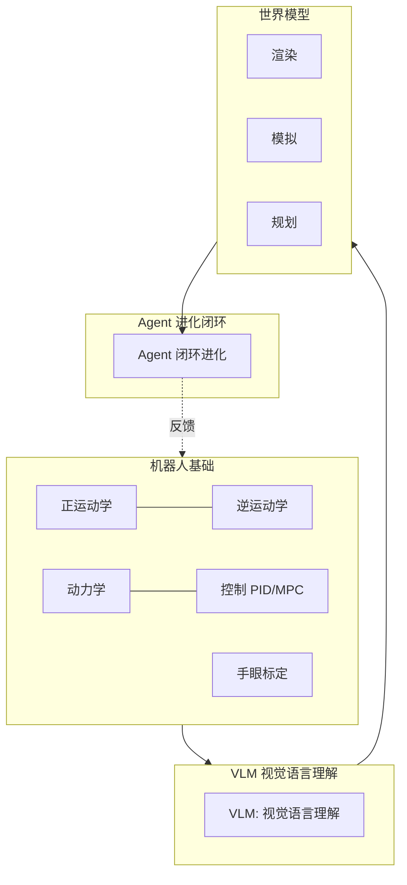
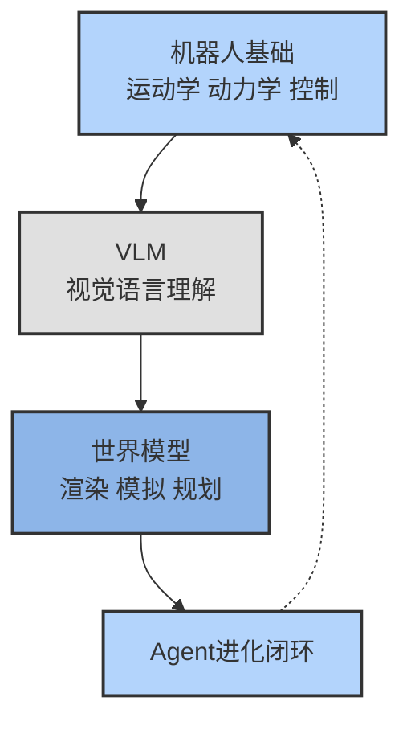
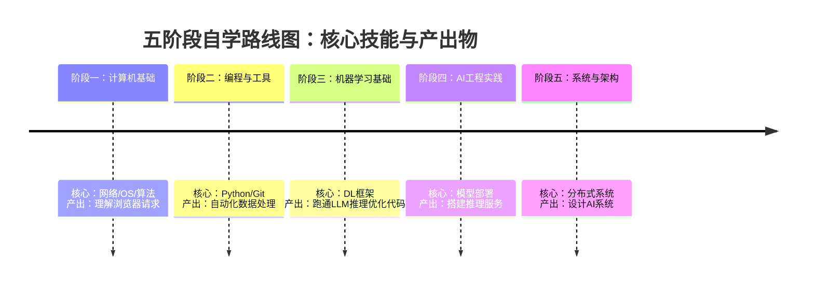

# 零基础到 AI 工程师：一张贯穿网络、模型与系统的认知地图
## LLM推理、具身智能、世界模型、Agent系统
**阅读时间**: 30 min
> 一张从浏览器到 AI Agent 的认知地图，让你看得清 AI 工程师需要掌握哪些核心领域，以及它们之间的关系。
## 目录
- [一、引子：从碎片到全部——为什么你需要一张认知地图](#一引子从碎片到全部——为什么你需要一张认知地图)
  - [1.1 痛点：你可能缺的不是技术，而是地图](#1.1-痛点你可能缺的不是技术，而是地图)
  - [1.2 Easy-Vibe 的核心主张：用全局视角学 AI](#1.2-easy-vibe-的核心主张用全局视角学-ai)
  - [1.3 本文路径预览：从网络到 AI Agent 的五个驿站](#1.3-本文路径预览从网络到-ai-agent-的五个驿站)
- [二、从浏览器到服务器：一次请求串起全网基础](#二从浏览器到服务器一次请求串起全网基础)
  - [2.1 从 URL 到网页：一次完整的“网络快递”](#2.1-从-url-到网页一次完整的“网络快递”)
  - [2.2 关键顿悟：API 调用和网页访问是同一种东西](#2.2-关键顿悟api-调用和网页访问是同一种东西)
  - [2.3 从浏览器到数据库：全栈雏形](#2.3-从浏览器到数据库全栈雏形)
- [三、深入 AI 核心：LLM 推理的底层逻辑](#三深入-ai-核心llm-推理的底层逻辑)
  - [3.1 模型说话的两段式：Prefill 与 Decode](#3.1-模型说话的两段式prefill-与-decode)
  - [3.2 KV Cache：笔记贴在桌上，但桌面越来越小](#3.2-kv-cache笔记贴在桌上，但桌面越来越小)
  - [3.3 多头注意力变体：MHA、MQA、GQA 的显存博弈](#3.3-多头注意力变体mhamqagqa-的显存博弈)
  - [3.4 FlashAttention：让计算在“手边工作台”完成](#3.4-flashattention让计算在“手边工作台”完成)
  - [3.5 PagedAttention & 量化：压榨最后一点显存](#3.5-pagedattention-&-量化压榨最后一点显存)
- [四、前沿拓展：从具身智能到世界模型](#四前沿拓展从具身智能到世界模型)
  - [4.1 具身智能：让 AI 长身体的三个板块](#4.1-具身智能让-ai-长身体的三个板块)
  - [4.2 VLM：把像素翻译成机器人能懂的语言](#4.2-vlm把像素翻译成机器人能懂的语言)
  - [4.3 世界模型：在脑子里先演一遍未来](#4.3-世界模型在脑子里先演一遍未来)
  - [4.4 Agent 的自我进化：AutoTalon 的经验→技能闭环](#4.4-agent-的自我进化autotalon-的经验→技能闭环)
- [五、整合与行动：你的 AI 工程师自学路线图](#五整合与行动你的-ai-工程师自学路线图)
  - [5.1 阶段一：计算机基础（耗时约 2 个月）](#5.1-阶段一计算机基础（耗时约-2-个月）)
  - [5.2 阶段二：全栈开发与部署（耗时约 3 个月）](#5.2-阶段二全栈开发与部署（耗时约-3-个月）)
  - [5.3 阶段三：AI 模型原理与实战（耗时约 4 个月）](#5.3-阶段三ai-模型原理与实战（耗时约-4-个月）)
  - [5.4 阶段四：前沿方向探索（终身学习）](#5.4-阶段四前沿方向探索（终身学习）)
  - [5.5 阶段五：Agent 工程与自动化（从看懂到能做）](#5.5-阶段五agent-工程与自动化（从看懂到能做）)
---
很多想成为 AI 工程师的同学，往往一头扎进模型训练或 API 调用，却缺乏对计算机系统整体的认知。看不懂推理优化？不理解具身智能？本文通过一张从浏览器到 AI Agent 的知识地图，帮你把网络、系统、模型、机器人等碎片知识串成一条线。目标不是让你精通所有细节，而是建立可迁移的全局视野，让你知道后续该学什么、为什么学。
---
## 一、引子：从碎片到全部——为什么你需要一张认知地图
### 1.1 痛点：你可能缺的不是技术，而是地图
你调过 `openai.ChatCompletion.create`，懂几行 Python，甚至自己跑过几个开源模型。但每次想深入一点，就像撞上一堵墙：理解了模型训练，却看不懂推理优化里“KV Cache”和“FlashAttention”在干什么；用 Agent 框架搭了个自动写博客的工具，但智能体一复杂，记忆和工具调用的逻辑就开始打架。学 AI 的过程，越来越像在黑夜里拼拼图——手里捏着一块，却不知道下一块该放哪。
许多有编程基础的人踏入 AI 领域时，都会陷入这种“东一榔头西一棒槌”的挫败感。原因不是学得不够多，而是手上缺一张地图。你学到的每个知识点——显卡、网络、数据库、Transformer——都是孤立的技术碎片，但从来没有人告诉你，这些碎片之间如何咬合，如何组成一台完整的“AI 引擎”。
> 没有整体认知，你学 AI 就像在黑夜里拼拼图——永远不知道下一块该放哪。
以 KV Cache 为例：你大概听说过它能加速推理，但你未必清楚它的代价。Llama-2-7B 用半精度推理，序列长度 4096、批大小 1 时，仅 KV Cache 就要占约 2GB 显存，而模型权重本身才 14GB。批大小和序列长度一旦增大，KV Cache 线性膨胀，很快顶爆 16GB 的显卡。到2026年，随着开源模型规模扩大到70B甚至200B级别（如DeepSeek-V2、Llama-3系列），KV Cache 的压力更加突出——单次推理的KV Cache占用轻松突破数十GB，促使GQA、PagedAttention等技术从“可选项”变成“标配”。再比如 FlashAttention，它不是花哨的“近似算法”——它比这更精妙。FlashAttention 的核心是分块计算（tiling）：将大矩阵切成小块，在 GPU 的快速缓存（SRAM）里一次算完一小块，并通过 online softmax 技巧在分块间逐步合并结果，避免了显存（HBM）与计算单元之间的大量搬运。最终结果与标准 Attention 数学完全等价，但速度更快、内存更省。这些看似“底层”的优化，核心都是在和两样东西较劲：**计算速度**和**显存（内存）**。不理解这一层，你就永远只知道调 API，不知道为什么同样的模型，有的服务一秒回几百字，有的卡成 PPT。而这些优化背后的瓶颈——计算和显存——正是理解系统全局的关键，而 Easy-Vibe 的认知地图正是帮你串联这些碎片。
### 1.2 Easy-Vibe 的核心主张：用全局视角学 AI
这正是 Easy-Vibe 试图回答的问题。这个由 Datawhale 出品的“从零开始的 AI 编程指南”，最值钱的地方不是教你怎么写代码，而是提供了一张把计算机从网络到 AI 串成一条线的认知地图。它的附录知识地图把计算机基础、前端、后端、数据、Git、AI（历史/提示词/LLM/Agent）每个模块都定位在完整的“技术版图”上。
但它更具启发性的是它的核心主张：**编程语言正在变成自然语言。以前做软件的门槛是“会写代码”，现在最难的是“你想做什么”。** 这个判断并非空洞口号——GitHub Copilot 自2022年上线以来，已被数百万开发者采用，生成代码占总代码量的比例在多个团队中超过30%；Cursor、Claude Code 等工具紧随其后，让自然语言描述需求直接生成可运行代码成为日常。到2026年，Copilot 已从“可选工具”演变为“编程基础设施”，大量开发者在日常编码中依赖AI辅助完成逻辑编写、调试甚至架构设计。Easy-Vibe 把这种现象叫作 **“vibe coding”（氛围编程）**：你用说话或聊天的方式驱动 AI 写代码，从想法一路做到能上线的产品。当编程语言逐渐退化为“表达意图的媒介”而非“必须死磕的技艺”时，什么才是你真正该掌握的？是对整个系统运作方式的直觉。
这个主张放在 AI 学习上尤其贴切。你可以把电脑跑一个网页的过程想象成网购：解析 URL 是填订单地址，DNS 查询是找仓库位置，TCP 握手是确认双方能收货，HTTP 请求是买家和商家的对话。一旦你脑子里有了这张“从按下回车到页面渲染”的地图，再去理解后端 API、网络协议、甚至 LLM 推理时的显存搬运逻辑，就不再是死记硬背。你看到的，是同一套底层规则在不同场景下的变化。
> 一个关键顿悟：你平时写的 API 调用（`fetch`/`axios`）和浏览器访问网页，在 HTTP 层面完全是同一个东西。服务器给 HTML，浏览器画出来；给 JSON，你的代码存起来。根本没有“两种请求”，只有同一种 HTTP 请求、返回格式不同。理解了这点，你就懂了 90% 的后端 API 原理。
举个例子，TCP 三次握手并不是简单的“打招呼”。第一次握手（SYN）是浏览器告诉服务器“我准备好接收了”；第二次握手（SYN-ACK）是服务器回应“我也准备好了”；第三次握手（ACK）是浏览器确认“收到，开始传数据”。为什么必须是三次？因为网络有延迟和重传，只有通过三次交互，双方才能确定“对方确实能收到我的消息，并且我也能收到对方的”。少一次，就有可能因为旧连接的迷路数据包干扰新连接——这是网络协议设计中最精妙的“容错”设计之一。
同样，DNS 查询并不只是“先问本地缓存→再问本地 DNS 服务器→层层向上”这么简单。它内部有两种查询模式。**递归查询**是你的本地 DNS 服务器替你把所有层级问完，最后直接把答案给你。**迭代查询**则是本地 DNS 服务器一次只问一级，拿到“下一级去哪里问”的地址，再自己逐级追问下去。实际运作中，本地 DNS 服务器通常作为递归器为你全权代理，但根服务器、顶级域名服务器（如 .com、.org）和权威名称服务器只做迭代回复——它们只告诉你“下一站去哪”，不会帮你跑完全程。这个分工，让全球数十亿台设备能在一秒内查到一个域名真正的 IP 地址。
而在隐私保护方面，传统的 DNS 查询是明文出行的——谁在中间偷听，就知道你访问了哪个网站。现代方案如 **DNS over HTTPS (DoH)** 和 **DNS over TLS (DoT)** 就是为了堵住这个漏洞。它们的核心区别在于传输层：DoT 使用专用的 853 端口，用 TLS 加密整个 DNS 对话；DoH 则把 DNS 查询伪装成普通的 HTTPS 流量（走 443 端口），混在其他网页请求中，让窃听者更难区分。二者都能防止中间人篡改 DNS 应答，但 DoH 更隐蔽——防火墙上很难直接封掉一个 443 端口的“普通网页请求”，而 DoT 的专用端口更容易被识别和拦截。而更进一步的 **DNS over QUIC (DoQ)** 则结合了 QUIC 协议的低延迟特性：它在传输层直接使用基于 UDP 的 QUIC，免去 TCP 握手与 TLS 握手的叠加开销，尤其适合对延迟敏感的场景——如实时语音、在线游戏——到2026年，DoQ 已在部分浏览器和递归解析器中获得一线部署能力。
换句话说，整体计算机认知不是让你记住所有技术细节，而是给你一根“系统根”——理解各个组件为什么这样设计、它们之间的通信规则是什么、一个问题到底出在哪个环节。
### 1.3 本文路径预览：从网络到 AI Agent 的五个驿站
基于这种全局视角，接下来的章节会带你进行一场“系统漫游”。我们会从一个简单的浏览器请求出发，先串起网络、操作系统、后端、数据库这些基础知识如何协同工作。接着，我们将细致拆解 DNS 查询的完整链路——从本地 hosts 文件到递归/迭代查询，再到现代隐私保护方案如 DNS over HTTPS (DoH)、DNS over TLS (DoT) 和 DNS over QUIC (DoQ) 如何在你“查地址”的同时加密整个对话。然后钻进 LLM 内部，拆解推理优化时预填充与解码、KV Cache、GQA、FlashAttention 到底解决了什么问题。再跳出屏幕，看看具身智能和世界模型怎么让 AI 走出像素世界——让机器不仅“看懂”世界，还能在“脑子里先演一遍”再动手。最后整合成一个会自我进化的 Agent 系统，并给出一条从零基础到 AI 工程师的高效学习路线。
这五个驿站，就像把一张落满灰尘的拼图拾起来，一张张摆回正确的位置。当你看到整张图画时，那些曾经让你困惑的碎片，就不再是负担了。
---
---
## 二、从浏览器到服务器：一次请求串起全网基础
想象一下，你在网上买了一本书。从点击“下单”到把书拿在手里，中间经历了填地址、查库存、快递运送、最后拆箱。浏览器请求网页的过程，几乎和这套流程一模一样。
一次浏览器请求是理解计算机网络、操作系统、后端、数据库的最小完整单元。它像一根线，把所有看似孤立的知识点——DNS、TCP、HTTP、浏览器渲染——串了起来。理解了这个过程，你就拥有了“整体计算机认知”的第一块拼图。
### 2.1 从 URL 到网页：一次完整的“网络快递”
每当你在地址栏输入一个网址并按下回车，背后发生的就是一次精心编排的“网购”。让我们把每一步都对应起来。
**第一步：填写订单（解析 URL）**
你输入的 `https://example.com/shop/item?id=123`，就像一张订单。浏览器需要先读懂这张订单上的信息：
- **协议（https://）**：告诉浏览器要用哪种“快递方式”，比如 HTTPS 就是带加密的安全快递。
- **域名（example.com）**：收件人的“品牌名”，方便人记忆，但电脑不认识。
- **路径（/shop/item）**：你具体想买哪个商品、去哪个货架。
- **查询参数（?id=123）**：商品的商品编号——这个商品的唯一标识。
> 这个过程叫 URL 解析，一个简单的文本拆分操作。
**第二步：查仓库地址（DNS 查询）**
电脑只认 IP 地址，比如 `93.184.216.34`。域名就是小名，IP 地址才是身份证号。所以浏览器需要查一个“电话本”——**DNS（域名系统）**。
查询路径一般是：先问自己电脑有没有缓存（本地 hosts 文件）→ 再问最近的“派出所”（本地 DNS 服务器）→ 层层向上，直到找到负责 `example.com` 的“总所”（权威 DNS 服务器）。
这个过程叫 **DNS 查询**。这里其实有两种查询方式，它们的区别在于谁在“跑腿”：
- **递归查询**：你只向本地 DNS 服务器问一次，它替你去问上级，直到拿到最终结果再告诉你。就像你只问小区快递点“这包裹在哪儿”，它自己一路打电话到总部，查到了回你。
 *步骤示例*：
 1. 你（浏览器）问本地 DNS 服务器：“`example.com` 的 IP 是多少？”
 2. 本地服务器不知道，于是它去问根服务器：“`example.com` 的 IP 是多少？”
 3. 根服务器说：“我不知道，你去问 `.com` 的顶级域名服务器。”
 4. 本地服务器再去问 `.com` 服务器。 `.com` 服务器说：“你去问 `example.com` 的权威服务器 `ns1.example.com`。”
 5. 本地服务器去问 `ns1.example.com`。权威服务器回答：“IP 是 `93.184.216.34`。”
 6. 本地服务器把这个结果返回给你。整个过程中，你只发起了一次请求。
- **迭代查询**：本地 DNS 服务器问根服务器，根服务器说“我不管，你去问 .com 的服务器”，它再去问 .com 服务器，.com 说“你去问 example.com 的服务器”——每一级都只告诉你“下一站找谁”，不替你去查。
 *步骤示例*：
 1. 本地 DNS 服务器问根服务器：“`example.com` 的 IP 是多少？”
 2. 根服务器回答：“我不负责这个，但我知道 `.com` 服务器的地址是 `a.gtld-servers.net`。”
 3. 本地服务器再去问 `a.gtld-servers.net`：“`example.com` 的 IP 是多少？”
 4. `.com` 服务器回答：“我不负责这个，但我知道 `example.com` 的权威服务器是 `ns1.example.com`。”
 5. 本地服务器最后问 `ns1.example.com`：“`example.com` 的 IP 是多少？”
 6. 权威服务器回答：“是 `93.184.216.34`。” 这一次，本地服务器终于拿到了答案。在这个过程中，本地服务器每次都会被“踢皮球”，直到找到最终答案。
实际中，你的电脑通常只用“递归查询”找本地 DNS 服务器，后面怎么查是它的事。
DNS 是互联网最基础的设施之一，没有它，你只能记住一长串数字来上网。
> **现代隐私补充**：传统的 DNS 查询是明文的，任何中间设备都能看到你正在访问哪个网站。如今，**DNS over HTTPS（DoH）**、**DNS over TLS（DoT）** 以及更新的 **DNS over QUIC（DoQ）** 正在成为主流——它们把查询内容加密，让运营商难以窥探你的上网踪迹，也让 DNS 劫持攻击变得更难。
>
> 三者的区别在于：DoH 把 DNS 查询伪装成普通的 HTTPS 流量（端口 443），混在网页流量里，更难被识别和拦截；DoT 使用专门的 853 端口，建立一条独立的加密通道；DoQ 则基于 QUIC 协议（端口 853），利用 UDP 减少连接建立的开销，在弱网环境下尤其有优势。DoQ 是 IETF 标准化的最新演进方向，目前主流浏览器已开始实验性支持。三者的目标相同：防止中间人偷看你正在访问什么网站。
**第三步：确认营业状态（TCP 三次握手）**
现在浏览器知道了仓库的地址，但还不能直接冲进去拿货。它得先确认对方“营业中且愿意接单”。这就是 **TCP 三次握手**，一种建立可靠连接的机制。
你可能觉得奇怪：为什么非要握三次手，两次不行吗？我们拆开来看每一步在做什么，以及报文中的序列号如何变化：
假设浏览器（客户端）的初始序列号（ISN）为 `x`，服务器（服务端）的初始序列号为 `y`。
1. **SYN（你问）**：浏览器发送一个 TCP 报文，将 SYN 标志位设为 1，并随机生成一个序列号，例如 `seq = x`。报文内容为空。这于问：“你好，营业吗？我准备发货了，我的编号是 `x`。”
2. **SYN-ACK（他回）**：服务器收到后，如果愿意建立连接，会回复一个报文。该报文的 SYN 和 ACK 标志位都为 1。其中，确认号 `ack = x + 1`，表示“我收到了你的编号为 `x` 的请求，现在期待你发编号为 `x+1` 的数据给我”。同时，它也会生成自己的序列号 `seq = y`。报文同样为空。这于回答：“营业中，我收到你消息了（`x+1`）。我也准备好了，你能收到我的回复吗？我的编号是 `y`。”
3. **ACK（你再回）**：浏览器收到服务器的回复后，再次发送一个报文，将 ACK 标志位设为 1。确认号 `ack = y + 1`，表示“我收到了你的编号为 `y` 的请求”。这个报文的序列号是 `seq = x + 1`。此时，报文虽然仍然为空，但它可以向服务器证明：“好的，收到你的回复了，我的序列号顺利增加到了 `x+1`，我们开始送货。”
关键点在于：**两次握手无法保证双方都能收发**。如果只用两次——浏览器发 SYN、服务器回 SYN-ACK——服务器就以为“连接已建立”。但如果这个 SYN-ACK 在半路丢了，浏览器以为自己没连上，服务器却在空等。三次握手确保了两点：**浏览器能收发、服务器也能收发**，在这个双向确认的基础上，数据传输才可靠。
这个“相互确认”的过程开销不小，所以有了很多复用连接的优化（如 HTTP Keep-Alive，让一个连接处理多次请求）。
**第四步：下单与取货（HTTP 请求/响应）**
连接建立后，浏览器正式发出 **HTTP 请求**——于把填好的订单（URL、参数）递过去。服务器收到后，用 **HTTP 响应** 把“包裹”（网页文件）打包回来。
这个包裹外面贴着一张“运单”，上面有状态码：
- **200 OK**：“订单已完成，包裹在此。”
- **301/302 重定向**：“这页搬家了，请去新地址取（可能是强制 HTTPS）。”
- **404 Not Found**：“查无此商品。”
- **500 服务器错误**：“仓库内部出故障。”
对于大型网站，服务器取“货”时可能还要现查数据库，下一节会细说。
> **协议版本演进与性能数据**：你正在用的 HTTP，背后可能有不同的“运输版本”。
>
> - **HTTP/1.1** 像一辆一次只能拉一件货的卡车。对同一个域名，浏览器通常会限制并行的连接数（比如6个）。当你请求10个文件时，它们需要在这6条车道上排队，前一个请求没结束，后一个就得等着。这就是**队头阻塞**问题。在 4G 网络下，加载一个包含 80 个资源的典型页面，HTTP/1.1 可能需要 2-3 秒。
> - **HTTP/2** 改成了“多路复用”——一辆卡车可以同时拉几十件货，所有请求都在一个连接上并行发送，解决了队头阻塞。还是上面那个80个资源的页面，改用 HTTP/2 后，加载时间可以缩减到 1-1.5 秒，性能提升约 30%-50%。这一切对于开发者来说几乎是透明的，只需要在服务器上开启 HTTP/2 支持即可。
> - **HTTP/3** 更进一步，底层改用 UDP 的 QUIC 协议。它解决了 TCP 的“队头阻塞”问题（一个数据包丢失会阻塞后面所有数据包的接收），并且将 TLS 握手和 TCP 握手合并，连接速度更快，尤其适合弱网环境。在丢包率 2% 的网络中，HTTP/3 的页面加载速度可能比 HTTP/2 快 10%-30%。现在主流浏览器均已默认支持 HTTP/3。
**第五步：拆箱组装（浏览器渲染）**
收到服务器发来的 HTML、CSS、JavaScript 文件后，剩下的事情全在客户端（你的浏览器）里完成。整个过程叫渲染，分为几个阶段：
1. **解析 HTML 成 DOM 树**：理解页面的“骨架结构”。
2. **解析 CSS 成 CSSOM 树**：理解页面的“外观样式”。
3. **合并 DOM + CSSOM 成渲染树**：只保留真正要显示的元素。
4. **布局（Layout）**：计算每个元素在屏幕上的位置和大小。
5. **绘制（Paint）**：把像素填充上去。
6. **合成（Composite）**：把不同的图层合并成最终画面。
这个过程高度优化，但逻辑和“收到快递后拆开箱子，看说明书、搭骨架、贴外观”完全相同。
> **DOM树构建过程举例**：假设服务器返回了这样一个简单的 HTML 片段：
> ```html
> <html>
> <head>
> <title>我的页面</title>
> </head>
> <body>
> <div id="main">
> <p>Hello, World!</p>
> </div>
> </body>
> </html>
> ```
> 浏览器解析这些标签的过程，就像搭积木一样：
> 1. 遇到 `<html>`，创建一个 `html` 节点，它成为整个文档的根节点。
> 2. 遇到 `<head>`，创建一个 `head` 节点，并将它挂到 `html` 节点下。
> 3. 遇到 `<title>`，创建一个 `title` 节点，挂到 `head` 下。
> 4. 遇到文本“我的页面”，创建一个文本节点，挂到 `title` 下。
> 5. 遇到 `<body>`，创建一个 `body` 节点，挂到 `html` 下。
> 6. 遇到 `<div>`，创建一个 `div` 节点，挂到 `body` 下。这个 `div` 节点被赋予了属性 `id="main"`。
> 7. 遇到 `<p>`，创建一个 `p` 节点，挂到 `div` 下。
> 8. 遇到文本“Hello, World!”，创建一个文本节点，挂到 `p` 下。
>
> 最终，就形成了一棵清晰的层级结构树，这就是 **DOM树（文档对象模型树）**。后续的 CSS 和 JavaScript 都可以通过这个树来找准目标元素。
**核心概念对照表**
为了让你看得更清楚，这里把整个流程浓缩成一张表：
| 计算机概念 | 网购比喻 | 一句话解释 |
| :--- | :--- | :--- |
| URL 解析 | 填写订单 | 把网址拆解成协议、域名、路径等部分。 |
| DNS 查询 | 查仓库地址 | 把域名翻译成机器可读的 IP 地址。 |
| TCP 三次握手 | 确认营业中 | 建立可靠的双向连接通道。 |
| HTTP 请求 | 递上订单 | 向服务器索要特定资源。 |
| HTTP 响应 | 收到包裹 | 服务器返回请求的资源（如 HTML）。 |
| 浏览器渲染 | 拆箱组装 | 客户端解析并绘制出最终可视化页面。 |
> **关键顿悟**：你平时写的 API 调用（fetch/axios）和浏览器访问网页，在 HTTP 层面完全是同一个东西。理解了这点，你就懂了 90% 的后端 API 原理。
### 2.2 关键顿悟：API 调用和网页访问是同一种东西
很多开发者在前后端分离的架构中写了好多年的 `fetch('/api/users')`，却从来没把这件事和“打开一个网页”联系在一起。
来看一个事实：
1. **浏览器访问网页**：发出 `GET /index.html`，服务器返回 `index.html`（一种文本格式）。
2. **前端调用 API**：发出 `GET /api/users`，服务器返回 `[{"name":"Alice"}]`（JSON，另一种文本格式）。
从 HTTP 层面看，两者的机制完全相同——都是请求-响应模型。唯一的区别在于**返回内容的格式**：
- **网页访问**：返回 HTML，交给渲染引擎解析成页面。
- **API 调用**：返回 JSON 或 XML，交给 JavaScript 逻辑解析成数据。
这也是为什么“全栈”这个概念如此合理。理解一次浏览器请求的完整过程，你就已经掌握了后端 API 的核心原理。
> 这里有一个更深层的观念转变：**编程语言正在变成自然语言。** 以前做软件的门槛是“会写代码”，现在最难的是“你想做什么”。当你用说话的方式驱动 AI 写代码时，理解这套底层流程，反而成了你判断 AI 生成结果是否靠谱的关键——你不是在写每一行代码，而是在指挥一次“网络快递”的正确流转。
这种转变的背后，是大语言模型在技术上的突破。你可能听说过 **KV Cache**、**FlashAttention** 这些术语，它们正是让 AI 能快速、持续生成代码的关键。简单来说，模型在生成文本时会“记住”之前已经算过的信息（KV Cache），避免重复计算；并通过分块计算（FlashAttention）减少显存搬运，大幅提升速度。以 Llama-2-7B 为例，半精度下推理一次需要约 16GB 显存（模型权重 14GB + KV Cache 2GB），每秒能生成数十个 token——比人类打字快得多。而到了 Llama-3-8B 和 DeepSeek-V2，由于采用了 GQA（分组查询注意力）或 MLA（多头潜在注意力）等优化，相同序列长度下的 KV Cache 占用进一步降低，使得更大批量的推理成为可能。其他优化（如 PagedAttention、量化、蒸馏）也在不断降低门槛。这就是为什么你能在浏览器里跟 AI 聊天，让它现场写一个 Python 爬虫——底层是大量工程优化的成果，而不是魔法。理解了这些，你就有了从浏览器到 AI 的整体认知。
先明确一个概念：**vibe coding（氛围编程）**。这个术语最早由 OpenAI 联合创始人 Andrej Karpathy 提出，描述的正是“用自然语言描述需求，让 AI 完成代码实现”的编程方式。在这种模式下，开发者不再逐行手工敲代码，而是像指挥家一样，用口语化的指令驱动多个 AI 模型协同工作。GitHub Copilot 自 2022 年正式上线后，已成为最广泛使用的 AI 编程助手之一，到 2026 年已服务超过 2800 万开发者，其生成的代码在不同语言中平均接受率在 25%-40% 之间。Stack Overflow 的开发者调查也持续显示，超过 70% 的受访者在工作中使用或尝试过 AI 编程工具。vibe coding 不是某种特定产品，而是一场正在发生的编程范式转变——编程语言正在变成自然语言，但理解底层原理依然是判断 AI 结果可靠性的关键。
### 2.3 从浏览器到数据库：全栈雏形
现在我们来看一个更完整的场景：当你请求一个动态页面时。
假设你登录了一个电商网站，进入了“我的订单”页面。你的浏览器发出 `GET /my-orders`。这次的处理流程是：
1. **浏览器 → 前端服务器**：请求 `/my-orders` 路由。
2. **前端服务器解析请求**：从 Cookie 或 token 中解析出你的用户 ID。
3. **前端服务器 → 数据库**：执行一条 SQL 查询。这一步是动态内容的核心。
 *SQL 查询示例*：假设用户 ID 是 `12345`，我们想要获取他最近的 10 个订单。一个典型的 SQL 查询会像这样：
 ```sql
 -- 这是一个参数化查询的推荐写法，而非直接拼接字符串
 SELECT order_id, total_amount, status, created_at
 FROM orders
 WHERE user_id = ?
 ORDER BY created_at DESC
 LIMIT 10;
 ```
 这里的 `?` 是一个**参数占位符**。在后端代码中，它会被绑定为变量 `userId`（即 `12345`），例如在 Node.js 的 `mysql2` 库中可以这样写：
 ```javascript
 const userId = 12345; // 从 token 中解析得到
 const sql = 'SELECT order_id, total_amount, status, created_at FROM orders WHERE user_id = ? ORDER BY created_at DESC LIMIT 10';
 connection.query(sql, [userId], (error, results) => {
 // results 就是查询结果，是一个包含订单信息的数组
 });
 ```
 采用参数占位符（`?`）而非直接拼接字符串（如 `"WHERE user_id = " + userId`）是一种重要的安全实践，能有效防止 SQL 注入攻击。
4. **数据库返回结果集**：返回包含订单数据的数组。
5. **前端服务器处理数据**：把查询结果拼接到 HTML 模板中（如 EJS、Jinja 等）或返回 JSON。
6. **服务器 → 浏览器**：返回最终渲染好的 HTML 或 JSON。
这就是静态内容与动态内容的区别：
- **静态内容**：服务器直接读取硬盘上的文件并原样返回（比如图片、CSS 文件）。速度快。
- **动态内容**：服务器收到请求后，必须调用后端代码，可能去查询数据库，将结果组合后再返回。速度慢，但能呈现个性化内容。
在 Supabase、Firebase 这类后端即服务平台中，这段流程被大大简化了。你往往只需要定义一个数据库表（Supabase 的 table）和一个 API 端点，就能完成从浏览器到数据库的完整数据流。一旦你理解了浏览器请求的本质，配置一个 Supabase API 端点就不再有神秘感。
> **从浏览器到 AI Agent 的延伸**：理解了上述流程，你就能看懂 AI Agent 的完整调用链路。以一个“帮我查订单”的 Agent 为例：你在聊天窗口输入指令 → 浏览器发出 HTTP 请求 → AI 模型解析意图（调用 LLM 的推理 API）→ 模型返回“需要查询用户订单”的动作计划 → 前端代码据此调用后端 API → 后端查询数据库 → 结果返回并展示在聊天界面。这本质上是一次浏览器请求的变体：请求内容从“URL+参数”变成了“自然语言指令”，但底层的网络、服务器、数据库链路完全一致。同时，这个 Agent 的运行也依赖一系列优化：用户的对话历史被编码为 token，通过 KV Cache 加速重复查询；每次调用 LLM 时，FlashAttention 确保长上下文也能高效计算。理解了一次请求的全过程，你就理解了 AI Agent 如何与现实系统交互——它只是在这条完整链路的最后一步，加了一个“智能调度层”。
> 一个完整的全栈应用，本质上就是浏览器发起 HTTP 请求 → 后端应对后查询数据库 → 返回结果 → 浏览器渲染的循环。而到了 AI Agent 的时代，这个循环的“调度层”被赋予了理解自然语言的能力。
理解了这一点，你就掌握了“整体计算机认知”的骨架。现在你知道了数据是如何从你的鼠标点击，经过网络、经过服务器、经过数据库，再回到屏幕上的——这是一套可拆解的系统流程。
---
# 三、深入 AI 核心：LLM 推理的底层逻辑
你或许已经跟 ChatGPT、Claude 这样的对话模型交流过了。它打字快得惊人，回答也常常让人惊叹。但如果你自己动手部署过一个开源的大模型，比如 Llama 或 Qwen，就会发现一个残酷的事实：**在家里那台显卡不错的机器上，它说话像得了“口吃”**——每蹦出一个字都要等上几百毫秒，显存还动不动就飙到接近爆满。这到底是怎么一回事？
要理解为什么 LLM 推理又慢又吃显存，先得拆解它的说话过程。
### 3.1 模型说话的两段式：Prefill 与 Decode
LLM 生成内容最根本的模式叫“自回归”，也就是一个一个地吐字。这个生成过程，实际上由两个性质完全不同的阶段组成。
**第一个阶段：预填充。** 当你把一段长长的提示词（Prompt）丢给模型，比如“请你写一篇关于大模型推理优化的文章”，这个阶段就开始了。模型会把整个提示词一次性“看完”，并行计算出所有字符之间的注意力关系。**这个阶段是计算密集型**，因为需要做大量的矩阵乘法，GPU 的并行计算能力在这里被拉满。你显卡里的流式多处理器会全速运转，所以这个过程通常很快，耗时主要取决于提示词的长度。就像一个考试前快速扫教材做笔记的学生，GPU 在这里发挥最大效率。
**第二个阶段：解码。** 模型开始一个接一个地生成新词。每生成一个词，模型都需要把当前这个词和前面所有的历史词（包括提示词和已生成的词）一起做一遍注意力计算。但这里的关键是：**这是一个串行的过程**。模型必须等前一个词生成完毕，才能开始计算下一个词。而且，每往前推进一步，需要计算的“历史”序列长度就增加一点。这个阶段成了 **访存密集型**。瓶颈不在于算力够不够快，而在于数据在显存（HBM，高带宽显存）和计算单元（SRAM）之间搬来搬去的时间。
> 卡住推理的，往往不是‘算得慢’，而是‘数据在显存里搬来搬去太慢’。
预填充是站满乘客的飞机，起飞很吃力但整体快；解码是出租车，虽然不耗油但跑不远，而且一趟接一趟，效率极低。
### 3.2 KV Cache：笔记贴在桌上，但桌面越来越小
既然解码阶段如此低效，有没有办法优化？一个直接的观察是：当模型生成第 100 个词时，它需要重新计算第 1 到第 99 个词的 Key（键）和 Value（值）矩阵。但第 1 到第 99 个词的这些计算结果，和生成第 99 个词时的计算结果完全一样！为什么每次都要从头算一遍？
这里需要先简单了解一下注意力机制中的 Key、Value 和 Query。每个词在注意力层中都会生成三个向量：**Query（查询）** 用来问“谁跟我相关”，**Key（键）** 用来回答“我有什么特征”，**Value（值）** 则存储最终要提取的信息。计算注意力分数时，Query 会和所有 Key 做匹配，再用得到的权重对 Value 做加权求和。解码时，新词需要和前面每个词的 Key、Value 做匹配——但前面的 Key、Value 其实早就算好了，只是没保存。
这就是 **KV Cache** 的用武之地。它的思路很朴素：**把计算过的 Key 和 Value 向量存储起来，下次直接用，不再重复算。** 就像你在桌上贴满了工作笔记，想查之前的信息直接看笔记，不用再去翻旧文档。
这个优化有效，它把解码阶段每个步骤的计算量从 O(n²) 降到 O(n)。但它带来了一个新问题：**显存成本**。随着“笔记”越贴越多，你的“桌面”（显存）越来越小。这也解释了为什么长文本越聊越慢、为什么显存动不动就爆（OOM）。
用 Llama-2-7B 模型来算一笔账就很清楚了。这个模型有 32 个注意力头，每个头都维护着自己的 K 和 V 矩阵。如果以半精度（float16，每个参数占 2 字节）计算，**序列长度为 4096、批处理大小为 1 时，光 KV Cache 就要消耗约 2GB 显存**。而模型本身的权重文件只有 14GB 左右。这意味着，当你的对话变长，或者同时服务多个用户（批处理大小变大），KV Cache 消耗的显存会以 **O(批大小 × 序列长度)** 的速度线性增长，迅速超过模型权重本身，成为显存的头号杀手。
新一代模型也在持续优化 KV Cache 的效率。例如 DeepSeek-V2 引入了 **MLA（Multi-Head Latent Attention）** 机制，通过对 Key 和 Value 进行低秩压缩，将每 token 的 KV Cache 大小从传统的 2dh（d 为头维度，h 为头数）压缩到约 d 级别。在相同显存预算下，这意味着可以支持更长的上下文或更大的批管理。类似地，Gemma 系列和 Qwen2 等模型也在架构层面探索更高效的 KV 缓存策略，使同等硬件条件下能承载更大的推理规模。
> ⚠️ **注意：** KV Cache 的本质是用显存换计算。它成功绕过了计算瓶颈，却撞上了显存容量的天花板。
### 3.3 多头注意力变体：MHA、MQA、GQA 的显存博弈
既然 KV Cache 这么占地方，那能不能对它“瘦身”？这就要从注意力机制的源头——多头注意力（MHA）说起。
在标准 MHA 中，模型有多个注意力头，每个头都独立拥有自己的 Query、Key、Value 矩阵。因此 KV Cache 也是每头一份，独立存储。这就好比**每人一本笔记**，最细最全，但本子堆满柜子，占地方。
一个激进的优化思路是 **多查询注意力（MQA）**。它让所有注意力头共享同一组 Key 和 Value 矩阵，只保留独立的 Query。这就相当于**全班共用一本笔记**，省地方省到了极致，但每个人记录的细节可能丢失，容易影响模型精度，尤其在需要精细理解的任务上。
MQA 太“糙”了，需要找个折中方案。于是有了 **分组查询注意力（GQA）**。它不打乱而是分组：比如每 4 个 Query 头共享一组 Key 和 Value。这就像**每 4 人合一本笔记**，既大大节省了空间，又因为共享范围有限，保留了足够的信息细节，不至于太糙。Llama-2-70B 这样的大模型就采用了 GQA。这个改动看似不大，但对实际部署意义重大——它能将 KV Cache 的显存消耗降低数倍，成倍地提升单张显卡能承载的并发用户数或上下文长度。这也是为什么现在开源大模型大多默认 GQA，它成了 MHA 质量和 MQA 效率之间的最佳折中。
### 3.4 FlashAttention：让计算在“手边工作台”完成
除了对 KV Cache 本身进行压缩，另一个优化的思路是：**让注意力计算本身变得更快、更省显存**。传统的注意力计算，需要将完整的 Q、K、V 矩阵从显存（HBM）加载到计算单元（SRAM），算完后再把结果写回 HBM。这个过程低效，因为 HBM 的带宽远小于 SRAM，数据搬运是主要耗时环节。你可以把 HBM 想象成楼下的大仓库——容量大但来回取货慢；SRAM 则是手边的工作台——空间小但随手可拿。
FlashAttention 的核心思想是“在哪儿干活就在哪儿取料”。它用了两个关键技巧：
1. **分块（Tiling）**：不一次性把所有数据搬进来，而是把大矩阵分成很多小块。每次只加载一小块到 SRAM 上完成计算，解决完后再去加载下一块。这就好比一个厨师，不再把整只猪搬上操作台，而是每次只拿一块肉过来切，操作台始终够用。
2. **重计算（Recomputation）**：，FlashAttention 故意不存储中间结果（比如 Softmax 的归一化因子），而是把计算过程和最终结果保存。在反向传播时，它不需要去读这些庞大的中间结果，而是**在计算单元上重新算一遍**。这看似多此一举，但因为省去了大量 HBM 读写的操作，反而让整体速度更快了。
通过这两招，FlashAttention 成功将注意力计算的带宽需求降低了数倍，并且它得到的结果在数学上跟标准实现完全等价。它不是“近似算法”，所以能直接替换已训练好的模型。它没有改变模型参数，只是优化了运行方式。演进到 V3 版本已针对 H100 等新硬件做了异步 + FP8 优化，进一步压榨性能。
### 3.5 PagedAttention & 量化：压榨最后一点显存
KV Cache 和 FlashAttention 解决了“大”和“慢”的一些问题，但显存里的碎片化依然存在。想象你往一块内存里反复分配和释放大小不一的 KV Cache，就像往一块硬盘里反复存删小文件，最终会产生很多用不了的空隙。传统做法给每个请求预分配一整块连续显存，大小按模型支持的最大长度来，而实际请求大多很短，于是 60%~80% 的显存就这样被白白浪费。
借鉴操作系统虚拟内存的思想，**PagedAttention** 被提出。它把 KV Cache 切成固定大小的“页”，不要求它们在物理显存中连续存放。一个逻辑上的长序列可以被分散存储在不连续的多个物理页上，就像操作系统的分页存储管理。多个请求共享同一段 prompt 时，还能用“写时复制（CoW）”共享页，省内存又省算力。这好比以前借笔记本必须一次性占一整本（哪怕只写两页），现在换成活页本——按需撕页，页与页不用挨着，写废了页还能回收给别人。多个同学写同一道例题，原题页可共用，只在各自写答案时才复印一份。这样，那些空隙（内存碎片）就被充分利用了，显存浪费趋近于零。PagedAttention 是 **vLLM** 这个最流行的 LLM 推理加速框架的核心，它让显存利用率显著提升，吞吐量提升 2~4 倍，能支持更大的批应对量和更长的上下文。
除了这些“聪明”的技巧，还有一些更“粗暴”但同样有效的方法：**量化**和**知识蒸馏**。量化的思路是把模型参数从 16 位浮点数（FP16）砍到 8 位整数（INT8）甚至 4 位整数（INT4）。这意味着模型体积直接缩小到原来的 1/2 甚至 1/4，KV Cache 的大小也相应减小。虽然精度有轻微损失，但在许多场景下依然够用，换来的却是显存容量和推理速度的巨大进步。知识蒸馏则是“大模型教小模型”，用一个强大的教师模型去训练一个结构更精巧、参数更少的学生模型，直接从根源上减小了需要存储和计算的规模。
> 显存大头之一是模型权重本身。蒸馏的精髓在于，学生模型学到的不是答案本身，而是教师模型在训练过程中形成的“思考方式”（即 soft label 的概率分布）。因此，即使学生模型小得多，也能在关键任务上保持接近教师模型的精度。这使得蒸馏和量化往往可以叠加使用：先蒸馏缩小模型，再量化精简参数，最大化“瘦身”效果。
---
## 四、前沿拓展：从具身智能到世界模型
AI 的下一个前沿不在聊天窗口里，而在物理世界中。当 LLM 学会理解和生成语言后，研究者们开始问一个更根本的问题：AI 能不能像人一样，在真实环境里看、听、摸、走、操作？这个问题催生了具身智能（Embodied AI），而世界模型则是让这项技术跑通的关键引擎。
### 4.1 具身智能：让 AI 长身体的三个板块
具身智能的目标很简单：给 AI 一个身体，让它能感知环境、做出动作、完成任务。要做到这点，需要三个板块协同工作。
第一块是**机器人基础**。这是硬约束——AI 要控制机械臂或移动平台，必须理解物理世界的基本规则。可以用四句话概括核心：“手在哪”对应运动学，包括正运动学（给定关节角度算出手的位置）和逆运动学（给定手的位置反推关节角度）；“用多大力”对应动力学，考虑质量、惯性、重力等因素，确保动作平稳且不损坏物体；“怎么稳”对应控制算法——PID 实时纠偏，MPC（模型预测控制）则提前模拟未来几步再决定当前动作，适合复杂轨迹跟踪；“各视角怎么对齐”对应坐标变换与手眼标定，确保摄像头看到的像素坐标能换算为电机转动的角度。这四句话构成了机器人理解物理世界的基本框架。一个更直观的理解：正运动学像掰台灯——你拧两节灯臂到某个角度，灯头自然落在某处；逆运动学则像想让灯头照到书页，反过来调两节臂的角度。动力学补上“力”的维度：运动学告诉你“手能伸到杯子上”，动力学说“伸过去时胳膊别抖、抓的时候力道刚好”。PID 是经典的自稳方法，就像调水温——太凉就加热，太烫就关点，来回微调；MPC 则像下棋，先想几步再落子。而手眼标定就像闭一只眼用手指戳鼻尖——靠长期校准“看到的位置”和“摸到的位置”，才能一次戳中。
第二块是**核心技术**，包括计算机视觉、强化学习和仿真环境。视觉让机器人识别物体和障碍，强化学习帮它在试错中找到最优策略，仿真则提供了安全、低成本的训练场，让算法在虚拟世界中快速迭代。
第三块是**具身大脑**。传统方法靠人工编写规则来控制机器人，泛化能力极差。具身大脑的思路是用 VLA（Vision-Language-Action 模型）或世界模型，把视觉输入、语言指令和动作输出端到端对齐。这才是具身智能的大脑所在。
> 具身智能三块板：物理身体的规则（机器人基础）、感知与学习的算法（核心技术）、把事情想通的决策系统（具身大脑）。

*三层结构图：底部机器人基础（运动学、动力学、控制），中间 VLM（视觉语言理解），顶部世界模型（渲染、模拟、规划），右侧*
### 4.2 VLM：把像素翻译成机器人能懂的语言
机器人看到的世界是一堆像素，无法理解“把桌上的苹果拿给我”这种抽象指令。VLM（视觉语言模型）就是桥梁——它把图像中的物体、关系和文本描述对齐，让机器人能看懂画面。
VLM 的发展有两条主要路线。**CLIP 路线**：用对比学习分别编码图像和文本，让匹配的图像-文本对在特征空间中靠近。CLIP 本身不生成语言，但它能为下游任务提供高质量的视觉特征。**LLaVA 路线**：在视觉编码器基础上接入 LLM，实现真正的多模态对话。模型看到一张图，能回答“图中有什么”、“物体之间是什么关系”。对机器人来说，LLaVA 路线更有前途，因为它能同时理解视觉和语言，并直接输出指令。
在实际部署中，VLM 承担“眼睛”的角色。机械臂抓取前，VLM 先定位目标物体的坐标，判断是否被遮挡，理解指令中的空间关系（“左边那个杯子”）。但只看到画面还不够——机器人还需要知道行动后会发生什么。这正是世界模型登场的原因。
### 4.3 世界模型：在脑子里先演一遍未来
如果说 VLM 是眼睛，世界模型就是**想象力**。它能根据当前状态和拟采取的动作，在内部模拟出接下来几帧的画面和物理结果，从而让机器人选择最优路径。简单说，世界模型 = 脑子里的“沙盘推演”——在真正动手之前，先在脑子里把未来演一遍。这个概念最早可追溯到 1943 年心理学家 Craik 的话：“如果有机体在颅骨内携带了一个外部现实的'小尺度模型'，它就能在应对紧急情况之前预先试验各种可能性。”直到近年，工程手段才真正追上这一设想。
需要区分广义和狭义的世界模型。广义上，任何能预测“接下来发生什么”的模型都算——语言模型预测下一个 token、视频模型预测下一帧、天气模型预测明天温度。而狭义的世界模型（具身智能关注的核心）要求**以动作为条件**：它回答的不是“未来会发生什么”，而是“如果我做了这个动作，世界会怎么变”。机器人需要的是顾问，不是预言家——它必须在真正动手之前，在内部模拟出动作的后果。
基于这种理解，世界模型可以分成三类：
- **渲染器（Renderer）**：回答“世界看起来是什么”——给定动作，预测下一帧的像素画面。典型代表是文生视频模型（如 Veo、Sora），它们优化的是视觉可信度，但对物理规律不必显式理解。这也带来明显问题：AI 生成的城市俯视图很完美，但你开车进去会发现建筑崩坏、违反物理——因为模型只学了“看起来像”，没有理解三维结构。
- **模拟器（Simulator）**：回答“世界本身是什么”——关注状态的变化，而非像素。例如仿真环境里物体被推后的新坐标。Dreamer 系列在隐空间中维护状态、根据动作推演下一步，就是一种隐式模拟器。模拟器是三者中商业关注最少但功能最关键的连接点——它连接了“渲染”（把状态画给人看）和“规划”（把状态变成动作）。一个真正理解世界的模型，应该能同时做这三件事。
- **规划器（Planner）**：回答“我能做什么”——在模拟器中搜索动作序列，规划出达成目标的路径。VLA、CEM-MPC 等都是规划器，但当前大多只能在高度受控的实验室中稳定运行。李飞飞和 World Labs 团队近期重新梳理了这一三分法，让业界对世界模型有了更清晰的认知。
一个典型例子是 Google 的 Dreamer 系列。Dreamer 从过往经验中学习世界的状态转移规律，在隐空间中做规划，不需要每次都在真实环境中试错。这就像棋手在心里先演算几步再落子——避免了许多无谓的碰撞和失败。
**能力阶梯 L1-L5** 给出了世界模型成熟度的视角：L1 仅做数据压缩和特征提取，回答“当前状态是什么”（如 DINO、MAE）；L2 能预测几步后的状态，回答“接下来会发生什么”（如视频预测模型）；L3 可以利用模型做简单规划，回答“如果我行动，会发生什么”（如机器人前向模型）；L4 实现闭环控制，模型预测与真实反馈持续校准，回答“什么更重要”（如 Dreamer 中的价值耦合）；L5 达到价值耦合，模型不仅能模拟物理世界，还能理解任务目标和约束，自主做出最优决策。当前大部分工作处于 L2-L3 阶段，L5 仍是长期目标。这套阶梯的价值在于：判断一个系统不再纠结于“它是不是世界模型”，而是看“它让智能体获得了什么能力”。
> 世界模型 = 脑子里的“沙盘推演”——在真正动手之前，先在脑子里把未来演一遍。

*三层结构图：底部机器人基础（运动学、动力学、控制），中间 VLM（视觉语言理解），顶部世界模型（渲染、模拟、规划），右侧*
### 4.4 Agent 的自我进化：AutoTalon 的经验→技能闭环
机器人环境复杂、任务多变——人类很难为每种情况都写死控制逻辑。因此具身智能的另一条线索是 Agent 的自我进化能力。AutoTalon 是一个具体的实践案例，展示了 Agent 如何从经验中提炼技能、持续改进。
AutoTalon 的进化机制包含四个关键步骤：执行内核在执行任务的同时，记录详细的执行日志（trace）；经验采集器从中筛选出候选经验片段，类型包括成功/失败、规律、约定、教训等；这些片段需经过**人工审核**确认有效性，状态从“candidate”标记为“accepted”；审核通过后，PromotionAdvisor 组件自动将经验起草为可复用的 skill（技能草稿），但只有人工最终批准后才正式生效。整个过程形成了一个闭环：执行 → 记录 → 筛选 → 审核 → 沉淀。
关键环节在于：经验不会自动影响决策。PromotionAdvisor 只有当某个模式被反复验证成功（如最低成功 3 次、成功率 ≥ 80%、稳定性 ≥ 0.6）时，才自动生成 skill 草稿并放入收件箱等待人工审核。这保证了学习方向可控——不让一次偶然成功直接变成“真理”。审核通过后的 skill 可被 Agent 直接调用，避免了重复试错。需要特别说明：AutoTalon 的“进化”并非修改自身源码，而是治理层面、可审计的技能沉淀——它不会越跑越变成另一个物种，而是通过人工把关的“技能积累”逐步提升同类任务的效率。目前这一闭环的效果尚未被系统验证，项目 roadmap 中明确将“被测量的进化”列为后续目标：借助对比同一批任务在“经验/skill 空着”与“已积累”时的性能差异来量化复利。
从具身智能到世界模型，再到 Agent 进化，背后一条清晰的主线：AI 不再只是一个静置的推理引擎，而是在物理世界中感知、预测、规划、学习、适应——越来越像人类理解世界的方式。下一章，我们将把这些分散的技术栈整合为一套可行的学习路线图，梳理从零开始成为 AI 工程师需要跨越的阶梯。
---
## 五、整合与行动：你的 AI 工程师自学路线图
你已经走过了从一次浏览器请求到世界模型的认知过程。现在的问题是：**我该先学什么？每个阶段走到哪里才算合格？** 答案是：不要试图一次性掌握所有知识，而是沿着一条明确的路径，分阶段建立你的能力栈。
以下是基于 Easy-Vibe 学习路径 {source_004} 和大量开发者实践经验总结的五阶段路线图。每个阶段都有明确的里程碑，完成后你就具备了进入下一阶段的资格。

*五阶段时间线图，标注每个阶段的核心技能和产出物，如阶段一输出“理解浏览器请求”，阶段三输出“跑通 LLM 推理优化代码”*
### 5.1 阶段一：计算机基础（耗时约 2 个月）
**核心目标**：理解一个浏览器请求从发出到渲染的全流程。
这个阶段不要求你写出复杂的系统，而是要建立计算机的**全局认知**。正如 Easy-Vibe 学习路径所强调的：“编程语言正在变成自然语言”——你不再需要死记硬背语法细节，而是需要理解底层逻辑。这种理念被称为 **vibe coding（氛围编程）**，它主张用自然语言描述需求，让 AI 直接生成代码，从而让开发者聚焦于“想做什么”而非“怎么写”。随着 AI 编程助手的普及，这一方式已成为主流——GitHub Copilot、Cursor 等工具已被众多开发者采用，自然语言编程大幅降低了传统编码的门槛。你需要掌握：计算机网络（HTTP、TCP/IP、DNS 解析）、操作系统基础（进程、线程、内存管理）、数据结构与算法（数组、链表、哈希表、树）。
**验收标准**：能清晰描述当你输入 URL 并按下回车后，发生了什么。这也是 Easy-Vibe Stage 1“零基础入门”的核心产出——建立起学习地图和全局视野 {source_004}。
一个推荐的认知框架是“网购比喻”：解析 URL 于填写订单（协议、域名、端口、路径、参数）；DNS 查询像查仓库地址——首先查询本地 hosts 文件和本地 DNS 缓存，如果找不到，就向本地 DNS 服务器发出请求。这里有两种查询方式：**递归查询**让本地 DNS 服务器代劳完成全部查找并返回最终结果；**迭代查询**则让本地 DNS 服务器依次向根 DNS 服务器、顶级域服务器、权威 DNS 服务器发起询问，每级只回答“下一步找谁”，由客户端自己追踪。实际中，本地 DNS 服务器通常帮客户端完成递归，内部则使用迭代。现代浏览器还支持 DNS over HTTPS (DoH)、DNS over TLS (DoT) 以及 DNS over QUIC (DoQ)，将查询加密，防止中间人窥探你访问了哪些网站。DoH 将 DNS 查询封装在 HTTPS 协议中（端口 443），流量与普通 HTTPS 混合，难以被单独拦截；DoT 使用专门的 853 端口，基于 TLS 加密，协议更标准化，但容易被防火墙直接阻断；DoQ 则利用 QUIC 协议的 0-RTT 握手和连接迁移特性，进一步减少建链延迟，在弱网环境下表现尤为出色。
TCP 三次握手像打电话确认仓库营业、能接单：第一次握手（SYN）客户端发“你在线吗？”；第二次握手（SYN-ACK）服务器回复“我在，你能听到吗？”；第三次握手（ACK）客户端再发“听到了，开始吧”。之所以要三次而不是两次，是为了防止已失效的旧连接请求（比如网络延迟后到达的 SYN 包）被服务器误认为是新请求，从而浪费资源——三次握手确保双方都能确认双方的收发能力正常。
HTTP 请求/响应像买家和商家对话，取货单换包裹。你还需要区分 HTTP/1.1、HTTP/2 和 HTTP/3：HTTP/1.1 每次请求需新建连接；HTTP/2 支持多路复用，多个请求共享一条连接；HTTP/3 基于 QUIC 协议，用 UDP 替代 TCP，减少握手延迟，显著提升弱网环境下的加载速度。最后浏览器渲染于拆箱组装：HTML 构建 DOM 树、CSS 构建 CSSOM 树，两者合并为渲染树，经过布局、绘制、合成，最终呈现在屏幕上。
一个关键顿悟：**你平时写的 API 调用（fetch/axios）和浏览器访问网页，在 HTTP 层面完全是同一个东西。** 服务器给 HTML，浏览器画出来；给 JSON，你的代码存起来。根本没有“两种请求”，只有同一种 HTTP 请求、返回格式不同。理解了这点，你就懂了 90% 的后端 API 原理。
### 5.2 阶段二：全栈开发与部署（耗时约 3 个月）
**核心目标**：独立搭建并部署一个包含前端、后端、数据库的完整应用。
有了基础认知后，你需要动手。学习一个前端框架（React/Vue）、一个后端框架（FastAPI/Node.js）、一个数据库（PostgreSQL/Supabase），以及版本控制工具（Git）。利用 Supabase 这类开箱即用的后端服务，可以大幅降低入门门槛，这恰好是 Easy-Vibe Stage 2“初中级开发”的重点 {source_004}。
**验收标准**：在 GitHub 上托管一个完整的 Web 应用，并部署到公开的生产环境。
### 5.3 阶段三：AI 模型原理与实战（耗时约 4 个月）
**核心目标**：动手跑通 LLM 推理和微调流程。
这是整个路线图里最核心、也最需要耐心的阶段。你需要理解 Transformer 架构的核心机制，掌握推理优化技术（预填充/解码、KV Cache、FlashAttention），并使用开源工具（vLLM、Hugging Face Transformers）完成一次完整的推理和微调实验。Easy-Vibe Stage 2 提到的 Dify 知识库搭建，是这一阶段极好的实践入口 {source_004}。
先拆解模型说话的两步：大模型生成文字是自回归的——一个字一个字蹦，每蹦一个字都要看前面所有字。这过程分两阶段：**预填充（Prefill）** 把你的输入整段读进去，高度并行，GPU 跑得飞起；**解码（Decode）** 阶段每生成一个新字都要依赖前面所有字，瓶颈变成了“从显存搬数据有多快”。后面几乎所有优化，都在救这两个阶段。
理解推理优化，本质是在和两样东西较劲：**计算速度**和**显存（内存）**。大模型生成文字分两阶段：预填充阶段将你的输入整段读进去，高度并行，GPU 跑得飞起；解码阶段每生成一个新字都要依赖前面所有字，瓶颈变成了“从显存搬数据有多快”。KV Cache 的做法是把算过的 Key 和 Value 缓存进显存，避免重复计算，但代价是显存膨胀——Llama-2-7B 在序列长 4096、批大小 1 时，KV Cache 约需 2GB，模型权重本身 14GB。以此为基础，后续模型在 KV Cache 上持续优化：GQA（分组查询注意力）已成为主流方案，从 Llama-3 系列到 Qwen2 系列均采用此设计；而更进一步的 MLA（Multi-Head Latent Attention，如 DeepSeek-V2）则通过低秩压缩大幅减少 KV Cache 占用，在同等任务下可将显存需求降低约 80%。多头注意力（MHA）每个头都有独立的 K、V，质量最好但最耗显存；多查询注意力（MQA）所有头共享一套 K、V，显存骤降但质量下降；分组查询注意力（GQA）是折中方案，把注意力头分成组，每组共享一套 K、V，Llama-2-70B 正是采用 GQA。FlashAttention 通过分块技术，把大矩阵切成小块在高速 SRAM 上计算，减少与慢速 HBM 之间的数据搬运，且结果与原版数学等价。vLLM 的核心是 PagedAttention，它借用了操作系统的虚拟内存分页思想，把 KV Cache 切成固定大小的页，按需分配，多个请求还能共享相同的 prompt 页，显存浪费趋近于零，吞吐量提升 2~4 倍。
**验收标准**：能用 vLLM 运行一个开源模型，并用 LoRA 在自有数据集上进行微调。
### 5.4 阶段四：前沿方向探索（终身学习）
**核心目标**：保持对具身智能、世界模型、多模态等方向的感知能力。
这个阶段没有固定的时间线。你需要养成阅读顶会论文（NeurIPS、ICML、ICLR）和开源项目（Isaac Gym、MuJoCo）的习惯。理解视觉语言模型（VLM）如何让机器“看懂”，世界模型如何构建内部模拟器。这不是为了成为专家，而是为了在技术快速迭代时，你知道从哪里切入。
具身智能的核心是让 AI 拥有身体，既能看懂世界，又能动手做事。你先要跨过机器人基础的门槛——运动学（Kinematics）解决“手在哪”，动力学（Dynamics）加上“用多大力”，控制（Control）保证“动得稳”，坐标变换与手眼标定统一不同传感器的参照系。这些知识看起来很硬，但本质都是初高中物理加一点线性代数，跑通一个仿真 demo 比先啃公式有效得多。
VLM 是机器人的眼睛和脑子：CLIP 路线将图片和文字编码到同一个向量空间，让“猫的照片”和“猫”这个词靠得近；LLaVA 路线把图片压成视觉 token，塞进大语言模型，让 LLM 既能读文字也能“读图”。在具身智能里，VLM 把像素翻译为语义，让机器人知道“左前方有个红方块”。
世界模型则更进一步，它回答的是：**如果我做这个动作，世界会怎么变？** 世界模型按功能分为三类：渲染器输出人能看懂的画面（文生视频）；模拟器输出符合物理规律的状态，在潜在空间里推演未来；规划器输出智能体该采取的动作。李飞飞团队提出了 L1 到 L5 的能力阶梯，每一级回答一个更复杂的问题：
| 层级 | 核心问题 | 最小能力 | 典型代表 |
|------|---------|---------|---------|
| L1 压缩 | What is here? | 表征当前状态 | DINO、MAE、NeRF 编码器 |
| L2 动力学 | What happens next? | 预测未来状态 | JEPA、视频预测、scene flow |
| L3 行动条件 | What if I act? | 预测动作后果 | 机器人前向模型、action-conditioned 动力学 |
| L4 价值耦合 | What matters? | 用预测服务规划决策 | Dreamer 系列、TD-MPC |
| L5 规划执行 | What should I do? | 全程自主规划 | 未来统一模型 |
Dreamer 系列已经在“梦境”里训练机器人策略，证明了世界模型的实用性。一个关键区别：渲染器只追求视觉可信，模拟器追求物理真实，规划器追求行动决策。模拟器是连接“看到”和“做到”的桥梁，也是当前工业界关注最少但最核心的一环。
### 5.5 阶段五：Agent 工程与自动化（从看懂到能做）
**核心目标**：构建一个能长期稳定运行、有自主能力的 AI Agent。
这是通往高级开发阶段的桥梁。你需要掌握 Agent 的规划、工具调用、记忆管理能力，并能借助 LangChain、AutoTalon 等框架构建可执行系统。Easy-Vibe Stage 3 强调的“长效稳定执行”和“个人品牌/博客”正是为这一阶段准备 {source_004}。当你构建的 Agent 能自主完成任务时，你就完成了从“运用者”到“构建者”的转变。
以 AutoTalon 为例，它是一个本地优先、可长期运行的个人智能体，核心能力是“带护栏的操作型 agent 运行时”。它具备 TUI 界面和 CLI 接口，每次调 shell、写文件、联网都要经过沙箱策略和审批，全程留下审计日志和回滚快照。“自动进化”，是一个经验→技能的人工审核闭环：执行内核发出生命周期事件，经验采集器将成功或失败记录为候选经验，人工审核采纳后才进入模型上下文。当一个模式被重复验证成功（例如至少成功 3 次、成功率≥80%），PromotionAdvisor 自动起草一个 skill 草稿，请你签字通过。**注意：skill 不是修改源码的补丁，而是可复用的操作说明书**。这种设计防止了一次偶然成功被直接当成真理，保证了 agent 行为的稳定与可信任。
“自动进化”目前还是设计目标和部分实现。AutoTalon 的路线图中，v0.2.0 的主题就是“可信的自我改进”——它能用评测对比“积累经验前”和“积累经验后”的性能差异，从而真正量化进化的效果。AutoTalon 全程采用 TypeScript + Node.js 而非 Python，是因为它需要依赖 npm 生态的实时运行时和异步 I/O 能力，方便在本地长期驻留而不引入额外的 Python 解释器开销——对于纯前端背景的开发者来说，这也意味着更低的接入门槛。
> 成为 AI 工程师不是终点，而是你拥有了一张不断更新的认知地图——知道去哪查，知道怎么补。
从今天开始，选定阶段一的第一门课程，花一周时间看懂浏览器的请求全过程。剩下的路径，会随着你迈出的每一步，逐渐清晰。
---
## 总结
- 整体计算机认知是 AI 工程师的根基，从浏览器请求到 LLM 推理，再到具身智能和世界模型，所有领域都围绕计算与内存展开。
- LLM 推理优化的核心是减少显存搬运和计算冗余，KV Cache、GQA、FlashAttention 是三大关键技术。
- 具身智能和世界模型是 AI 的物理交互前沿，VLM 是感知入口，世界模型是预测与规划核心。
- 按 Easy-Vibe 的 Stage 路径，从基础到高级，结合 DataWhale 开源教程，可以系统性地成长为 AI 工程师。
## 延伸阅读
阅读 Easy-Vibe 附录知识地图，动手跑通一次浏览器请求的全流程；然后选择 DataWhale 的 LLM 推理优化或具身智能教程，开始第一个实操项目。
